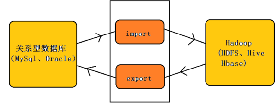
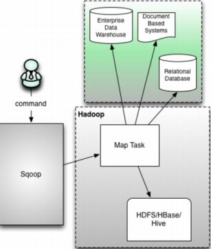
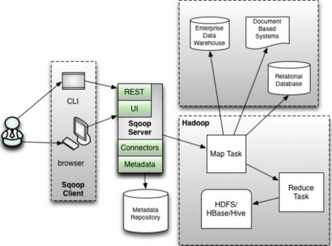
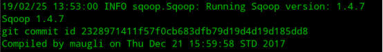
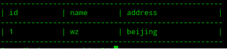
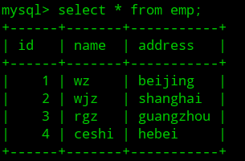

# Sqoop

## 一．sqoop的简单概论

### 1.sqoop产生的原因：

A. 多数使用hadoop技术的处理大数据业务的企业，有大量的数据存储在关系型数据中。

B. 由于没有工具支持，对hadoop和关系型数据库之间数据传输是一个很困难的事。

依据以上的原因sqoop产生的。

### 2.sqoop的介绍

sqoop是连接关系型数据库和hadoop的桥梁，主要有两个方面(导入和导出)：

A. 将关系型数据库的数据导入到Hadoop 及其相关的系统中，如 Hive和HBase

B. 将数据从Hadoop 系统里抽取并导出到关系型数据库



### 3.Sqoop的优点：

A. 可以高效、可控的利用资源，可以通过调整任务数来控制任务的并发度。

B. 可以自动的完成数据映射和转换。由于导入数据库是有类型的，它可以自动根据数据库中的类型转换到Hadoop 中，当然用户也可以自定义它们之间的映射关系

C.支持多种数据库，如mysql，orcale等数据库

### 4.sqoop工作的机制：

将导入或导出命令翻译成MapReduce程序来实现的,MapReduce 中主要是对InputFormat和OutputFormat进行定制

### 5.sqoop版本介绍：sqoop1和sqoop2

A. sqoop的版本sqoop1和sqoop2是两个不同的版本，它们是完全不兼容的

B. 版本划分方式: apache1.4.X之后的版本是1,1.99.0之上的版本是2

C. Sqoop2相比sqoop1的优势有：

​	1) 它引入的sqoop Server，便于集中化的管理Connector或者其它的第三方插件；

​	2) 多种访问方式：CLI、Web UI、REST API；

​	3) 它引入了基于角色的安全机制，管理员可以在sqoop Server上配置不同的角色。

D. Sqoop2和sqoop1的功能性对比：

| 功能                         | sqoop1                                            | sqoop2                                                       |
| ---------------------------- | ------------------------------------------------- | ------------------------------------------------------------ |
| 用于所有主要RDBMS的连接器    | 支持                                              | 不支持<br />解决办法：使用通用jdbc连接器                     |
| Kerberos安全集成             | 支持                                              | 不支持                                                       |
| 直接从RDBMS传输至hive或HBase | 支持                                              | 不支持：<br />解决1办法：先导入HDFS，再手动加载到Hive或HBase |
| 直接从hive或HBase传输至RDBMS | 不支持<br />解决办法：先提取到HDFS，再传输到RDBMS | 不支持<br />解决办法：先提取到HDFS，再传输到RDBMS            |

E. sqoop1和sqoop2的架构区别：

1）sqoop1的架构图：



sqoop1的架构图

版本号：1.4.X以后的sqoop1

在架构上：sqoop1使用sqoop客户端直接提交代码方式

访问方式：CLI命令行控制台方式访问

安全性：命令或者脚本指定用户数据库名和密码

原理：Sqoop工具接收到客户端的shell命令或者Java api命令后，通过Sqoop中的任务翻译器(Task Translator)将命令转换为对应的MapReduce任务，而后将关系型数据库和Hadoop中的数据进行相互转移，进而完成数据的拷贝

2）sqoop2架构图：



sqoop2架构图

版本号：1.99.X以上的版本sqoop2

在架构上：sqoop2引入了 sqoop server,对对connector实现了集中的管理访问方式：REST API、 JAVA API、 WEB UI以及CLI控制台方式进行访问 

CLI方式访问，会通过交互过程[界面](https://links.jianshu.com/go?to=https%3A%2F%2Fwww.baidu.com%2Fs%3Fwd%3D%E7%95%8C%E9%9D%A2%26tn%3D24004469_oem_dg%26rsv_dl%3Dgh_pl_sl_csd)，输入的密码信息会被看到，同时Sqoop2引入基亍角色的安全机制，Sqoop2比Sqoop多了一个Server端。

F. Sqoop1和sqoop2优缺点：

sqoop1优点：架构部署简单

sqoop1缺点：命令行方式容易出错，格式紧耦合，无法支持所有数据类型，安全机制不够完善，例如密码暴漏，安装需要root权限，connector必须符合JDBC模型

sqoop2优点：多种交互方式，命令行，web UI，rest API，conncetor集中化管理，所有的链接安装在sqoop server上，完善权限管理机制，connector规范化，仅仅负责数据的读写

sqoop2缺点：sqoop2的缺点，架构稍复杂，配置部署更繁琐

## 二．安装sqoop1

### 1. 安装前提：

Sqoop需要安装在hive，hbase的服务器上，linux环境中必须有java和hadoop环境

Java 1.8.0_161

Hadoop  2.8.5

### 2. 下载软件：

软件下载地址：[http://mirrors.hust.edu.cn/apache/sqoop](https://links.jianshu.com/go?to=http%3A%2F%2Fmirrors.hust.edu.cn%2Fapache%2Fsqoop)

此处下载的软件是sqoop1的软件包：sqoop-1.4.7.bin__hadoop-2.6.0.tar.gz

### 3. 安装sqoop：

A. 解压：

```shell
tar xf sqoop-1.4.7.bin__hadoop-2.6.0.tar.gz

mv sqoop-1.4.7.bin__hadoop-2.6.0 /usr/local/sqoop
```

B. 修改配置文件：

```shell
cd /usr/local/sqoop/conf
cp sqoop-env-template.sh  sqoop-env.sh
vim  sqoop-env.sh

export HADOOP_COMMON_HOME=/usr/local/hadoop
export HADOOP_MAPRED_HOME=/usr/local/hadoop
export HIVE_HOME=/usr/local/hive
```

注意：为什么在sqoop-env.sh文件中会要求分别进行 common和mapreduce的配置呢

在apache的hadoop的安装中四大组件都是安装在同一个hadoop_home中的，但是在CDH, HDP中， 这些组件都是可选的。在安装hadoop的时候，可以选择性的只安装HDFS或者YARN。CDH,HDP在安装hadoop的时候，会把HDFS和MapReduce有可能分别安装在不同的地方。

> CDH(Cloudera’s Distribution, including Apache Hadoop)，是Hadoop众多分支中的一种，由Cloudera维护，基于稳定版本的Apache Hadoop构建，并集成了很多补丁，可直接用于生产环境
>
> HDP(Hortonworks Data Platform)是hortworks推出的100%开源的hadoop发行版本,以YARN 作为其架构中心，包含pig、hive、phoniex、hbase、storm、spark等大量组件，在最新的2.4版本，监控UI实现与grafana集成

C. 将mysql的驱动包放到sqoop的lib目录下

cp  mysql-connector-java-5.1.46.jar /usr/local/sqoop/lib

D. 修改环境变量：

```shell
export SQOOP_HOME=/usr/local/sqoop

export PATH=$SQOOP_HOME/bin:$PATH
```

4.安装显示：



## 三．Sqoop的使用

### 1. 查看数据库的名称：

```shell
sqoop list-databases --connect jdbc:mysql://ip:3306/ --username 用户名 --password 密码
```

### 2. 列举出数据库中的表名：

```shell
sqoop list-tables --connect jdbc:mysql://ip:3306/数据库名称 --username 用户名 --password 密码
```

### 3. 导入：

```shell
sqoop import  

--connect jdbc:mysql://ip:3306/databasename  #指定JDBC的URL 其中database指的是(Mysql或者Oracle)中的数据库名

--table  tablename  #要读取数据库database中的表名      

--username root    #用户名 

--password  123456  #密码  

--target-dir  /path  #指的是HDFS中导入表的存放目录(注意：是目录)

--fields-terminated-by '\t'  #设定导入数据后每个字段的分隔符，默认；分隔

--lines-terminated-by '\n'  #设定导入数据后每行的分隔符

--m 1  #并发的map数量1,如果不设置默认启动4个map task执行数据导入，则需要指定一个列来作为划分map task任务的依据

--where ’查询条件‘  #导入查询出来的内容，表的子集

--incremental append  #增量导入

--check-column：column_id  #指定增量导入时的参考列

--last-value：num  #上一次导入column_id的最后一个值

--null-string ‘’  #导入的字段为空时，用指定的字符进行替换
```

**以上导入到hdfs中**

```shell
--hive-import   #导入到hive

--hive-overwrite  #可以多次写入

--hive-database  databasename  #创建数据库，如果数据库不存在的必须写，默认存放在default中

--create-hive-table  #sqoop默认自动创建hive表

--delete-target-dir  #删除中间结果数据目录

--hive-table tablename  #创建表名
```

### 4. 导入所有的表放到hdfs中：

```shell
sqoop import-all-tables  --connect jdbc:mysql://ip:3306/库名 --username 用户名  --password  密码  --target-dir 导入存放的目录
```

### 5. 导出

**目标表必须在mysql数据库中已经建好，数据存放在hdfs中**

```shell
sqoop export

--connect jdbs:mysql://ip:3600/库名 #指定JDBC的URL 其中database指的是(Mysql或者Oracle)中的数据库名

--username 用户名  #数据库的用户名

--password 密码   #数据库的密码

--table 表名     #需要导入到数据库中的表名

--export-dir 导入数据的名称   #hdfs上的数据文件

--fields-terminated-by ‘\t’    #HDFS中被导出的文件字段之间的分隔符

--lines-terminated-by '\n'  #设定导入数据后每行的分隔符

--m 1  #并发的map数量1,如果不设置默认启动4个map task执行数据导入，则需要指定一个列来作为划分map task任务的依据

--incremental  append  #增量导入

--check-column：column_id  #指定增量导入时的参考列

--last-value：num  #上一次导入column_id的最后一个值

--null-string ‘’  #导出的字段为空时，用指定的字符进行替换
```

### 6. sqoop作业

**sqoop作业创建并保存导入和导出命令**

A.创建作业:

```shell
sqoop job --create 作业名 --import　--connect jdbc:mysql://ip:3306/数据库 --username 用户名 --table 表名 --password 密码 --m 1 --target-dir  存放目录
```

注意加粗的地方是有空格的

B. 验证作业（显示已经保存的作业）：

```shell
sqoop job --list
```

C. 显示作业详细信息：

```shell
sqoop  job --show 作业名称
```

D.删除作业：

```shell
sqoop  job --delete 作业名
```

E. 执行作业：

```shell
sqoop  job --exec 作业
```

### 7. eval：预览查询

**它允许用户针对各自的数据库服务器执行用户定义的查询，并在控制台中预览结果，可以使用期望导入结果数据。**

A.选择查询：

```shell
sqoop eval -connect jdbc:mysql://ip:3306/数据库 --username 用户名  --password 密码 --query "select * from emp limit 1"
```



Ｂ．插入查询：

```shell
sqoop eval  jdbc:mysql://ip:3306/数据库 --username 用户名  --password 密码 --query "insert into emp values(4,'ceshi','hebei')"
```



### 8.codegen

**从面向对象的应用程序的角度来看，每个数据库表都有一个DAO类，它包含用于初始化对象的'getter'和'setter'方法。该工具（-codegen）自动生成DAO类。**

它根据表模式结构在Java中生成DAO类。Java定义被实例化为导入过程的一部分。这个工具的主要用途是检查Java是否丢失了Java代码。如果是这样，它将使用字段之间的默认分隔符创建Java的新版本,其实就是生成表名.java

语法：`sqoop codegen --connectjdbc:mysql://ip:3306/数据库 --username 用户名 --table 表名 --m 1 --password 密码`

回显中会显示文件存放的位置。


## 出处

作者：宇晨棒棒的
链接：https://www.jianshu.com/p/ec9003d8918c
来源：简书
著作权归作者所有。商业转载请联系作者获得授权，非商业转载请注明出处。