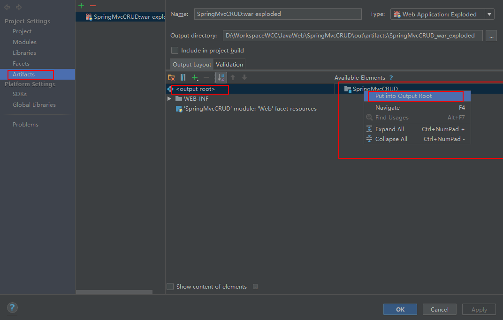
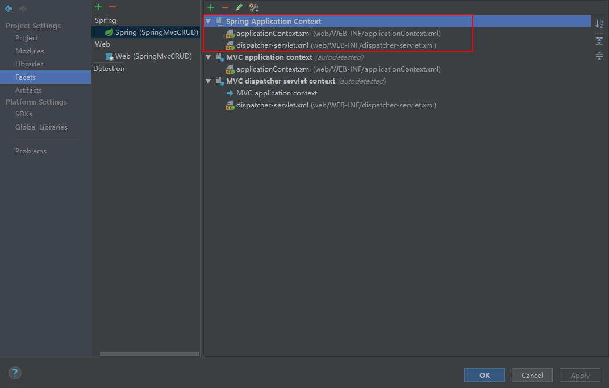

# 1、ClassNotFoundException  OR ClassLoadException

`org.apache.catalina.core.StandardContext.listenerStart Error configuring application listener of class  org.springframework.web.context.ContextLoaderListener  java.lang.ClassNotFoundException: org.springframework.web.context.ContextLoaderListener `

SolutionA：



SolutionB：




# 2、前端采用form-data传递数据，后端接收为null

添加

```xml
<!--//解决form-data中数据为空的问题-->
<bean id="multipartResolver" class="org.springframework.web.multipart.commons.CommonsMultipartResolver">
    <property name="maxUploadSize" value="500000"/>
</bean>
```

添加依赖

```xml
<!-- https://mvnrepository.com/artifact/commons-fileupload/commons-fileupload -->
<dependency>
    <groupId>commons-fileupload</groupId>
    <artifactId>commons-fileupload</artifactId>
    <version>1.3.3</version>
</dependency>
```

# 3、多对象的formdata格式

```java
@RequestMapping(value = "/queryForPageList", method = RequestMethod.POST)
public EasyUIPage queryPageList(EasyUIPage page,Integer rows,SydwCyryxxb entity){
   page.setPagePara(rows);
   return sydwCyryxxbService.queryPageList(page, entity);
}
```

数据请求格式Form-data：

```json
{
    "page":"1",
    "rownum":"10",
    "rows":"10",
    "zjhm":"513922199805015455",
    "xm":"张三"
}
```


