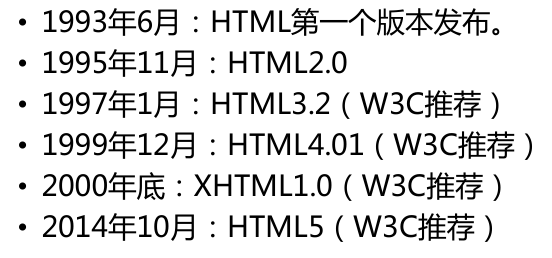

# HTML&CSS

## 相关基本知识

### 软件开发模式

**B/S模式**

**C/S模式**

### WEB软件开发流程


### 网页的组成


## HTML

HTML（Hypertext Markup Language）即超文本标记语言，它负责网页的三个要素之中的**结构**。 HTML使用**标签**的的形式来标识网页中的不同组成部分。一个基本的HTML页面源码如下：

```html
<!DOCTYPE html>
<html>
<head>
    <meta charset="UTF-8">
    <title>网页标题</title>
</head>
<body>
    <h1>网页正文</h1>
</body>
</html>
```

### 元素/标签

- **标签的结构**

```html
<标签名>标签内容</标签名>
<标签名 />
```

- **子元素/父元素**

```html
<p>我是一个<em>段落</em></p>
```

​	p也是一个元素，em是p的**子元素**，p是em的**父元素。**

- **祖先元素/后代元素**

```html
<body>
	<p><em>内容</em></p>
</body>
```

​	body是p和em的**祖先元素**。p和em是body的**后代元素**。

#### 常用元素

##### html

作用：<html>标签用于告诉浏览器这个文档中包含的信息是用HTML编写的。

用法：所有的网页的内容都需要编写到html标签中，一个页面中html标签只能有一个。html标签中有两个子标签**head**和**body** 

##### head

作用：<head>标签用来表示网页的元数据，head中包含了浏览器和搜索引擎使用的其他不可见信息。
用法：head标签作为html标签的子元素的出现，一个网页中只能有一个head。

##### title

作用：– <title>标签表示网页的标题，一般会在网页的标题栏上显示。– title标签中的文字，是页面优化的最重要因素。在**搜索引擎**的搜索时最先看到的、最醒目的内容。

用法：建议将title标签紧贴着head标签编写，这样搜索引擎可以快速检索到标题标签。 网站中的多个页面的title也不应该重复，这样不利于搜索隐藏检索

##### meta

**作用**

- meta 标签可提供有关页面的元信息，比如,针对搜索引擎和更新频度的描述和关键词。
- meta标签位于文档的头部，不包含任何内容。meta 标签的属性定义了与文档相关联的名称/值对

**用法**

meta的用法

- 设置页面的字符集

```html
<meta charset="utf-8">
```

-  设置网页的描述

```html
<meta name="description" content="">
```


- 设置网页的关键字

```html
<meta name="keywords" content="">
```

- 请求的重定向

```html
  – <meta http-equiv="refresh" content="5;url=地址"/>
```

##### body

作用：<body>标签用来设置网页的主体，所有在页面中能看到的内容都应该编写到body标签中。
用法：body标签作为html的子标签使用。

##### h1~h6

作用：h1~h6都是网页中的标题标签，用来表示网页中的一个标题，不同的是，从h1~h6重要性越来越低。标题标签相当于正文的标题，通常认为重要性仅次于页面的title。一般标题标签我们只会使用到h3，h3以后的标题标签对于搜索引擎就没有什么意义了。一个页面中只会使用一个h1标签。

##### 其他常用元素

**p**：标签表示网页中的一个段落。一般浏览器会在段落的前和后各加上一个换行，也就是段落会在页面中自成一行

**br**：标签表示一个换行标签，使用br标签可以使br标签后的内容另起一行。

**hr**：标签是水平线标签，使用hr标签可以在页面中打印一条水平线，水平线可以将页面分成上下两个部分。

**img**：标签是图片标签，可以用来向页面中引入一张外部的图片。 src指向一个外部的图片的路径。alt图片的描述，可以被**搜索引擎**检索。

**a**：标签是超链接标签，通过a标签，可以快速跳转到其他页面。 href指向一个链接地址. target设置打开目标页面的位置，可选值：_blank新窗口、_self当前窗口。

### 属性

 可以为HTML标签设置属性。通过属性为HTML元素提供附加信息。属性需要设置在开始标签或自结束标签中。属性总是以名称/值对的形式出现，比如：name=“value”。有些属性可以是任意值，有些则必须是指定值。

```html
<h1 title="我是一个属性">标题</h1>

```

#### 常见属性：

- id

  id属性作为标签的唯一标识，在同一个网页中不能
  出现相同的id属性值

- class 

   class属性用来为标签分组，拥有相同class属性的
    标签我们认为就是一组，可以出现相同的class属
    性，可以为一个元素指定多个class

- title

   title属性用来指定标签的标题，指定title以后，鼠
    标移入到元素上方时，会出现提示文字。

### 注释

 格式

```html
<!--注释内容-->
```

- 合理的使用注释可以帮助开发人员理解网
  页的代码。
- **注释不能嵌套！**

### HTML的发展



#### doctype

为了让浏览器知道我们使用的HTML版本我们还需要在网页的最上边添加一个doctype声明，来告诉浏览器网页的版本。

```html
<!-- HTML 4.01 -->
<!DOCTYPE HTML PUBLIC "-//W3C//DTD HTML 4.01 Transitional//EN"
"http://www.w3.org/TR/html4/loose.dtd">
<!-- XHTML 1.0 -->
<!DOCTYPE html PUBLIC "-//W3C//DTD XHTML 1.0 Transitional//EN" "
http://www.w3.org/TR/xhtml1/DTD/xhtml1-transitional.dtd">
<!-- HTML5 -->
<!DOCTYPE html>
```

### 编码问题

- 在计算机的内部，文件都是以**二进制**编码保存的。
- 一个汉字在计算机的底层保存的可能要转换为10100101这种二进制码，这一过程称为**编码**。
- 计算机在读取文件时需要将10100101在转换为中国给我们显示这一过程称为**解码**。 

#### 字符集

‘中国’这两个字到底是10100101还是01011010到底由谁说了算。所以我们还需要一个东西称为字符集，字符集规定了如何将文本转换为二进制编码。

**常见的字符集**：ASCII、ISO8859-1、GBK、GB2312、UTF-8

#### 乱码

 如果我们保存文件时使用的是utf-8进行编码，而浏览器读取页面时使用gb2312，这样就会导致页面中的内容不能正常显示，也就是我们所说的乱码。
**解决**：统一编码和解码的字符集。这里为了页面有更好的使用性，我们一般使用utf-8

### 实体（转义字符）

在HTML中预留了一些字符。这些预留字符是不能在网页中直接使用的。比如<和>,我们不能直接在页面中使用<和>号，因为浏览器会将它解析为html标签。为了可以使用这些预留字符，我们必须在html中使用字符实体。

**语法: &实体名;**

| 显示结果 | 描述     | 实体名称          | 实体编号 |
| -------- | -------- | ----------------- | -------- |
|          | 空格     | `&nbsp;`            | `&#160;`   |
| <        | 小于号   | `&lt;`              | `&#60;`    |
| >        | 大于号   | `&gt;`              | `&#62; `  |
| &        | 和号     | `&amp;`             | `&#38;`   |
| "        | 引号     | `&quot;`            | `&#34;`    |
| '        | 撇号     | `&apos;` (IE不支持) |`&#39; `   |
| ￠       | 分       | `&cent;`            | `&#162; `  |
| £        | 镑       | `&pound;`           | `&#163; `  |
| ¥        | 日圆     | `&yen; `            | `&#165;`   |
| €        | 欧元     | `&euro;`            | `&#8364; ` |
| §        | 小节     | `&sect;`            | `&#167; `  |
| ©        | 版权     | `&copy; `           | `&#169;`   |
| ®        | 注册商标 | `&reg;`             | `&#174;`   |
| ™        | 商标     | `&trade;`           | `&#8482;`  |
| ×        | 乘号     | `&times;`           |` &#215;`   |
| ÷        | 除号     | `&divide;`          | `&#247; `  |

**实体名称对大小写敏感！**

## CSS

**CSS**：层叠样式表 (Cascading Style Sheets)。 css可以用来为网页创建样式表，通过样式表可以对网页进行装饰。所谓层叠，可以将整个网页想象成是一层一层的结构，层次高的将会覆盖层次低的。而css就可以分别为网页的各个层次设置样式。

### 基本语法

CSS的样式表由一个一个的样式构成，一个样式又由**选择器**和**声明块**构成，如

```css
选择器 {样式名:样式值；样式名:样式值 ; }
```

### 三种声明形式

- 行内样式

  ```html
  <p style="color: red;font-size: 30px"></p>
  ```

- 内部样式

  ```html
  ...
  <head>
  <style>
  	p{color:red; font-size: 30px;}
  </style>  
  </head>
  ...
  ```

- 外部样式

  可以将所有的样式保存到一个外部的css文件中，然后通过<link>标签将样式表引入到文件中。种方式将样式表放入到了页面的外部，可以在多个页面中引入，同时浏览器加载文件时可以**使用缓存**，这是我们开发中使用的最多的方式

  ```html
  <head>
      <link rel="stylesheet" type="text/css" href="style.css">
  </head>
  ```

### 选择器

#### 元素选择器

最常见的 CSS 选择器是元素选择器。换句话说，文档的元素就是最基本的选择器。

如果设置 HTML 的样式，选择器通常将是某个 HTML 元素，比如 p、h1、em、a，甚至可以是 html 本身：

```css
html {color:black;}
h1 {color:blue;}
h2 {color:silver;}
```

#### 选择器分组

假设希望 h2 元素和段落都有灰色。为达到这个目的，最容易的做法是使用以下声明：

```css
h2, p {color:gray;}
```

将 h2 和 p  选择器放在规则左边，然后用逗号分隔，就定义了一个规则。其右边的样式（color:gray;）将应用到这两个选择器所引用的元素。逗号告诉浏览器，规则中包含两个不同的选择器。如果没有这个逗号，那么规则的含义将完全不同。参见后代选择器。

可以将任意多个选择器分组在一起，对此没有任何限制。

#### CSS 类选择器

类选择器允许以一种独立于文档元素的方式来指定样式。该选择器可以单独使用，也可以与其他元素结合使用。

```html
<style>
    *.important {color:red;} /*选择所有，通配符*可忽略*/
    p.important {color:red;} 
</style>

<h1 class="important">
This heading is very important.
</h1>
<p class="important">
This paragraph is very important.
</p>
```

#### CSS ID 选择器

在某些方面，ID 选择器类似于类选择器，不过也有一些重要差别。请看下面的规则：

```css
*#intro {font-weight:bold;}/*选择id属性为indro的元素，通配符*可忽略*/
```

#### 属性选择器。

**属性选择器可以根据元素的属性及属性值来选择元素。**如果希望选择有某个属性的元素，而不论属性值是什么，可以使用简单属性选择器。

```css
*[title] {color:red;}
p[title][name] {color:red;}
input[name='zjhm'] {background-color:red}
```

##### 子串匹配属性选择器

下面为您介绍一个更高级的选择器模块，它是 CSS2  完成之后发布的，其中包含了更多的部分值属性选择器。按照规范的说法，应该称之为“子串匹配属性选择器”。

很多现代浏览器都支持这些选择器，包括 IE7。

下表是对这些选择器的简单总结：

| 类型         | 描述                                       |
| ------------ | ------------------------------------------ |
| [abc^="def"] | 选择 abc 属性值以 "def" 开头的所有元素     |
| [abc$="def"] | 选择 abc 属性值以 "def" 结尾的所有元素     |
| [abc*="def"] | 选择 abc 属性值中包含子串 "def" 的所有元素 |
| [abc~="def"] | 选择 abc 属性值中不包含 "def" 的所有元素   |
| [abc="def"]  | 选择 abc 属性值为 "def" 的元素             |

可以想到，这些选择有很多用途。

举例来说，如果希望对指向 W3School 的所有链接应用样式，不必为所有这些链接指定 class，再根据这个类编写样式，而只需编写以下规则：

```css
a[href*="w3school.com.cn"] {color: red;}
```

#### 后代选择器

**后代选择器可以选择作为某元素后代的元素。**举例来说，如果您希望只对 h1 元素中的 em 元素应用样式，可以这样写：

```css
h1 em {color:red;}
```

#### 子元素选择器

**与后代选择器相比，子元素选择器（Child selectors）只能选择作为某元素子元素的元素。**如果您不希望选择任意的后代元素，而是希望缩小范围，只选择某个元素的子元素，请使用子元素选择器（Child selector）。例如，如果您希望选择只作为 h1 元素子元素的 strong 元素，可以这样写：

```css
h1 > strong {color:red;}
```

#### 兄弟选择器

**兄弟选择器（sibling selector）可选择在另一元素后的元素，且二者有相同父元素。**

```css
h1 + p {margin-top:50px;} /*选择后边一个兄弟 */
h1 ~ p {margin-top:50px;} /*选择后边所有兄弟 */
```

这个选择器读作：“选择紧接在 h1 元素后出现的段落，h1 和 p 元素拥有共同的父元素”。

#### 伪类选择器

伪类的语法：`selector : pseudo-class {property: value}`

举例

```css
a:link {color: #FF0000}		/* 未访问的链接 */
a:visited {color: #00FF00}	/* 已访问的链接 */
a:hover {color: #FF00FF}	/* 鼠标移动到链接上 */
a:active {color: #0000FF}	/* 选定的链接 */
p:first-child {font-weight: bold;}
li:first-child {text-transform:uppercase;}
li:nth-child {text-transform:uppercase;}
div:first-of-type {text-transform:uppercase;}
div:last-of-type {text-transform:uppercase;}
div:nth-of-type {text-transform:uppercase;}
```

**伪类**

W3C*："W3C" 列指示出该属性在哪个 CSS 版本中定义（CSS1 还是 CSS2）。

| 属性                                                | 描述                                     | CSS  |
| --------------------------------------------------- | ---------------------------------------- | ---- |
| :not(selector){ ... }                               | 否定选择                                 |      |
| [:active](../cssref/pr_pseudo_active.asp)           | 向被激活的元素添加样式。                 | 1    |
| [:focus](../cssref/pr_pseudo_focus.asp)             | 向拥有键盘输入焦点的元素添加样式。       | 2    |
| [:hover](../cssref/pr_pseudo_hover.asp)             | 当鼠标悬浮在元素上方时，向元素添加样式。 | 1    |
| [:link](../cssref/pr_pseudo_link.asp)               | 向未被访问的链接添加样式。               | 1    |
| [:visited](../cssref/pr_pseudo_visited.asp)         | 向已被访问的链接添加样式。               | 1    |
| [:first-child](../cssref/pr_pseudo_first-child.asp) | 向元素的第一个子元素添加样式。           | 2    |
| :nth-child                                          | 向元素的第n个子元素添加样式。            | 2    |
| :last-child                                         | 向元素的最后一个子元素添加样式。         | 2    |
| :first-of-type :last-of-type :nth-of-type           | 选择指定类型的子元素                     |      |
| [:lang](../cssref/pr_pseudo_lang.asp)               | 向带有指定 lang 属性的元素添加样式。     | 2    |

注意：涉及a标签的伪类选择器声明顺序一般为 :link :visited :hover :active，否则会导致hover或active失效。详情请看[选择器优先级](#选择器的优先级)

#### 伪元素选择器

伪元素的语法：`selector:pseudo-element {property:value;}`

```css
p:first-letter{
  color:#ff0000;
  font-size:xx-large;
}

p:first-line{
  color:#0000ff;
  font-variant:small-caps;
}
```

**伪元素**

*W3C*："W3C" 列指示出该属性在哪个 CSS 版本中定义（CSS1 还是 CSS2）。

| 属性                                                  | 描述                             | CSS  |
| ----------------------------------------------------- | -------------------------------- | ---- |
| [:first-letter](../cssref/pr_pseudo_first-letter.asp) | 向文本的第一个字母添加特殊样式。 | 1    |
| [:first-line](../cssref/pr_pseudo_first-line.asp)     | 向文本的首行添加特殊样式。       | 1    |
| [:before](../cssref/pr_pseudo_before.asp)             | 在元素之前添加内容。             |      |

#### 选择器的优先级

在页面中使用CSS选择器选中元素时，经常都是一个元素同时被多个选择器选中，如果两个选择器设置的样式不一
致那还好不会产生冲突，是如果两个选择器设置的是同一个样式，到底要应用那个样式呢？CSS中会默认使用权重较大的样式，权重又是如何计算的呢？不同的选择器有不同的权重值，权重值大的会被优先显示。

| 选择器               | 权重 |
| -------------------- | ---- |
| 内联样式             | 1000 |
| id选择器             | 100  |
| 类、属性、伪类选择器 | 10   |
| 元素选择器           | 1    |
| 通配符               | 0    |
| 继承的样式           | 无   |

当选择器中包含多种选择器时，会将各种权重相加然后在比较，当权重相同时，会优先使用后出现的样式。

注意：

①选择器的优先级计算不会超过它的最大数量级。（即10个id选择器加在一起，并不会超过1000）。

②并集选择器各选择器的权重单独计算

例如

```css
body h1{
    color:red;
}
h1{
    color:yellow;
}
```

这种情况下第一个选择器权重为2，第二个为1，所以最终第一个选择器选中的h1为红色

### 样式的继承

后代元素会继承祖先元素的样式，当有冲突时，越亲近的祖先的样式优先级越高。

**注意：并不是所有的样式都会被继承，如所有背景、边块、定位相关的样式不会被继承。**