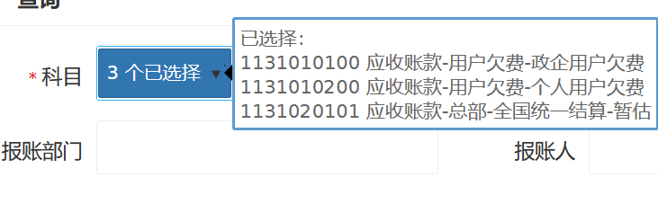

# KendoUI

## API文档

https://docs.telerik.com/kendo-ui/api/javascript/

常用代码集锦，相关代码在HAP3.5框架下实现， 对应kendoUI的版本v2016.2.714

## DropDownList - 单选下拉框

https://docs.telerik.com/kendo-ui/api/javascript/ui/dropdownlist

### 基本使用

- html

```html
<div class="form-group">
    <label class="control-label col-md-3"><@spring.message "preference.timezone"/></label>
    <div class="col-md-4">
        <select  data-role="dropdownlist" data-value-primitive="true" data-text-field="meaning" style="width:100%" data-value-field="value"
                data-bind="source: timeZones, value: data.timeZone,events: {change: onChange}"></select>
        <small class="help-block"><@spring.message "preference.timezone.description"/></small>
    </div>
</div>
```

- js

```js
$("#enabledFlag").kendoDropDownList({
    // 自动绑定
    autoBind: true,
    // 使用原始值，如果使用则返回dataValueField对应的值，否则返回整个对象
    valuePrimitive: true,
    dataSource: [{value:'Y',meaning:'启用'},{value:'N',meaning:'禁用'}]
    dataTextField: "meaning",
    dataValueField: "value",
});
```

### 服务器数据源

```js
$("#unitType").kendoDropDownList({
    autoBind: true,
    valuePrimitive: true,
    dataSource: new kendo.data.DataSource({
        transport: {
            read: {url: "/common/code/SYS.UNIT_TYPE"},
        },
        schema: {
            // 解析接口响应的数据
            parse: function (res) {
                return res.rows || []
            }
        },
    }),
    dataTextField: "meaning",
    dataValueField: "value",
});
```

### 模糊匹配筛选

客户端筛选

```js
$("#enabledFlag").kendoDropDownList({
    autoBind: true,
    valuePrimitive: true,
    // 支持三种匹配模式，startswith, endswith, contains.
    filter: "contains",
    // 是否区分大小写
    ignoreCase: false,
    dataSource: [{value:'Y',meaning:'启用'},{value:'N',meaning:'禁用'}]
    dataTextField: "meaning",
    dataValueField: "value",
});
```

服务端筛选

```js
$("#unitType").kendoDropDownList({
    autoBind: true,
    valuePrimitive: true,
    filter: "contains",
    ignoreCase: false,
    // 延时，防止过于频繁刷新，默认200ms
    delay: 600,
    dataSource: new kendo.data.DataSource({
        // 开启服务器过滤
        serverFiltering: true,
        transport: {
            read: {url: "/common/ext/code/SYS.UNIT_TYPE"},
            parameterMap: function (options, type) {
                if (type === "read") {
                    // 准备请求参数，默认是传递filters对象。服务端往往不用那么复杂
                    var params = {};
                    var filterArr = options.filter && options.filter.filters;
                    if (!$.isEmpty(filterArr)) {
                        params["searchText"] = filterArr[0].value
                    }
                    return params;
                }
            }
        },
        schema: {
            parse: function (res) {
                return res.rows || []
            }
        },
    }),
    dataTextField: "meaning",
    dataValueField: "value",
});
```


## Combobox - 可自定义值的单选下拉框

https://docs.telerik.com/kendo-ui/api/javascript/ui/combobox

相比DropDownList的优点：可以配置清空按钮，可以支持自定义值和离线数据搜索

响应的缺点：配置服务器数据源时会出现，会导致下拉三角消失（应该是kendo的bug，loading取消时，没有还原三角图标。）

### 服务器数据

同DropDownList

### 本地数据

同DropDownList

### 模糊匹配筛选

和DropDownList类似

客户端筛选

```js
$("#enabledFlag").kendoComboBox({
    autoBind: true,
    valuePrimitive: true,
    // 支持三种匹配模式，startswith, endswith, contains.
    filter: "contains",
    // 是否区分大小写
    ignoreCase: false,
    // 当设置为true时，小部件将自动将所选值设置为键入的自定义文本。将该选项设置为false可清除选定值，但保留自定义文本
    syncValueAndText: true,
    dataSource: [{value:'Y',meaning:'启用'},{value:'N',meaning:'禁用'}]
    dataTextField: "meaning",
    dataValueField: "value",
});
```

服务端筛选

```js
$("#unitType").kendoComboBox({
    autoBind: true,
    valuePrimitive: true,
    filter: "contains",
    ignoreCase: false,
    // 延时，防止过于频繁刷新，默认200ms
    delay: 600,
    dataSource: new kendo.data.DataSource({
        // 开启服务器过滤
        serverFiltering: true,
        transport: {
            read: {url: "/common/ext/code/SYS.UNIT_TYPE"},
            parameterMap: function (options, type) {
                if (type === "read") {
                    // 准备请求参数，默认是传递filters对象。服务端往往不用那么复杂
                    var params = {};
                    var filterArr = options.filter && options.filter.filters;
                    if (!$.isEmpty(filterArr)) {
                        params["searchText"] = filterArr[0].value
                    }
                    return params;
                }
            }
        },
        schema: {
            parse: function (res) {
                return res.rows || []
            }
        },
    }),
    dataTextField: "meaning",
    dataValueField: "value",
});
```


## MultiSelect - 多选下拉框

### 隐藏选中值

默认是每选一个就多一个的平铺形式，并且会自动撑大输入框，影响布局，显得很丑。如下图：


#### 展示效果

展示选择的总数。鼠标移动上去自动弹出已选择的列表，如下图



#### 核心代码

```javascript
$("#subjectNum").kendoMultiSelect({
    // ...
	tagMode: "single",
	tagTemplate: kendo.template('#:values.length# 个已选择'),
    // ....
});
    
$("#subjectNum").parent().kendoTooltip({
    filter: 'li.k-button',
    position: "left",
    showOn: "mouseenter",
    content: function (e) {
        return '已选择：<br>' + subjects.dataItems().map(item => item.subjectNumDesc).join("<br>");
    }
})
```

给输入框添加一个tooltip提示框

#### 完整代码

```javascript
var subjects = $("#subjectNum").kendoMultiSelect({
    valuePrimitive: true,
    tagMode: "single",
    autoWidth: true,
    delay: 500,
    tagTemplate: kendo.template('#:values.length# 个已选择'),
    dataSource: new kendo.data.DataSource({
        serverFiltering: true,
        transport: {
            read: {
                url: _basePath + '/hdp/gl/contact/subject/query?page=1&pageSize=500'
            },
            parameterMap: function (options, type) {
                if (type === "read") {
                    var filterArr = options.filter && options.filter.filters;
                    if (!$.isEmpty(filterArr)) {
                        return {search: filterArr[0].value}
                    }
                }
            }
        },
        schema: {
            parse: function (res) {
                return (res.rows || []).map(row => ({...row, subjectNumDesc: row.subjectNum + ' ' + row.description}))
            }
        }
    }),
    dataValueField: 'subjectNum',
    dataTextField: 'subjectNumDesc',
}).data("kendoMultiSelect");
$("#subjectNum").parent().kendoTooltip({
    filter: 'li.k-button',
    position: "left",
    showOn: "mouseenter",
    content: function (e) {
        return '已选择：<br>' + subjects.dataItems().map(item => item.subjectNumDesc).join("<br>");
    }
})
```

### 过滤

#### 展示效果


#### 服务端数过滤

核心代码

```javascript
var subjects = $("#subjectNum").kendoMultiSelect({
	// ...
    delay: 500, // 过滤时间
    // 服务端过滤要使用服务器数据源
    dataSource: new kendo.data.DataSource({
        serverFiltering: true, // 开启服务器过滤
        transport: {
            read: {
                url: _basePath + '/hdp/gl/contact/subject/query?page=1&pageSize=500'
            },
            parameterMap: function (options, type) {
                if (type === "read") {
                    var filterArr = options.filter && options.filter.filters;
                    if (!$.isEmpty(filterArr)) {
                        // 将关键字返回到后端，由后端根据关键字做模糊查询
                        return {search: filterArr[0].value}
                    }
                }
            }
        },
    }),
}).data("kendoMultiSelect");
```

完整代码参考隐藏选中值的完整代码

#### 本地数据过滤

核心代码：`filter:"contains"`

完整代码

```javascript
var contactChilds = $("#contactChild").kendoMultiSelect({
    valuePrimitive: true,
    tagMode: "single",
    filter: "contains",
    autoWidth: true,
    tagTemplate: kendo.template('#:values.length# 个已选择'),
    dataSource: new kendo.data.DataSource({
        transport: {
            read: {
                url: _basePath + '/hdp/gl/contact/subject/sub?page=1&pageSize=500'
            },
        },
        schema: {
            parse: function (res) {
                return (res.rows || []);
            }
        }
    }),
    dataValueField: 'description',
    dataTextField: 'description'
}).data("kendoMultiSelect");
```

### 非空验证 - 注意

和普通组件不一样，在组件对应input标签上添加 required的属性，自动绑定实现的非空校验无法生效，此外必须在input标签中添加正确的data-role属性（`data-role="multiselect"`），否则会导致以下自定义的非空校验也无法执行。

```html
<input type="text" id="subjectNum" data-role="multiselect" style="width: 100%" name="subjectNum"
       data-bind="value:model.subjectNum"/>
```

```javascript
var validator = $("#query-form").kendoValidator({
        invalidMessageType: "block",
        rules: {
            subjectRequired: function (input) {
                if (input.is("[name=subjectNum]")) {
                    // 多选下拉框通过无法通过，input.val()获取。直接看模型数据。为空的时候是空对象{length:0}。
                    var mulSelected = viewModel.model.get("subjectNum");
                    return !$.isEmpty(mulSelected) && mulSelected.length > 0;
                }
                return true;
            }
        },
        messages: {
            subjectRequired: "科目不能为空！",
        },
    }).data("kendoValidator");
```

### 全选

通过向数据源添加一个数据项【全选】，点击这个数据项时，选择全部。

#### 展示效果


#### 核心代码

```js
$("#status-picker").kendoMultiSelect({
    autoBind: true,
    dataSource: [
        {value: "DRAFT", meaning: "草稿"},
        {value: "PEDNING", meaning: "待审批"},
        {value: "REJECTED", meaning: "已拒绝"},
        {value: "PUBLISHED", meaning: "已发布"}
    ],
    valuePrimitive: true,
    dataTextField: "meaning",
    dataValueField: "value",
    dataBound: function() {
        // 添加一个全选的数据项
        let first = this.dataSource.at(0);
        const valueField = this.options.dataValueField;
        const textField = this.options.dataTextField;
        const allItem = {};
        allItem[valueField] = '_all';
        allItem[textField] = '全选';
        console.log(first)
        if (!first || first[valueField] !== '_all') {
            this.dataSource.insert(0, allItem);
        }
    },
    select: function(e) {
        const valueField = this.options.dataValueField;
        const items = this.items();
        // 全选
        if (e.dataItem[valueField] === '_all') {
            // console.log('select all');
            e.preventDefault();
            selectAll(items)
            return;
        }
        // 普通点选之后满足全选条件
        if (this.dataItems().length + 1 === items.length - 1) {
            $(items[0]).addClass('k-state-selected');
        }
    },
    deselect: function (e) {
        const valueField = this.options.dataValueField;
        const items = this.items();
        // 取消全选
        if (e.dataItem[valueField] === '_all') {
            // console.log('deselect all');
            e.preventDefault();
            const items = this.items();
            deSelectAll(items);
            return;
        }
        // 普通点选之后不满足全选条件
        if (this.dataItems().length === items.length - 1) {
            $(items[0]).removeClass('k-state-selected');
        }
    }
});

function selectAll(items) {
    for (const item of items) {
        if (!$(item).hasClass('k-state-selected')) {
            item.click();
        }
    }
}

function deSelectAll(items) {
    for (const item of items) {
        if ($(item).hasClass('k-state-selected')) {
            item.click();
        }
    }
}
```

### 新增选项

#### 实现效果

如图所示，当输入不存在的选项时，可以提示新增输入的选项


#### 核心代码

参考后节【表格中编辑】的完整代码，核心为noDataTemplate模板，addNew方法，labelSource的requestEnd事件

### 表格中编辑

#### 注意点：

- 数据绑定，绑定的数据必须是数组，如果不是，需要分别在得到查询和保存请求之前做两个相反的转换。

    参考dataSource.schema.parse和dataSource.transport.parameterMap以及MultiSelect的定义

- 避免过滤保留，过滤保留会导致编辑其他行时，已选择项无法正确展示

    参考MultiSelect.options.close

- 新增选项如何添加到已选择，参考labelSource的requestEnd事件

#### 完整代码

```html
<script>
    var dataSource = new kendo.data.DataSource({
        transport: {
            read: {
                url: BaseUrl + "/moa/material/archive/query",
                type: "GET",
                dataType: "json"
            },
            update: {
                url: BaseUrl + "/moa/material/archive/submit",
                type: "POST",
                contentType: "application/json"
            },
            destroy: {
                url: BaseUrl + "/moa/material/archive/remove",
                type: "POST",
                contentType: "application/json"
            },
            parameterMap: function (options, type) {
                if (type !== "read" && options.models) {
                    var datas = Hap.prepareSubmitParameter(options, type)
                    datas = datas.map(item => ({...item, fileLabel: item.fileLabel.join(',')}));
                    return kendo.stringify(datas);
                } else if (type === "read") {
                    var json = viewModel.model.toJSON();
                    // 数组转字符串
                    json.fileLabel = $.isEmpty(json.fileLabel) ? null : json.fileLabel.join(",");
                    json.fileType = $.isEmpty(json.fileType) ? null : json.fileType.join(",");
                    return Hap.prepareQueryParameter(json, options)
                }
            }
        },
        batch: true,
        serverPaging: true,
        pageSize: 10,
        requestEnd: function (e) {
            const {response, type} = e;
            if (type !== "read" && response && response.success) {
                viewModel.query();
            }
        },
        schema: {
            data: 'rows',
            total: 'total',
            model: {
                id: "archiveId",
                fields: {
                    fileName: {
                        type: 'string',
                    },
                    fileLabel: {
                        type: 'object',
                    },
                    fileFormat: {
                        type: 'string',
                        editable: false,
                    },
                    fileType: {
                        type: 'string',
                        editable: false,
                    },
                }
            },
            parse: response => {
                response.rows = (response.rows || []).map(item => ({
                    ...item,
                    fileLabel: item.fileLabel ? item.fileLabel.split(',') : [],
                }));
                return response;
            }
        }
    });

    var labelSource = new kendo.data.DataSource({
        transport: {
            read: {
                url: BaseUrl + "/moa/material/archive/label/query",
                type: "GET",
                dataType: "json"
            },
            create: {
                url: BaseUrl + "/moa/material/archive/label/create",
                type: "POST",
                contentType: "application/json"
            },
            parameterMap: function (options, type) {
                if (type !== "read" && options.models) {
                    var datas = Hap.prepareSubmitParameter(options, type)
                    return kendo.stringify(datas);
                } else if (type === "read") {
                    const json = viewModel.model.toJSON();
                    return Hap.prepareQueryParameter(json, options)
                }
            }
        },
        batch: true,
        requestEnd: function (e) {
            const {response, type} = e;
            var widget = $("#fileLabel").data("kendoMultiSelect");
            if (type === "create" && response.success === true) {
                // 后台新增标签成功，添加到已选择项中
                var newValue = response.rows[0].fileLabel;
                widget.value(widget.value().concat([newValue]));
            }
        },
        schema: {
            data: 'rows',
            total: 'total',
            model: {
                id: "labelId",
                fields: {
                    labelId: {
                        type: 'number',
                    },
                    fileLabel: {
                        type: 'string',
                    },
                }
            },
        },
    });
$("#grid").kendoGrid({
    dataSource: dataSource,
    resizable: true,
    scrollable: true,
    navigatable: false,
    selectable: 'multiple, rowbox',
    dataBound: function () {
        const functionCode = '${RequestParameters.functionCode!}';
        if (parent.autoResizeIframe) {
            parent.autoResizeIframe(functionCode)
        }
        Hap.gridFloatingHorizontalScrollBar("#grid", functionCode)
    },
    pageable: {
        pageSizes: [5, 10, 20, 50],
        refresh: true,
        buttonCount: 5
    },
    columns: [
        // .... 省略其他无关列
        {
            field: "fileLabel",
            title: '文件标签',
            width: 200,
            attributes: {
                style: "text-align:center;",
            },
            template: dataItem => {
                return dataItem.fileLabel.join(',');
            },
            editor: function (container, options) {
                $('<input id="fileLabel" style="width: 100%;" name="' + options.field + '" />')
                    .appendTo(container)
                    .kendoMultiSelect({
                        // headerTemplate: '<div><button onclick="addNew(\'fileLabel\')">添加新标签</button></div>',
                        autoBind: true,
                        close: function() {
                            // 防止保留过滤标签项，导致编辑别的项时，已选择项无法正确展示
                            if (this.dataSource.filter()) {
                                this.dataSource.filter('')
                            }
                        },
                        // filter: "eq",
                        filter: "startswith",
                        dataTextField: "fileLabel",
                        dataValueField: "fileLabel",
                        valuePrimitive: true,
                        dataSource: labelSource,
                        model: options.model,
                        noDataTemplate: $("#noDataTemplate").html()
                    })
            }
        },
        {
            width: 200,
            title: '<@spring.message "hap.action"/>',
            attributes: {
                style: "text-align:center;",
            },
            command: [
                {
                    name: 'edit',
                    template: '<a href="javascript:void(0)" class="k-grid-edit"><@spring.message "hap.edit"/></a>',
                    click: function (e) {
                        $(".k-button.k-grid-update").bind("click", showInvalidMsg);
                    }
                },
                {
                    name: 'remove',
                    template: '<a style="margin-left: 10px" href="javascript:void(0)" class="k-grid-remove"><@spring.message "hap.delete"/></a>',
                    click: function (e) {
                        e.preventDefault();
                        var source = $("#grid").data('kendoGrid').dataSource,
                            data = this.dataItem($(e.target).closest("tr"));
                        kendo.ui.showConfirmDialog({
                            title: $l('hap.prompt'),
                            message: $l('hap.tip.delete_confirm')
                        }).done(function (event) {
                            if (event.button === 'OK') {
                                source.remove(data);
                                source.sync()
                            }
                        })
                    }
                },
                {
                    name: 'download',
                    template: '<a style="margin-left: 10px" href="javascript:void(0)" class="k-grid-download">下载</a>',
                    click: function (e) {
                        e.preventDefault();
                        const data = this.dataItem($(e.target).closest("tr"));
                        const minioFileName = data.minioFileName;
                        const fileName = data.fileName + "." + data.fileFormat;
                        location.href = "${base.contextPath}/moa/material/archive/download?minioFileName=" +
                            minioFileName + "&fileName=" + fileName;
                    }
                },
                /* {
                     name: 'view',
                     template: '<a style="margin-left: 10px" href="javascript:void(0)" class="k-grid-view">预览</a>',
                     /!* click: function (e) {
                          e.preventDefault();
                          const data = this.dataItem($(e.target).closest("tr"));
                          top.openTab('po_view_' + data.contractId, '基本信息与完成度', 'po/shop.html?contractId=' + data.contractId);
                      }*!/
                 },*/
            ],
        }
    ],
    editable: {
        mode: 'inline'
    },
});
    </script>
<script id="noDataTemplate" type="text/x-kendo-tmpl">
        # var value = instance.input.val(); #
        # var id = instance.element[0].id; #
        <div>
           没有该标签。是否添加新标签 - '#: value #'？
        </div>
        <br />
        <button class="k-button" onclick="addNew('#: instance.element[0].id #', '#: instance.input.val() #')"
        ontouchend="addNew('#: instance.element[0].id #', '#: instance.input.val()#')">添加新标签</button>

</script>

<script>
    function addNew(widgetId, value) {
        var widget = $("#" + widgetId).getKendoMultiSelect();
        var dataSource = widget.dataSource;
        if (confirm("确定添加该标签吗?")) {
            dataSource.add({
                fileLabel: value
            });
            dataSource.sync();
        }
    }
</script>
```

## GRID - 数据表格

### 行内编辑

```js
editable: "inline"
```

### 自定义操作命令

#### 实现效果


#### 核心代码

css

```css
.k-grid-edit,.k-grid-update {
    color: #fff;
    background-color: #42a5f5;
    border-color: #42a5f5;
}
.k-grid-remove {
    color: #fff;
    background-color: #d9534f;
    border-color: #d43f3a;
}

.k-grid tbody button.k-button {
    min-width: 110px;
}

.k-grid-add {
    padding: 0 10px;
}

.k-button:hover {
    color: #fff;
    background-color: #8dc21f;
    border-color: #8dc21f
}
```

js

```js
var treeList = $("#tree-list").kendoTreeList({
    dataSource: dataSource,
    editable: true,
    resizable: true,
    scrollable: true,
    navigatable: false,
    toolbar: '<div id="index-toolbar">' +
        '<span id="error-msg" style="float: left;margin-left: 10px; font-weight:bold;color: red;" data-bind="text:errorMsg"></span>' +
        '<span id="total-score" style="float: right;margin-right: 50px" data-bind="text:totalScore"></span>' +
        '<span style="float: right;margin-right: 10px; font-weight:bold;">总分:</span>' +
        '</div>'
    ,
    dataBound: function () {
        if (parent.autoResizeIframe) {
            parent.autoResizeIframe('${RequestParameters.functionCode!}')
        }
        kendo.bind($("#index-toolbar"), toolbarModel);
    },
    messages: {
        commands: {
            edit: '<@spring.message "hap.edit"/>',
            update: '<@spring.message "hap.save"/>',
            canceledit: '<@spring.message "hap.cancel"/>',
            create: '<@spring.message "hap.add"/>',
            createchild: '<@spring.message "moa.finevalindex.createchild"/>',
            destroy: '<@spring.message "hap.delete"/>',
        }
    },
    columns: [
        {
            expandable: true,
            field: "indexName",
            headerAttributes: {style: "text-align: left;text-indent: 1em"},
            title: '<@spring.message "moa.finevalindex.indexname"/>',
            width: 120
        },
        {
            field: "referScore",
            attributes: {style: "text-align: center"},
            title: '<@spring.message "moa.finevalindex.referscore"/>',
            width: 120
        },
        {
            field: "targetRemark",
            headerAttributes: {style: "text-align: center;"},
            attributes: {style: "text-align: center"},
            title: '<@spring.message "moa.finevalindex.targetRemark"/>',
            width: 120
        },
        {
            field: "orderSeq",
            attributes: {style: "text-align: center"},
            title: '<@spring.message "moa.finevalindex.orderseq"/>',
            width: 120,
            editor: function (container, options) {
                $('<input id="' + options.field + '" name="' + options.field + '" />')
                    .appendTo(container)
                    .kendoNumericTextBox({
                        format: '#',
                        step: 10
                    });
            }
        },
        {
            title: '<@spring.message "hap.action"/>',
            attributes: {style: "text-align: center"},
            command: [
                "createChild",
                "edit",
                // 自定义删除按钮，默认的destroy无法确认弹窗（确认框是异步的，无法等用户确认后再preventDefault）
                {
                    name: "remove",
                    text: '<@spring.message "hap.delete"/>',
                    className: 'k-grid-remove',
                    imageClass: 'k-delete',
                    click: function (e) {
                        e.preventDefault();
                        var that = this;
                        var dataItem = that.dataItem($(e.target).closest("tr"));
                        kendo.ui.showConfirmDialog({
                            message: '<@spring.message "hap.tip.delete_confirm"/>',
                        }).done(function (event) {
                            if (event.button === 'OK') {
                                that.removeRow(dataItem);
                            }
                        });
                    }
                }
            ],
            width: 160
        }
    ],
}).data("kendoTreeList");
// 解决页面不能自适应大小的问题
treeList.bind("expand", autoResizeIframe);
```

### 实现勾选事件

Grid的API里面没有勾选事件，需要自己实现一个勾选事件。

```js
const grid = $("#grid").kendoGrid({
    selectable: 'multiple, rowbox',
    dataBound: function () {
        if (parent.autoResizeIframe) {
            parent.autoResizeIframe('${RequestParameters.functionCode!}')
        }
        // 默认已选择
        if (selectedIndexes.length > 0) {
            // 例如 grid.select("tr:eq(0), tr:eq(1)");
            grid.select("tr:eq(" + selectedIndexes.join("), tr:eq(") + ")")
        }
        $("#grid table .k-checkbox").bind('click', bindOnCheckRow)
    },
    // 省略...
});

function bindOnCheckRow(e) {
    const headRow = $(e.target).hasClass("k-headbox");
    // 点击之前的选中状态
    let justSelected;
    if (headRow) {
        justSelected = $(e.target).hasClass("fa-check");
        justSelected ? onUnselectAll(e) : onSelectAll(e);
    } else {
        const thisRow = e.target.closest("tr");
        const dataItem = grid.dataItem(thisRow);
        justSelected = $(thisRow).hasClass("k-state-selected");
        justSelected ? onUnselect(e, dataItem) : onSelect(e, dataItem);
    }
}

let selectedItems = [];

function onSelectAll() {
    selectedItems = grid.dataItems();
}

function onUnselectAll() {
    selectedItems = [];
}

function onSelect(e, dataItem) {
    selectedItems.push(dataItem)
}

function onUnselect(e, dataItem) {
    selectedItems = selectedItems.filter(item => item.materialId !== dataItem.materialId);
}
```


## TreeList - 树形表格、可展开表格


### 服务器数据集

服务器数据集需要使用**TreeListDataSource**，核心是以下三个配置，指定父子元素之间的关系，服务器直接返回列表就行，TreeListDataSource会根据这个关系构建树。

```js
schema:{
    model:{
        id: "EmployeeID",
        parentId:"parentId",
        expanded: true
    }
}
```

完整代码

```js
var dataSource = new kendo.data.TreeListDataSource({
    transport: {
        read: {
            url: crudServiceBaseUrl + "/query",
            type: "POST",
            dataType: "json"
        },
        update: {
            url: crudServiceBaseUrl + "/submit",
            type: "POST",
            contentType: "application/json"
        },
        destroy: {
            url: crudServiceBaseUrl + "/remove",
            type: "POST",
            contentType: "application/json"
        },
        create: {
            url: crudServiceBaseUrl + "/submit",
            type: "POST",
            contentType: "application/json"
        },
        parameterMap: function (options, type) {
            if (type !== "read" && options.models) {
                var datas = Hap.prepareSubmitParameter(options, type);
                for (let i = 0; i < datas.length; i++) {
                    var item = datas[i];
                    item.belongYear = viewModel.model.belongYear;
                    if (type === 'create') {
                        const parentNode = dataSource.parentNode(item);
                        item.level = parentNode ? parentNode.level + 1 : 0;
                        // 先把父节点的path作为自己的path，后端生成id后在拼上当前节点的id
                        item.path = parentNode ? parentNode.path : '';
                    }
                }
                return kendo.stringify(datas);
            } else if (type === "read") {
                return Hap.prepareQueryParameter(viewModel.model.toJSON(), options)
            }
        }
    },
    batch: true,
    sort: { field: "orderSeq", dir: "asc" },
    requestEnd: function (e) {
        const {response, type} = e;
        if (type !== 'read') {
            viewModel.query();
            return;
        }
        const resData = response.rows || [];
        treeData = resData.filter(item => item.level === 0).map(root => buildChildren(root, resData));
        // 计算总分
        const totalScore = resData
                .filter(item => item.level === 0 && item.referScore > 0)
                .map(item => item.referScore)
                .reduce((prev, cur) => prev + cur, 0);
        toolbarModel.set("totalScore", totalScore);
    },
    schema: {
        data: 'rows',
        model: {
            id: "indexId",
            parentId: "parentId",
            fields: {
                indexId: {type: "number", editable: false, nullable: true},
                parentId: {nullable: false, type: "number", defaultValue: -1},
                indexName: {type: "string", validation: {required: true}},
                orderSeq: {type: "number", nullable: false, defaultValue: 10},
                referScore: {type: "number", nullable: true},
                level: {type: "number", defaultValue: 0},
                path: {type: "string", efaultValue: ''},
            },
            expanded: true
        }
    }
});
function buildChildren(parent, allItems) {
    parent.children = allItems
        .filter(item => item.parentId === parent.indexId)
        .map(child => buildChildren(child, allItems));
    return parent;
}
```

### 本地数据集


### 一键展开、一键收起

```js
function expand() {
    var tree = treeList.dataSource.data();
    for (var i = 0; i < tree.length; i++) {
        if (tree[i].hasChildren) {
            treeList.expand(tree[i]);
        }
    }
    if (parent.autoResizeIframe) {
        parent.autoResizeIframe('${RequestParameters.functionCode!}')
    }
}

function collapse() {
    var tree = treeList.dataSource.data();
    for (var i = 0; i < tree.length; i++) {
        if (tree[i].hasChildren) {
            treeList.collapse(tree[i]);
        }
    }
    if (parent.autoResizeIframe) {
        parent.autoResizeIframe('${RequestParameters.functionCode!}')
    }
}
```

## TreeView - 目录树

### 基本使用


示例代码（JS部分）

这里使用本地数据，会自动转换默认的层级数据源，每个节点的id和items属性是必须，**items代表子节点**

```js
$("#treeview-telerik").kendoTreeView({
    template: kendo.template($("#treeview").html()),
    dataSource: [{
        id: 1, text: "My Documents", expanded: true, items: [
            {
                id: 2, text: "New Web Site", expanded: true, items: [
                    { id: 3, text: "mockup.pdf" },
                    { id: 4, text: "Research.pdf" },
                ]
            },
            {
                id: 5, text: "Reports", expanded: true, items: [
                    { id: 6, text: "May.pdf" },
                    { id: 7, text: "June.pdf" },
                    { id: 8, text: "July.pdf" }
                ]
            }
        ]
    }],
    dragAndDrop: true,
    checkboxes: true,
    loadOnDemand: true
});
```

### 本地数据源

```js
var inline = new kendo.data.HierarchicalDataSource({
    data: [
        { categoryName: "Storage", subCategories: [
            { subCategoryName: "Wall Shelving" },
            { subCategoryName: "Floor Shelving" },
            { subCategoryName: "Kids Storage" }
        ] },
        { categoryName: "Lights", subCategories: [
            { subCategoryName: "Ceiling" },
            { subCategoryName: "Table" },
            { subCategoryName: "Floor" }
        ] }
    ],
    schema: {
        model: {
            children: "subCategories"
        }
    }
});
```

### 服务器数据源

```js
var Categories = new kendo.data.HierarchicalDataSource({
    type: "odata",
    transport: {
        read: {
            url: "https://demos.telerik.com/kendo-ui/service/Northwind.svc/Categories"
        }
    },
    schema: {
        model: {
            hasChildren: "Products",
            id: "CategoryID",
            children: Products
        }
    }
});
$("#treeview").kendoTreeView({
    dataSource: Categories,
    dataTextField: ["CategoryName", "ProductName", "OrderID"]
});
```

## kendoUI validator 表单验证

### 实现方式一

**验证规则和提示信息写在input标签的属性中**

- 通过标签的`pattern`和`validationMessage` 实现

```html
<div id="page-content">
    <form id="mainform" class="form-horizontal" method="post"
        <input type="text" required style="width:100%" name="myId"
                pattern="^[0-9a-zA-Z]{1,64}$" validationMessage="{0}只包含字母和数字,且长度为1-64"
                data-bind="value:model.myId" class="k-textbox">
        <input type="text" required style="width:100%" name="myName"
                pattern=".{1,64}" validationMessage="{0}长度为1-64"
                data-bind="value:model.myName" class="k-textbox">
        <input type="text" required style="width:100%" name="myAge"
                pattern="^([1-9]|1\d{2}|[1-9]\d)$" validationMessage="{0}为1-200的自然数"
                data-bind="value:model.myAge" class="k-textbox">
    </form>
</div>
```

- 使用

```javascript
var validator = $("#page-content").kendoValidator().data("kendoValidator");
if (validator.validate()){
    //valid. do something
} else{
    //invalid. notify user
}
```

### 实现方式二

**验证规则和提示写在JavaScript代码中**

- html

```html
<div id="page-content">
    <form id="mainform" class="form-horizontal" method="post"
        <input type="text" required style="width:100%" name="myId"
               data-bind="value:model.myId" class="k-textbox">
        <input type="text" required style="width:100%" name="myName"
               data-bind="value:model.myName" class="k-textbox">
       <input type="text" required style="width:100%" name="myAge"
               data-bind="value:model.myAge" class="k-textbox">
    </form>
</div>
```

- 验证器和验证规则

```javascript
var validator = $("#page-content").kendoValidator({
    rules: {
        idRange: function (input) {
            if (input.is("[name=myId]")) {
                var value = input.val();
                return value && /^[0-9a-zA-Z]{1,64}$/.test(value);
            }
            return true;
        },
        ageRange: function (input) {
            if (input.is("[name=myAge]")) {
                var value = input.val();
                // 自然数<200
                return /^([1-9]|1\d{2}|[1-9]\d)$/.test(value);
            }
            return true;
        },
        nameRange: function (input) {
            if (input.is("[name=myName]")) {
                var value = input.val();
                return value.length <= 64;
            }
            return true;
        },
    },
    messages: {
        idRange: "{0}只包含字母和数字,且长度不能超过64位",
        ageRange: "{0}范围只能为1-199",
        nameRange: "{0}不能超过64个汉字"
    },
}).data("kendoValidator");

if (validator.validate()){
    //valid. do something
} else{
    //invalid. notify user
}
```

## kendoUI模板引擎：

[原文](https://www.jianshu.com/p/742df82da47d)

kendoUI中的模板引擎使用的语法叫做`#号语法`，或者`hash syntax（哈希语法）`。

它的主要作用是:

- `渲染数据`和`执行js表达式`

### 1. 渲染数据到html模板

- 第一种：使用`=号`渲染`原始值`
   `#= myVar #`
- 第二种：使用`:号`渲染`html编码值`
   `#: myVar #`
- 两者的区别：
   当数据值中`包含HTML标签`时，`冒号`方式会对值里的HTML标签进行`转义`，从而可以把标签作为字符串直接输出。

区别示例：

```css
//uses #= #
var myTemplateRaw = kendo.template("<p>#= name #</p>");
var newHTMLRaw = myTemplateRaw({name:"<strong>zmh</strong>"});
console.log(newHTMLRaw); //<p><strong>zmh</strong></p>
$("#container").append(newHTMLRaw);

//uses #: #
var myTempalteHTMLEncoded = kendo.template("<p>#: name #</p>");
var newHTMLEncoded = myTempalteHTMLEncoded({name:"<strong>zhouminghang</strong>"});
console.log(newHTMLEncoded); //<p>&lt;strong&gt;zhouminghang&lt;/strong&gt;</p>
$("#container").append(newHTMLEncoded);
```

页面结果：

```css
zmh
<strong>zhouminghang</strong>
```

> *很明显，=号过滤掉了html标签，但：号会将html标签作为字符串输出。*

### 2. 执行js表达式 # expression

- 示例1：

```css
<script type="text/x-kendo-template">
    <ul>
    # for (var i = 0; i < data.length; i++){ #
           <li>#= data[i] #</li>
    # } #
    </ul>
</script>
```

- 示例2：

```css
var template = "#if(foo) {# #= foo # is true #}#";
```

- 示例3：

```css
<script type="text/x-kendo-template">
    #if(isAdmin){#
        <li>#: name # is Admin</li>
    #}else{#
         <li>#: name # is not Admin</li>
    #}#
</script>
```

无论是在行内模板中，还是在外部模板中，都可以使用JS变量和表达式。

- 注意：
   js表达式中都要`以#开头`，`以#结束`，注意`单双引号`的`嵌套`，一般为`外双内单`。
   如果表达式中存在 `#号特殊字符`，比如style中颜色用#号值，注意使用`双斜杠\\`，进行`转义`，不是单斜杠，否则会报无效的模板错误。