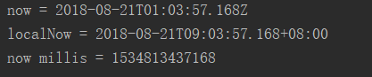

# Java8新特性
## 一、速度更快
1、HashMap，
2、ConcurrentHashMap的锁分段机制替换为CAS
3、内存优化：去掉JVM永久区，增加元空间

## 二、代码减少 -- Lambda表达式
### 1、新操作符 -> 和它的语法

**() -> {}**

 -> 表达式的两侧：

**左侧：lambda表达式的参数列表**--即接口方法的参数列表

**右侧：lambda表达式中需要执行的功能**

接口方法的方法实现

- 语法格式一：无参数，无返回值 

```java
Runnable r = () -> System.out.println("Hello lambda!");
r.run();
```

- 语法格式二：有参数，无返回值。只有一个参数小括号可以省略不写

如：(args) -> System.out.println(args)
```java
Consumer<String> con = (x) -> System.out.println(x);//省略括号con = x -> System.out.println(x);
con.accept("Hello");//print hello 
```

- 语法格式三：有参数、有返回值(多条语句)
```java
Comparator<Integer> c = (x,y) -> {
    System.out.println("函数式接口");
    return x-y;
};
int returnVal = c.compare(1,2);
//如果只有一条语句{}和return都可以省略
Comparator<Integer> c = (x,y) -> x-y;
```

- 语法格式四：参数列表的数据类型可以省略
JVM编译器可以根据上下文推断出参数的数据类型，即“类型推断”

**总结**：
上联：左右遇一括号省
下联：左侧推断类型省
横批：能省则省

### 2、lambda表达式需要函数式接口的支持

函数式接口：接口中只有一个抽象方法的接口，称为函数式接口。可以使用@FunctionalInterface注解检查是否是函数式接口

### 3、Java8 内置四大核心函数式接口

- Consumer<T> : 消费型接口
     void accept(T t)

- Supplier<T> : 供给型接口
     T get()
     
- Function<T,R> : 函数型接口
     R apply(T t)

- Predicate<T> : 断言型接口
     Boolean test(T t)

**举例**
```java
class Tester{
    @Test
    public void testPredicate() {
        List<String> oldList = new ArrayList<>();
        oldList.add("Jesse");
        oldList.add("Tom");
        oldList.add("Hello");
        List newList = filterStr(oldList, s -> s.length() > 3);
        System.out.println("oldList = " + oldList);//Jesse tom hello
        System.out.println("newList = " + newList);//Jesse Hello
    }
    
    //过滤字符串
    public List<String> filterStr(List<String> list, Predicate<String> predicate) {
        List<String> strlist = new ArrayList<String>();
        for (String s : list) {
            if (predicate.test(s)) {
                strlist.add(s);
            }
        }
        return strlist;
    }
}
```
### 4、方法和构造器引用

若lambda方法体中内容已经实现了，我们可以使用方法引用。
主要有三种语法：

- 对象::实例方法名
- 类::静态方法名
- 类::实例方法名

举例：
```java
public class TestMethodReference {
    @Test
    public void test1() {
        //Consumer consumer = x -> System.out.println(x);
        Consumer consumer = System.out::println;
        consumer.accept("Hello lambda!");
        //构造器引用
        Supplier<Person> supplier = Person::new;
        Person person = supplier.get();
    }
}
```
**要求**：函数式接口与被引用方法必须具有相同的参数列表和返回类型

## 三、强大的Stream API
### 1、认识Stream API

### 2、创建Stream
**创建Stream** : 

`CollectionImpls.stream()/parallelStream() `、 `Arrays.Stream()`、`Stream.of()`、`无限流stream.generate()/iterate()`

```java
public class TestStreamAPI {
    public void testGenerate() {
        //创建方式1：通过Collection系列集合的stream和parallelStream方法
        List<String> list = new ArrayList<>();
        Stream<String> stream = list.stream();
        //创建方式2：通过Arrays的静态方法stream获取数组流
        Stream<User> emps = Arrays.stream(new User[]{new User("001", "Jesse"), new User("002", "Tom")});
        //创建方式3：通过Stream.of();
        Stream<String> stream1 = Stream.of("AA", "BB", "CC", "DD");
        //创建方式4：Stream.iterate()/generate()创建无限流;
        Stream<Integer> stream2 = Stream.iterate(0, x -> x + 2);//（1）迭代
        Stream stream3 = Stream.generate(() -> Math.random());//（2）生成
    }
}
```
### 3、中间操作
**过滤（filter）、截断（limit）、跳过（skip）**

```java
public class TestStreamAPI{
    @Test
    public void testFilter() {
        Person[] people = new Person[]{
                new Person("Jesse", 12),
                new Person("Jessie", 16),
                new Person("Jessica", 20),
                new Person("Monica", 24),
                new Person("Mary",28),
                new Person("Mary",28),
                new Person("Maria",32)
        };
        
        Stream<Person> personStream = Arrays.stream(people).skip(2)//跳过前四个
            .distinct()//过滤相同
            .filter(person -> person.getAge() >= 18)//过滤18岁以下的未成年人
            .limit(3);//限制只找三个满足条件的元素
        personStream.forEach(System.out::println);
    }
}
```
**映射：**

map : 一个函数操作，应用到流中的每个元素上，并将其映射成一个新的元素。

flatMap : 一个函数操作，应用到流中的每个值（包含流中流的值）上，并将其映射成一个新的值，最后将所有的流连接成一个流。

```java
@Test
public void testFlatMap() {
    Stream<String> names = personList.stream().map(Person::getName);
    Stream<String> names2 = personList.stream().map(Person::getName);
    names.map(this::toUpperCharsStream)
            .forEach(System.out::println);//输出流
    names2.flatMap(this::toUpperCharsStream)
            .forEach(System.out::println);//输出字母
}
public Stream<Character> toUpperCharsStream(String s) {
    List<Character> list = new ArrayList<>();
    for (Character c : s.toCharArray()) {
        list.add(c >= 97 && c <= 122 ? (char) (c - 32) : c);
    }
    return list.stream();
}
```
排序：sorted、 sorted(Comparator<? super T> comparator)
```java
@Test
public void testSort() {
    Stream<Integer> ages = personList.stream().map(Person::getAge);
    Stream<Integer> ages2 = personList.stream().map(Person::getAge);
    System.out.println("---------自然排列的年龄---------");
    ages.sorted()
            .forEach(System.out::println);
    System.out.println("---------降序排列的年龄---------");
    ages2.sorted(Comparator.comparingInt(x -> -x))
            .forEach(System.out::println);
}
```
### 4、终止操作
查找与匹配：findAny findFirst max min count allMatch anyMatch noneMatch
```java
Optional<Employee> availableEmp = Arrays.stream(emps)
        .filter(employee -> Status.AVAILABLE.equals(employee.getStatus()))
        .findAny();
System.out.println("availableEmp = " + availableEmp);
boolean allBusy = Arrays.stream(emps).allMatch(employee -> employee.getStatus() == Status.BUSY);
System.out.println("allBusy = " + allBusy);
```
归约与收集：reduce,collect
```java
//归约
Stream<Integer> ages = personList.stream().map(Person::getAge);
Integer totalAge = ages.reduce(0, (x, y) -> x + y);
System.out.println("totalAge = " + totalAge);
//收集-将流转化为其他形式
List<String> names = employeeList.stream().map(Employee::getName).collect(Collectors.toList());
System.out.println("names = " + names);
//收集到特殊集合中
HashSet<String> strings = employeeList.stream().map(Employee::getName).collect(Collectors.toCollection(HashSet::new));
//总和、平均值、最大最小值、分组、分片...
Double totalSalary = employeeList.stream().collect(Collectors.summingDouble(Employee::getSalary);
Map<Status,List<Employee>> statusGroup = employeeList.stream().collect(Collectors.groupingBy(Employee::getStatus);
```
### 5、顺序流与并行流
Java8并行流使用类似ForkJoin框架的方式计算，极大地提高了超大任务的运行效率。
可以通过sequenceStream.parallel产生并行流，
```java
@Test
public void testParallel() {
    //一至一百亿的累加和
    Instant start = Instant.now();
    LongStream.rangeClosed(0, 10000000000L)
            .parallel()
            .reduce(0, Long::sum);
    Instant end = Instant.now();
    System.out.println("并行流耗费时间：" + Duration.between(start, end).toMillis()+"毫秒");

    Instant start1 = Instant.now();
    LongStream.rangeClosed(0, 10000000000L)
            .reduce(0, Long::sum);
    Instant end1 = Instant.now();
    System.out.println("顺序流耗费时间：" + Duration.between(start1, end1).toMillis()+"毫秒");
}
```
## 四、更好的并行机制

参见并行流

## 五、最大化减少空指针异常
### Optional类
Java8提供了一个Optional<T>容器类，代表一个值存在或不存在，原来用null表示一个值不存在，现在Optional可以更好的表达这个概念。并且可以避免空指针异常。

常用方法：

- Optional.of(T t):创建一个Optional的实例
- Optional.empty():创建一个空的Optional实例
- Optional.ofNullable(T t):若t不为null，创建Optional实例，否则创建空实例
- isPresent():判断是否包含值
- orElse(T t):如果调用对象包含值，返回该值，否则返回T
- orElseGet(Supplier s):如果调用对象包含值，返回该值，否则返回s产生的值
- map(Function f):如果有值对其处理，并返回处理后的Optional，否则返回Optional.empty()
- flatMap(Function mapper):与map类似，要求返回值必须是Optional
## 六、接口新特性
```java
/**
 * Java8中接口允许定义具有实现的方法。
 * 1、默认方法
 * 冲突：
 * ①与类实现方法冲突。类优先方法
 * ②与接口方法/类抽象方法冲突。必须实现该方法
 * 2、静态方法
 * 同类的静态方法。
 */
public interface Java8Interface {
    default void defaultMethod() {
        System.out.println("Hello interface default method");
    }

    static void staticMethod() {
        System.out.println("Hello static interface method");
    }
}
```
## 七、新的时间日期API
### 1、旧的时间日期API存在的问题。

①日期/时间类的定义并不一致，在java.util和java.sql的包中都有日期类，此外用于格式化和解析的类却在java.text包中定义。

②java.util.Date同时包含日期和时间，而java.sql.Date仅包含日期，将其纳入java.sql包并不合理。另外这两个类都有相同的名字，这本身就是一个非常糟糕的设计

③对于时间、时间戳、格式化以及解析，并没有一些明确定义的类。对于格式化和解析的需求，我们有java.text.DateFormat抽象类，但通常情况下，SimpleDateFormat类被用于此类需求。

④所有的日期类都是可变的，因此他们都不是线程安全的，这是Java日期类最大的问题之一。

⑤日期类并不提供国际化，没有时区支持，虽然引入了java.util.Calendar和java.util.TimeZone类，但他们同样存在上述所有的问题。

### 2、Java8时间日期的优点

- 不变性，线程安全：新的日期/时间API中，所有的类都是不可变的，这种设计有利于并发编程。
- 关注点分离：新的API将人可读的日期时间和机器时间（unix timestamp）明确分离，它为日期（Date）、时间（Time）、日期时间（DateTime）、时间戳（unix timestamp）以及时区定义了不同的类。
- 清晰：在所有的类中，方法都被明确定义用以完成相同的行为。举个例子，要拿到当前实例我们可以使用now()方法，在所有的类中都定义了format()和parse()方法，而不是像以前那样专门有一个独立的类。为了更好的处理问题，所有的类都使用了工厂模式和策略模式，一旦你使用了其中某个类的方法，与其他类协同工作并不困难。
- 实用操作：所有新的日期/时间API类都实现了一系列方法用以完成通用的任务，如：加、减、格式化、解析、从日期/时间中提取单独部分等操作。
- 可扩展性：新的日期/时间API是工作在ISO-8601日历系统上的，但我们也可以将其应用在非ISO的日历上。

### 3、新的时间日期的包结构

- **java.time**包：这是新的Java日期/时间API的基础包，所有的主要基础类都是这个包的一部分，如：LocalDate, LocalTime, LocalDateTime, Instant, Period, Duration等等。所有这些类都是不可变的和线程安全的，在大多数情况下，这些类足够应付常见需求。
- **java.time.chrono**包：这个包为非ISO的日历系统定义了一些泛化的API，我们可以扩展AbstractChronology类来创建自己的日历系统。
- **java.time.forma**t包：这个包包含能够格式化和解析日期时间对象的类，在绝大多数情况下，我们不应该直接使用它们，因为java.time包中相应的类已经提供了格式化和解析的方法。
- **java.time.temporal**包：这个包包含一些时态对象，我们可以用其找出关于日期/时间对象的某个特定日期或时间，比如说，可以找到某月的第一天或最后一天。你可以非常容易地认出这些方法，因为它们都具有“withXXX”的格式。
- **java.time.zone**包：这个包包含支持不同时区以及相关规则的类。

### 4、使用示例
#### ①本地时间

人可读时间

```java
public class TestLocalDataTime {
    @Test
    public void testLocalDataTime() {
        //localDate LocalTime LocalDateTime使用方法一模一样，这里使用LocalDateTime举例
        //1、创建对象
        LocalDateTime now = LocalDateTime.now();
        LocalDateTime ldt = LocalDateTime.of(2005, 10, 1, 13, 12, 11);
        //2、获取时间
        System.out.println("now = " + now);
        System.out.println("year = " + now.getYear());
        System.out.println("month = " + now.getMonthValue());
        System.out.println("dayOfMonth = " + now.getDayOfMonth());
        System.out.println("hour = " + now.getHour());
        System.out.println("minute = " + now.getMinute());
        System.out.println("second = " + now.getSecond());
        //3、日期操作
        LocalDateTime tenYearsAgo = now.minusYears(10);
        System.out.println("tenYearsAgo = " + tenYearsAgo);
        LocalDateTime twoWeeksInFuture = now.plusWeeks(2);
        System.out.println("twoWeeksInFuture = " + twoWeeksInFuture);
    }
}
```
#### ②时间戳

计算机时间（以Unix元年UTC时区：1970.01.01 00:00:00到某个时间的毫秒值）

```java
public class TestInstant {
    @Test
    public void test() {
        Instant now = Instant.now();
        System.out.println("now = " + now);
        OffsetDateTime localNow = now.atOffset(ZoneOffset.ofHours(8));
        System.out.println("localNow = " + localNow);
        System.out.println("now millis = " + now.toEpochMilli());
    }
}
```

打印结果



#### ③计算间隔

**时间间隔Duration**

```java
@Test
public void testDuration() {
    Instant now = Instant.now();
    Instant twoMinutesLater = Instant.now().plusSeconds(120);
    Duration duration = Duration.between(now, twoMinutesLater);
    System.out.println("duration = " + duration.getSeconds());
    System.out.println("millis between = " + duration.toMillis());
}
```
**日期间隔Period**
```java
@Test
public void testPeriod() {
    LocalDate now = LocalDate.now();
    LocalDate aWeekLater = now.plusWeeks(1);
    Period period = Period.between(now, aWeekLater);
    System.out.println("period = " + period.getDays());
}
```
#### ④时间矫正器

TemporalAdjuster

```java
LocalDateTime = now = LocalDateTime.now();
System.out.println("now = " + now);

LocalDateTime nextMonday = now.with(TemporalAdjusters.nextMonday());
System.out.println("nextMonday = " + nextDay);

//自定义:下一个工作日
LocalDateTime nextWeekDay = ldt.with((l)->{
    LocalDateTime ldt = (LocalDateTime)l;
    DayOfWeek day = ldt.getDayOfWeek();
    if(day.equals(DayOfWeek.FRIDAY)){
        return ldt.plusDays(3);
    }else if(day.equals(DayOfWeek.SATURDAY)){
        return ldt.plusDays(2);
    }else{
        return ldt.plusDays(1);
    }
});
```
#### ⑤时间格式化

```java
public class Tester{
    @Test
    public void testFormatter() {
        DateTimeFormatter dtf = DateTimeFormatter.ISO_DATE;
        LocalDateTime now = LocalDateTime.now();
        String formatted = now.format(dtf);
        System.out.println("formatted = " + formatted);

        DateTimeFormatter myPattern = DateTimeFormatter.ofPattern("yyyy/MM/dd HH:mm:ss");
        String time = now.format(myPattern);
        System.out.println("formatted = " + time);
        //日期字符串转时间
        LocalDateTime parse = LocalDateTime.parse(time,myPattern);
    }
}
```
#### ⑥时区

```java
public class ZoneTester{
     @Test
     public void testZone() {
         //打印支持的时区
         Set<String> zoneSet = ZoneId.getAvailableZoneIds();
         zoneSet.forEach(System.out::println);
         //东京时间
         LocalDateTime tokyoTime = LocalDateTime.now(ZoneId.of("Asia/Tokyo"));
         System.out.println("tokyoTime = " + tokyoTime);
         //2018-08-21T10:00:08.992+08:00[Asia/Shanghai]
         ZonedDateTime zoneNow = ZonedDateTime.now();
         System.out.println("zoneNow = " + zoneNow);
     }
 }
```
## 八、注解新特性
### **重复注解**

```java
@Repeatable(MyAnnotations.class)
@Target({ElementType.TYPE,ElementType.METHOD})
@Retention(RetentionPolicy.RUNTIME)
public @interface MyAnnotation {
    String value() default "hello";
}
@Target({ElementType.TYPE,ElementType.METHOD})
@Retention(RetentionPolicy.RUNTIME)
public @interface MyAnnotations {
    MyAnnotation[] value();
}

public class TestAnnotation {
    @MyAnnotation("Hello")
    @MyAnnotation("World")
    public void show(){}

    //通过反射获取我们的注解
    @Test
    public void test() throws NoSuchMethodException {
        Class<TestAnnotation> thisClass = TestAnnotation.class;
        Method show = thisClass.getMethod("show");

        MyAnnotation[] mas = show.getAnnotationsByType(MyAnnotation.class);
        for (MyAnnotation ma : mas) {
            System.out.println("ma = " + ma.value());
        }
    }
}
```
### **类型注解**

```java
/**
* target为TYPE_PARAMETER的注解可以修饰类型
*/
@Target({ElementType.TYPE_PARAMETER})
@Retention(RetentionPolicy.RUNTIME)
public @interface MyAnnotation {
    String value() default "hello";
}
```