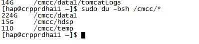

## 现象

磁盘空间告警了，空间利用率100%

```shell
df -lh
```


使用du命令查看查看实际文件占用239G，和磁盘容量1.5T相差甚远

```shell
du -bsh /cmcc/*
```



## 分析

百度了一下找到一篇文章，原因是当前系统存在大文件已经被删除（deleted），可是文件句柄并没有被释放的情况。

```shell
lsof | grep deleted
```


上图圈出来的一行代表存在大小为700G普通文件（`/cmcc/data1/log4x/hapNode1/failure/Audit/Audit.log`）

lsof命令输出的字段从左往右分别是

```text
COMMAND：进程的名称
PID：进程标识符
TID：线程ID。Linux 下 TID 为空表示该行为进程
USER：进程所有者
FD：文件描述符。主要有：
	cwd：应用程序当前工作目录，这是该应用程序启动的目录，除非它本身对这个目录进行更改
	txt：该类型的文件是程序代码，如应用程序二进制文件本身或共享库，如上列表中显示的 /sbin/init 程序
	lnn：库引用（AIX）
	err：FD 信息错误
	jld：监狱目录（FreeBSD）
	ltx：共享库文本（代码和数据）
	mxx：十六进制内存映射类型号 xx
	m86：DOS合并映射文件
	mem：内存映射文件
	mmap：内存映射设备
	pd：父目录
	rtd：根目录
	tr：内核跟踪文件（OpenBSD）
	v86：VP/ix 映射文件
	0：标准输出
	1：标准输入
	2：标准错误
	文件描述符后一般还跟着文件状态模式：
	r：只读模式
	w：写入模式
	u：读写模式
	空格：文件的状态模式为 unknow，且没有锁定
	-：文件的状态模式为 unknow，且被锁定
	
	同时在文件状态模式后面，还跟着相关的锁：
	N：对于未知类型的 Solaris NFS 锁
	r：文件部分的读锁
	R：整个文件的读锁
	w：文件的部分写锁
	W：整个文件的写锁
	u：任何长度的读写锁
	U：用于未知类型的锁
	x：用于部分文件上的 SCO OpenServer Xenix 锁
	X：用于整个文件上的 SCO OpenServer Xenix 锁
	space：无锁
TYPE：文件类型。常见的文件类型有：
	REG：普通文件
	DIR：表示目录
	CHR：表示字符类型
	BLK：块设备类型
	UNIX：UNIX 域套接字
	FIFO：先进先出队列
	IPv4：IPv4 套接字
DEVICE：磁盘名称
SIZE：文件的大小或文件偏移量（以字节为单位）
NODE：索引节点
NAME：打开文件的确切名称
```

问题已经有答案了，因为系统中存在大文件已经删除，担还有程序引用文件句柄没有释放，导致当前占用的磁盘空间无法释放。

## 解决

解决办法有如下两种

> 1. 将当前线程进行重启，关闭线程，从而让句柄释放，释放空间
> 2. 找到指定的文件句柄，将当前文件句柄的大小设置为空

方案一需要重启应用，生产环境肯定不行，所以就只有采取方案二了

```
command pid 	tid	   user FD 	type device size 		 node 		name
java 	432391	455919 hap 1502r REG 8,16 	704094318592 768799199 /cmcc/data1/log4x/hapNode1/failure/Audit/Audit.log(deleted)
```

使用管道命令清空文件句柄

```shell
# > /proc/PID/fd/FD
> /proc/432391/fd/1502
```

