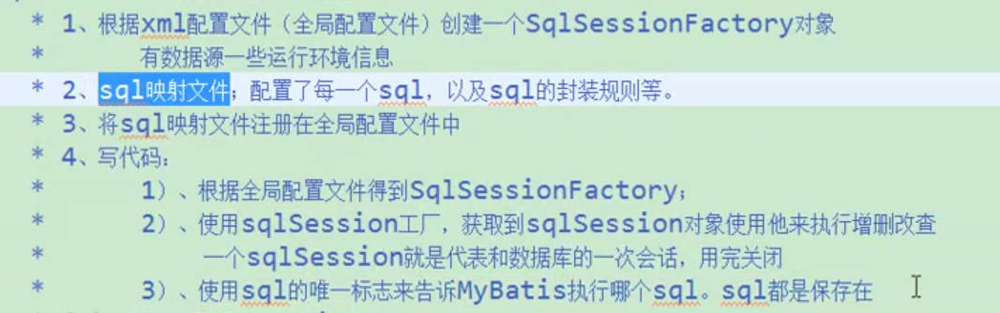

# MyBatis基础

## 一、一般步骤



#### 1、创建xml配置文件

```xml
<configuration>
    <environments default="development">
        <environment id="development">
            <transactionManager type="JDBC"/>
            <dataSource type="POOLED">
                <property name="driver" value="oracle.jdbc.driver.OracleDriver"/>
                <property name="url" value="jdbc:oracle:thin:@xxx.xxx.xxx.xxx:1521:ORCL"/>
                <property name="username" value="xxxx"/>
                <property name="password" value="xxxx"/>
            </dataSource>
        </environment>
    </environments>
    <mappers>
        <mapper resource="sqlmap/PersonMapper.xml"/>
    </mappers>
</configuration>
```

#### 2、根据配置文件创建SqlSessionFactory

```java
String resource = "mybatis_config.xml";
InputStream inputStream = null;
try {
    inputStream = Resources.getResourceAsStream(resource);
} catch (IOException e) {
    e.printStackTrace();
}
SqlSessionFactory sqlSessionFactory = new SqlSessionFactoryBuilder().build(inputStream);
```

#### 3、配置一个sql映射文件

```xml-dtd
<?xml version="1.0" encoding="UTF-8" ?>
<!DOCTYPE mapper
        PUBLIC "-//mybatis.org//DTD Mapper 3.0//EN"
        "http://mybatis.org/dtd/mybatis-3-mapper.dtd">
<mapper namespace="com.wangchuncheng.PersonMapper">
    <select id="selectPerson" resultType="com.wangchuncheng.beans.Person">
    SELECT "ID" id,"NAME" name,"GENDER" gender FROM JCJ.TEST_WCC_PERSON WHERE "ID" = #{id};
  </select>
</mapper>
```

#### 4、注册映射文件到全局配置文件

```xml
<configuration>
    ...
    <mappers>
        <mapper resource="sqlmap/PersonMapper.xml"/>
    </mappers>
    ...
</configuration>
```

#### 5、获取SqlSession并使用SqlSession来使用sql

```java
SqlSession sqlSession = sqlSessionFactory.openSession();//get sqlSession
Person person;
try {
    person = sqlSession.selectOne("selectPerson",1);//query
} finally {
    sqlSession.close();// close sqlSession is essential
}
...//now using person
```

#### 6、sql映射的另一种方式：接口式映射

除了使用步骤3的xml映射文件之外，MyBatis还支持接口式映射，并且我们推荐使用这种方式，因为这种方式有**安全的类型检查**。
##### （1）绑定配置文件(推荐)

不使用注解，绑定配置文件的sql语句。

①编写mapper接口

PersonMapper.class

```java
public interface PersonMapper {
    Person selectPerson(int id);
}
```

②绑定到映射文件PersonMapper.xml

```xml
<mapper namespace="com.wangchuncheng.mappers.PersonMapper">
    <select id="selectPerson" resultType="com.wangchuncheng.beans.Person">
        SELECT * FROM TEST_WCC_PERSON WHERE "ID" = #{id}
    </select>
</mapper>
```

③注册到配置文件

④使用mapper

```java
PersonMapper mapper = session.getMapper(PersonMapper.class);
Person person = mapper.selectPerson(101);
```

##### （2）基于注解（SQL语句复杂时不推荐）

①编写mapper接口

```java
public interface PersonMapper {
    @Select("SELECT * FROM person WHERE id = #{id}")
    Person selectPerson(int id);
}
```

②注册Mapper

```xml
<mappers>
    <!--<package name="com.wangchuncheng.mappers"/>--><!--批量-->
    <mapper class="com.wangchuncheng.mappers.PersonMapper"/>
</mappers>
```

③使用mapper

```java
PersonMapper mapper = session.getMapper(PersonMapper.class);
Person person = mapper.selectPerson(101);
```

对于简单语句来说，注解使代码显得更加简洁，**然而 Java 注解对于稍微复杂的语句就会力不从心并且会显得更加混乱，另外SQL和代码耦合在一起不利于维护**。因此，如果你需要做很复杂的事情，那么最好使用 XML 来映射语句。

## 二、MyBatis的几个重要概念

### 1、对象作用域与生命周期

#### SqlSessionFactoryBuilder

这个类可以被实例化、使用和丢弃，一旦创建了 SqlSessionFactory，就不再需要它了。因此  SqlSessionFactoryBuilder 实例的最佳作用域是**方法作用域**（也就是局部方法变量）。你可以重用  SqlSessionFactoryBuilder 来创建多个 SqlSessionFactory 实例，但是最好还是不要让其一直存在以保证所有的  XML 解析资源开放给更重要的事情。

#### SqlSessionFactory

SqlSessionFactory 一旦被创建就应该**在应用的运行期间一直存在**，没有任何理由对它进行清除或重建。使用  SqlSessionFactory 的最佳实践是在应用运行期间不要重复创建多次，多次重建 SqlSessionFactory  被视为一种代码“坏味道（bad smell）”。因此 SqlSessionFactory  的最佳作用域是**应用作用域**。有很多方法可以做到，最简单的就是使用单例模式或者静态单例模式。

#### SqlSession

每个线程都应该有它自己的 SqlSession 实例。**SqlSession  的实例不是线程安全的**，因此是**不能被共享**的，所以它的最佳的作用域**是请求或方法作用域**。绝对不能将 SqlSession  实例的引用放在一个类的静态域，甚至一个类的实例变量也不行。**也绝不能将 SqlSession 实例的引用放在任何类型的管理作用域中，比如  Servlet 架构中的 HttpSession**。如果你现在正在使用一种 Web 框架，要考虑 SqlSession 放在一个和 HTTP  请求对象相似的作用域中。换句话说，每次收到的 HTTP 请求，就可以打开一个  SqlSession，返回一个响应，就关闭它。这个关闭操作是很重要的，你应该把这个关闭操作放到 finally  块中以确保每次都能执行关闭。下面的示例就是一个确保 SqlSession 关闭的标准模式：

```java
SqlSession session = sqlSessionFactory.openSession();
try {
  // do work
} finally {
  session.close();
}
```

在你的所有的代码中一致性地使用这种模式来保证所有数据库资源都能被正确地关闭。 

#### 映射器实例（Mapper Instances）

映射器是一个你创建来绑定你映射的语句的接口。映射器接口的实例是从 SqlSession 中获得的。因此从技术层面讲，任何映射器实例的最大作用域是和请求它们的 SqlSession 相同的。尽管如此，映射器实例的最佳作用域是方法作用域。

### 2、接口式映射

原生:	dao 	====> daoImpl

mybatis: mapper	====> xxMapper.xml

**mapper接口无需编写实现类，与映射文件绑定后，MyBatis会为mapper接口生成代理对象**

### 3、两个重要的XML文件

MyBatis全局配置文件：包含数据源、连接池、事务管理。。。系统运行环境信息。

SQL映射文件：保存了所有SQL语句的映射信息。

## 三、全局配置文件

Batis 的配置文件包含了会深深影响 MyBatis 行为的设置（settings）和属性（properties）信息。文档的顶层结构如下： 

- Configuration 
  - [properties](#properties)
  - [settings](#settings)
  - [typeAliases](#typeAliases)
  - [typeHandlers](#typeHandlers)
  - [objectFactory](#objectFactory)
  - [plugins](#plugins)
  - [environments](#environments)
    - environment
      - [transationManager](#transationManager)
      - [dataSource](#datasource)
  - [databaseProvider](#databaseProvider)
  - [mappers](#mappers)

### properties

properties标签用于引入外部properties配置文件内容。有以下两种方式：

```xml
<properties resource="datasource.properties"></properties>
<properties url="D:\config\datasource.properties"></properties>
```

resource：引入类路径下的资源

URL：引入网络路径或者磁盘路径下的资源

**提示**：与Spring框架进行整合时，数据源一般由Spring管理。所以这个标签将很少用到。

### Settings

这是 MyBatis 中**极为重要**的调整设置 。典型的写法如下。

```xml
<settings>
    <setting name="mapUnderscoreToCamelCase" value="true"/>
    <setting name="cacheEnabled" value="true"/>
    ....
</settings>
```

这里有很多种设置参数，具体可查阅官方文档[settings](http://www.mybatis.org/mybatis-3/zh/configuration.html#settings)

### typeAliases

类型别名是为 Java 类型设置一个短的名字。它只和 XML 配置有关，存在的意义仅在于用来减少类完全限定名的冗余。 

```xml
<typeAliases>
  <typeAlias alias="Author" type="domain.blog.Author"/>
  <typeAlias alias="Blog" type="domain.blog.Blog"/>
  <typeAlias alias="Comment" type="domain.blog.Comment"/>
	...
</typeAliases>
```

也可以指定一个包名，MyBatis 会在包名下面搜索需要的 Java Bean，比如:         

```xml
<typeAliases>
  <package name="domain.blog"/>
</typeAliases>
```

每一个在包 `domain.blog` 中的 Java Bean**，在没有注解的情况下，会使用 Bean 的首字母小写的非限定类名来作为它的别名**。 比如 `domain.blog.Author` 的别名为 `author`；**若有注解，则别名为其注解值**。看下面的例子： 

```Java
@Alias("author")
public class Author {
    ...
}
```

**注意**：**别名不区分大小写**

内建别名:

> 基本类型是类型前加一个下划线：如int的别名为_int
>
> 包装类型是类名的全部小写形式：如BigInter的别名为biginteger

**注意**起别名的时候不要与这些内建别名相同

全部的内建别名可参考官方文档[typeAliases](http://www.mybatis.org/mybatis-3/zh/configuration.html#typeAliases)

### typeHandlers

Java与数据库之间的**类型转换**处理器。无论是 MyBatis 在预处理语句（PreparedStatement）中设置一个参数时，还是从结果集中取出一个值时， 都会用类型处理器将获取的值以合适的方式转换成 Java 类型。 

默认的类型处理器：参考官方文档[typeHandlers](http://www.mybatis.org/mybatis-3/zh/configuration.html#typeHandlers)

自定义类型处理器：参考官方文档[typeHandlers](http://www.mybatis.org/mybatis-3/zh/configuration.html#typeHandlers)

**提示** 从 3.4.5 开始，MyBatis 默认支持 JSR-310(日期和时间 API) ，JDK1.8支持。 

### objectFactory

MyBatis 每次创建结果对象的新实例时，它都会使用一个对象工厂（ObjectFactory）实例来完成。 默认的对象工厂需要做的仅仅是实例化目标类，要么通过默认构造方法，要么在参数映射存在的时候通过参数构造方法来实例化。 如果想覆盖对象工厂的默认行为，则可以通过创建自己的对象工厂来实现。参考官方文档[objectFactory](http://www.mybatis.org/mybatis-3/zh/configuration.html#objectFactory)

### plugins

MyBatis 允许你在已映射语句执行过程中的某一点进行拦截调用。默认情况下，MyBatis 允许使用插件来拦截的方法调用包括：         

- Executor (update, query, flushStatements, commit, rollback,  getTransaction, close, isClosed)  
- ParameterHandler (getParameterObject, setParameters)           
- ResultSetHandler (handleResultSets, handleOutputParameters)           
- StatementHandler (prepare, parameterize, batch, update, query)          

 参考官方文档[plugins](http://www.mybatis.org/mybatis-3/zh/configuration.html#plugins)

### environments

MyBatis 可以配置成适应多种环境，这种机制有助于将 SQL 映射应用于多种数据库之中 。

**不过要记住：尽管可以配置多个环境，每个 SqlSessionFactory 实例只能选择其一。** 

所以，如果你想连接两个数据库，就需要创建两个 SqlSessionFactory 实例，每个数据库对应一个。而如果是三个数据库，就需要三个实例，依此类推，记起来很简单： 

- **每个数据库对应一个 SqlSessionFactory 实例**

```java
SqlSessionFactory factory = new SqlSessionFactoryBuilder().build(reader, environment);//未指定环境参数，将加载默认环境
SqlSessionFactory factory = new SqlSessionFactoryBuilder().build(reader, environment, properties);//指定环境参数
```

典型的environment标签：

```xml
<environments default="development">
  <environment id="deployment">...</environment>
  <environment id="development">
    <transactionManager type="JDBC">
      ...
    </transactionManager>
    <dataSource type="POOLED">
      ...
    </dataSource>
  </environment>
</environments>
```

#### transationManager

事物管理器类型：

**JDBC**（JDBC TransactionFactory）

**MANAGED**（ManagedTransactionFactory）

**自定义事务管理器**：实现TransactionFactory接口.type指定为全类名

#### dataSource

数据源

type:数据源类型;

**UNPOOLED**(UnpooledDataSourceFactory) ：不使用连接池，这个数据源的实现只是每次被请求时打开和关闭连接 

**POOLED**(PooledDataSourceFactory) ： 这种数据源的实现利用“池”的概念将 JDBC 连接对象组织起来，避免了创建新的连接实例时所必需的初始化和认证时间。 这是一种使得并发 Web 应用快速响应请求的流行处理方式。 

**JNDI**(JndiDataSourceFactory) ：这个数据源的实现是为了能在如 EJB 或应用服务器这类容器中使用，容器可以集中或在外部配置数据源，然后放置一个 JNDI 上下文的引用 

**自定义数据源**：实现DataSourceFactory接口，type是全类名

 参考官方文档[environments](http://www.mybatis.org/mybatis-3/zh/configuration.html#environments)

### databaseProvider

用于支持多数据库厂商。

①配置databaseIdProvider

```xml
<!--DB_VENDOR是VendorDatabaseIdProvider的别名-->
<databaseIdProvider type="DB_VENDOR" >
    <!--为不同厂商起别名-->
	<property name"MySQL" value="mysql"/>
    <property name"Oracle" value="oracle"/>
    <property name"SQL Server" value="sqlserver"/>
</databaseIdProvider>
```

这里的 DB_VENDOR 会通过 `DatabaseMetaData#getDatabaseProductName()` 返回的字符串进行设置。 由于通常情况下这个字符串都非常长而且相同产品的不同版本会返回不同的值，所以最好通过设置属性别名来使其变短 

②映射文件中使用

使用时在映射文件中sql标签上使用databaseId属性指定语句适用的数据库

```xml
<select id="selectPersonByName"
        resultType="com.wangchuncheng.beans.Person"
        databaseId="oracle">
    SELECT * FROM TEST_WCC_PERSON WHERE "NAME" = #{name}
</select>
<select id="selectPersonByName"
        resultType="com.wangchuncheng.beans.Person"
        databaseId="mysql">
    SELECT * FROM person WHERE "NAME" = #{name}
</select>
```

### mappers

既然 MyBatis 的行为已经由上述元素配置完了，我们现在就要定义 SQL 映射语句了。但是首先我们需要告诉 MyBatis 到哪里去找到这些语句 。 Java 在自动查找这方面没有提供一个很好的方法，所以最佳的方式是告诉 MyBatis 到哪里去找映射文件。 

- 相对于类路径的资源引用resource

```xml
<mappers>
  <mapper resource="org/mybatis/builder/AuthorMapper.xml"/>
  <mapper resource="org/mybatis/builder/BlogMapper.xml"/>
  <mapper resource="org/mybatis/builder/PostMapper.xml"/>
</mappers>
```

- 使用完全限定资源定位符URL

```xml
<mappers>
  <mapper url="file:///var/mappers/AuthorMapper.xml"/>
  <mapper url="file:///var/mappers/BlogMapper.xml"/>
  <mapper url="file:///var/mappers/PostMapper.xml"/>
</mappers>
```

- 使用映射器接口实现类的完全限定名class

```xml
<mappers>
  <mapper class="org.mybatis.builder.AuthorMapper"/>
  <mapper class="org.mybatis.builder.BlogMapper"/>
  <mapper class="org.mybatis.builder.PostMapper"/>
</mappers>
```

- 将包内的映射器接口实现全部注册为映射器package

```xml
<mappers>
  <package name="org.mybatis.builder"/>
</mappers>
```

## 四、XML映射文件

MyBatis 的真正强大在于它的映射语句，也是它的魔力所在。由于它的异常强大，映射器的 XML  文件就显得相对简单。如果拿它跟具有相同功能的 JDBC 代码进行对比，你会立即发现省掉了将近 95% 的代码。MyBatis 就是针对 SQL  构建的，并且比普通的方法做的更好。

SQL 映射文件有很少的几个顶级元素（按照它们应该被定义的顺序）：

- `cache` – 给定命名空间的缓存配置。         
- `cache-ref`– 其他命名空间缓存配置的引用。         
- `resultMap`  – 是最复杂也是最强大的元素，用来描述如何从数据库结果集中来加载对象。
- ~~`parameterMap`– 已废弃！老式风格的参数映射。内联参数是首选,这个元素可能在将来被移除，这里不会记录。~~ 
- `sql` – 可被其他语句引用的可重用语句块。         
- `insert`   – 映射插入语句         
- `update` – 映射更新语句         
- `delete` – 映射删除语句         
- `select` – 映射查询语句         

接下来看具体的元素。

### SELECT

```xml
<select id="selectPerson" parameterType="int" resultType="hashmap">
  SELECT * FROM PERSON WHERE ID = #{id}
</select>
```

SELECT元素的属性

| 属性             | 描述                                                         |
| ---------------- | ------------------------------------------------------------ |
| `id`             | 在命名空间中唯一的标识符，可以被用来引用这条语句。           |
| `parameterType`  | 将会传入这条语句的参数类的完全限定名或别名。这个属性是可选的，因为 MyBatis 可以通过 TypeHandler 推断出具体传入语句的参数，默认值为 unset。 |
| ~~parameterMap~~ | ~~这是引用外部 parameterMap 的已经被废弃的方法。使用内联参数映射和 parameterType 属性。~~ |
| `resultType`     | 从这条语句中返回的期望类型的类的完全限定名或别名。注意如果是集合情形，那应该是集合可以包含的类型，而不能是集合本身。使用 resultType 或 resultMap，但不能同时使用。 |
| `resultMap`      | 外部 resultMap 的命名引用。结果集的映射是 MyBatis 最强大的特性，对其有一个很好的理解的话，许多复杂映射的情形都能迎刃而解。使用 resultMap 或 resultType，但不能同时使用。 |
| `flushCache`     | 将其设置为 true，任何时候只要语句被调用，都会导致本地缓存和二级缓存都会被清空，默认值：false。 |
| `useCache`       | 将其设置为 true，将会导致本条语句的结果被二级缓存，默认值：对 select 元素为 true。 |
| `timeout`        | 这个设置是在抛出异常之前，驱动程序等待数据库返回请求结果的秒数。默认值为 unset（依赖驱动）。 |
| `fetchSize`      | 这是尝试影响驱动程序每次批量返回的结果行数和这个设置值相等。默认值为 unset（依赖驱动）。 |
| `statementType`  | STATEMENT，PREPARED 或 CALLABLE 的一个。这会让 MyBatis 分别使用 Statement，PreparedStatement 或 CallableStatement，默认值：PREPARED。 |
| `resultSetType`  | FORWARD_ONLY，SCROLL_SENSITIVE 或 SCROLL_INSENSITIVE 中的一个，默认值为 unset （依赖驱动）。 |
| `databaseId`     | 如果配置了 databaseIdProvider，MyBatis 会加载所有的不带 databaseId 或匹配当前 databaseId 的语句；如果带或者不带的语句都有，则不带的会被忽略。 |
| `resultOrdered`  | 这个设置仅针对嵌套结果 select 语句适用：如果为 true，就是假设包含了嵌套结果集或是分组了，这样的话当返回一个主结果行的时候，就不会发生有对前面结果集的引用的情况。这就使得在获取嵌套的结果集的时候不至于导致内存不够用。默认值：`false`。 |
| `resultSets`     | 这个设置仅对多结果集的情况适用，它将列出语句执行后返回的结果集并每个结果集给一个名称，名称是逗号分隔的。 |

### INSERT、UPDATE、DELETE

元素属性

| 属性               | 描述                                                         |
| ------------------ | ------------------------------------------------------------ |
| `id`               | 命名空间中的唯一标识符，可被用来代表这条语句。               |
| `parameterType`    | 将要传入语句的参数的完全限定类名或别名。这个属性是可选的，因为 MyBatis 可以通过 TypeHandler 推断出具体传入语句的参数，默认值为 unset。 |
| ~~`parameterMap`~~ | ~~这是引用外部 parameterMap 的已经被废弃的方法。使用内联参数映射和 parameterType 属性。~~ |
| `flushCache`       | 将其设置为 true，任何时候只要语句被调用，都会导致本地缓存和二级缓存都会被清空，默认值：true（对应插入、更新和删除语句）。 |
| `timeout`          | 这个设置是在抛出异常之前，驱动程序等待数据库返回请求结果的秒数。默认值为 unset（依赖驱动）。 |
| `statementType`    | STATEMENT，PREPARED 或 CALLABLE 的一个。这会让 MyBatis 分别使用 Statement，PreparedStatement 或 CallableStatement，默认值：PREPARED。 |
| `useGeneratedKeys` | （仅对 insert 和 update 有用）这会令 MyBatis 使用 JDBC 的 getGeneratedKeys 方法来取出由数据库内部生成的主键（比如：像 MySQL 和 SQL Server 这样的关系数据库管理系统的自动递增字段），默认值：false。 |
| `keyProperty`      | （仅对 insert 和 update 有用）唯一标记一个属性，MyBatis 会通过 getGeneratedKeys 的返回值或者通过 insert 语句的 selectKey 子元素设置它的键值，默认：`unset`。如果希望得到多个生成的列，也可以是逗号分隔的属性名称列表。 |
| `keyColumn`        | （仅对 insert 和 update 有用）通过生成的键值设置表中的列名，这个设置仅在某些数据库（像 PostgreSQL）是必须的，当主键列不是表中的第一列的时候需要设置。如果希望得到多个生成的列，也可以是逗号分隔的属性名称列表。 |
| `databaseId`       | 如果配置了 databaseIdProvider，MyBatis 会加载所有的不带 databaseId 或匹配当前 databaseId 的语句；如果带或者不带的语句都有，则不带的会被忽略 |

示例

```xml
<insert id="insertAuthor">
  insert into Author (id,username,password,email,bio)
  values (#{id},#{username},#{password},#{email},#{bio})
</insert>

<update id="updateAuthor">
  update Author set
    username = #{username},
    password = #{password},
    email = #{email},
    bio = #{bio}
  where id = #{id}
</update>

<delete id="deleteAuthor">
  delete from Author where id = #{id}
</delete>
```

### sql

这个元素可以被用来定义可**重用**的 SQL 代码段，可以包含在其他语句中。它可以被静态地(在加载参数) 参数化. 不同的属性值通过包含的实例变化. 比如

```xml
<sql id="userColumns"> ${alias}.id,${alias}.username,${alias}.password </sql>
```

这个 SQL 片段可以被包含在其他语句中，例如：

```xml
<select id="selectUsers" resultType="map">
  select
    <include refid="userColumns"><property name="alias" value="t1"/></include>,
    <include refid="userColumns"><property name="alias" value="t2"/></include>
  from some_table t1
    cross join some_table t2
</select>
```

属性值也可以被用在 include 元素的 refid 属性里或 include 内部语句中，例如

```xml
<!--属性值被用在include 内部语句-->
<sql id="sometable">
  ${prefix}Table
</sql>
<!--属性值被用在include元素refid中-->
<sql id="someinclude">
  from
    <include refid="${include_target}"/>
</sql>
<select id="select" resultType="map">
  select
    field1, field2, field3
  <include refid="someinclude">
    <property name="prefix" value="Some"/>
    <property name="include_target" value="sometable"/>
  </include>
</select>
<!--最终语句为
	SELECT field1, field2, field3 from SomeTable;
-->
```

### 参数（Parameters）

前面的所有语句中你所见到的都是简单参数的例子，实际上参数是 MyBatis 非常强大的元素，对于简单的做法，大概 90% 的情况参数都很少，比如:

```xml
<select id="selectUsers" resultType="User">
  select id, username, password
  from users
  where id = #{id}
</select>
```

上面的这个示例说明了一个非常简单的命名参数映射。参数类型被设置为 `int`，这样这个参数就可以被设置成任何内容。原生的类型或简单数据类型（比如整型和字符串）因为没有相关属性，它会完全用参数值来替代。然而，如果传入一个复杂的对象，行为就会有一点不同了。比如：

```xml
<insert id="insertUser" parameterType="User">
  insert into users (id, username, password)
  values (#{id}, #{username}, #{password})
</insert>
```

如果 User 类型的参数对象传递到了语句中，id、username 和 password 属性将会被查找，然后将它们的值传入预处理语句的参数中。这点相对于向语句中传参是比较好的，而且又简单，不过参数映射的功能远不止于此。

首先，像 MyBatis 的其他部分一样，参数也可以指定一个特殊的数据类型。

```c
//指定数据类型
#{property,javaType=int,jdbcType=NUMERIC}
//指定类处理器或别名
#{age,javaType=int,jdbcType=NUMERIC,typeHandler=MyTypeHandler}
//指定小数位数
#{height,javaType=double,jdbcType=NUMERIC,numericScale=2}
```

[更多高级用法](http://www.mybatis.org/mybatis-3/zh/sqlmap-xml.html#Parameters)

#### 字符串替换

默认情况下,使用 `#{}` 格式的语法会导致 MyBatis 创建 `PreparedStatement` 参数并安全地设置参数（就像使用 ? 一样）。这样做更安全，更迅速，通常也是首选做法，不过有时你就是想直接在 SQL 语句中插入一个不转义的字符串。比如，像 ORDER BY，你可以这样来使用：

```SQL
ORDER BY ${columnName}
```

这里 MyBatis 不会修改或转义字符串。 

**`NOTE`** 用这种方式接受用户的输入，并将其用于语句中的参数是不安全的，会导致潜在的 SQL 注入攻击，因此要么不允许用户输入这些字段，要么自行转义并检验。 

### Result Maps

`resultMap` 元素是 MyBatis 中最重要最强大的元素。它可以让你从 90% 的 JDBC `ResultSets` 数据提取代码中解放出来,并在一些情形下允许你做一些 JDBC 不支持的事情。实际上，在对复杂语句进行联合映射的时候，它很可能可以代替数千行的同等功能的代码。ResultMap 的设计思想是，简单的语句不需要明确的结果映射，而复杂一点的语句只需要描述它们的关系就行了。

简单映射语句示例,但没有明确的 resultMap。比如:

```xml
<select id="selectUsers" resultType="map">
  select id, username, hashedPassword
  from some_table
  where id = #{id}
</select>
```

上述语句只是简单地将所有的列映射到 HashMap 的键上，这由 resultType 属性指定。虽然在大部分情况下都够用，但是 HashMap 不是一个很好的领域模型。你的程序更可能会使用 JavaBean 或 POJO(Plain Old Java Objects，普通 Java 对象)作为领域模型。MyBatis 对两者都支持。
```xml
<select id="selectUsers" resultType="com.someapp.model.User">
select id, username, hashedPassword
from some_table
where id = #{id}
</select>
```

其中的User是一个JavaBea。select 语句中的列名会对应到下面这些属性上 。

```java
package com.someapp.model;
public class User {
  private int id;
  private String username;
  private String hashedPassword;
  
  public int getId() {
    return id;
  }
  public void setId(int id) {
    this.id = id;
  }
  public String getUsername() {
    return username;
  }
  public void setUsername(String username) {
    this.username = username;
  }
  public String getHashedPassword() {
    return hashedPassword;
  }
  public void setHashedPassword(String hashedPassword) {
    this.hashedPassword = hashedPassword;
  }
}
```

MyBatis 会在幕后自动创建一个 `ResultMap`，再基于属性名来映射列到 JavaBean 的属性上。如果列名和属性名没有精确匹配，可以在 SELECT 语句中对列使用别名（这是一个 基本的 SQL 特性）来匹配标签。比如：

```xml
<select id="selectUsers" resultType="User">
  select
    user_id             as "id",
    user_name           as "userName",
    hashed_password     as "hashedPassword"
  from some_table
  where id = #{id}
</select>
```

`ResultMap` 最优秀的地方在于，虽然你已经对它相当了解了，但是根本就不需要显式地用到他们。 上面这些简单的示例根本不需要下面这些繁琐的配置。 出于示范的原因，让我们来看看最后一个示例中，如果使用外部的 `resultMap` 会怎样，这也是解决列名不匹配的另外一种方式。

```xml
<resultMap id="userResultMap" type="User">
  <id property="id" column="user_id" />
  <result property="username" column="user_name"/>
  <result property="password" column="hashed_password"/>
</resultMap>
```

 引用它的语句使用 resultMap 属性就行了（**注意**我们去掉了 resultType 属性）。比如: 

```xml
<select id="selectUsers" resultMap="userResultMap">
  select user_id, user_name, hashed_password
  from some_table
  where id = #{id}
</select>
```

 如果世界总是这么简单就好了。 

[更多高级用法](http://www.mybatis.org/mybatis-3/zh/sqlmap-xml.html#Result_Maps)

### 自动映射

正如你在前面一节看到的，在简单的场景下，MyBatis可以替你自动映射查询结果。如果遇到复杂的场景，你需要构建一个result map。但是在本节你将看到，你也可以混合使用这两种策略。让我们到深一点的层面上看看自动映射是怎样工作的。

当自动映射查询结果时，MyBatis会获取sql返回的列名并在java类中查找相同名字的属性（忽略大小写）。这意味着如果Mybatis发现了*ID*列和*id*属性，Mybatis会将*ID*的值赋给*id*。

通常数据库列使用大写单词命名，单词间用下划线分隔；而java属性一般遵循驼峰命名法。为了在这两种命名方式之间启用自动映射，需要将 **`mapUnderscoreToCamelCase`**设置为true。 

自动映射甚至在特定的result map下也能工作。在这种情况下，对于每一个result map,所有的ResultSet提供的列，如果没有被手工映射，则将被自动映射。自动映射处理完毕后手工映射才会被处理。在接下来的例子中， *id* 和 *userName*列将被自动映射， *hashed_password* 列将根据配置映射。

```xml
<select id="selectUsers" resultMap="userResultMap">
  select
    user_id             as "id",
    user_name           as "userName",
    hashed_password
  from some_table
  where id = #{id}
</select>
```

```xml
<resultMap id="userResultMap" type="User">
  <result property="password" column="hashed_password"/>
</resultMap>
```

有三种自动映射等级：         

- `NONE` - 禁用自动映射。仅设置手动映射属性。           
- `PARTIAL` - 将自动映射结果除了那些有内部定义内嵌结果映射的(joins).           
- `FULL` - 自动映射所有。           

默认值是`PARTIAL`，这是有原因的。当使用`FULL`时，自动映射会在处理join结果时执行，并且join取得若干相同行的不同实体数据，因此这可能导致非预期的映射。

### 缓存

MyBatis 包含一个非常强大的查询缓存特性,它可以非常方便地配置和定制。MyBatis 3 中的缓存实现的很多改进都已经实现了,使得它更加强大而且易于配置。 默认情况下是没有开启缓存的,除了局部的 session 缓存,可以增强变现而且处理循环 依赖也是必须的。要**开启二级缓存**,你需要在你的 SQL 映射文件中添加一行:         

```xml
<cache/>
```

 字面上看就是这样。这个简单语句的效果如下:  

- 映射语句文件中的所有 select 语句将会被缓存。
- 映射语句文件中的所有 insert,update 和 delete 语句会刷新缓存。
- 缓存会使用 Least Recently Used(LRU,最近最少使用的)算法来收回。
- 根据时间表(比如 no Flush Interval,没有刷新间隔), 缓存不会以任何时间顺序 来刷新。
- 缓存会存储列表集合或对象(无论查询方法返回什么)的 1024 个引用。
-  缓存会被视为是 read/write(可读/可写)的缓存,意味着对象检索不是共享的,而 且可以安全地被调用者修改,而不干扰其他调用者或线程所做的潜在修改。           

​           **NOTE** The cache will only apply to statements declared in the mapping file where the cache tag is located. If you are using the Java API in conjunction with the XML mapping files, then statements declared in the companion interface will not be cached by default. You will need to refer to the  cache region using the @CacheNamespaceRef annotation.

 所有的这些属性都可以通过缓存元素的属性来修改。比如:  

```xml
<cache
  eviction="FIFO"
  flushInterval="60000"
  size="512"
  readOnly="true"/>
```

 这个更高级的配置创建了一个 FIFO 缓存,并每隔 60 秒刷新,存数结果对象或列表的 512 个引用,而且返回的对象被认为是只读的,因此在不同线程中的调用者之间修改它们会 导致冲突。

 可用的收回策略有: 

- `LRU` – 最近最少使用的:移除最长时间不被使用的对象。            
- `FIFO` – 先进先出:按对象进入缓存的顺序来移除它们。           
- `SOFT` – 软引用:移除基于垃圾回收器状态和软引用规则的对象。           
- `WEAK` – 弱引用:更积极地移除基于垃圾收集器状态和弱引用规则的对象。

默认的是 LRU。

 `flushInterval`(刷新间隔)可以被设置为任意的正整数,而且它们代表一个合理的毫秒 形式的时间段。默认情况是不设置,也就是没有刷新间隔,缓存仅仅调用语句时刷新。

` size`(引用数目)可以被设置为任意正整数,要记住你缓存的对象数目和你运行环境的 可用内存资源数目。默认值是 1024。

 `readOnly`(只读)属性可以被设置为 true 或 false。只读的缓存会给所有调用者返回缓 存对象的相同实例。因此这些对象不能被修改。这提供了很重要的性能优势。可读写的缓存 会返回缓存对象的拷贝(通过序列化) 。这会慢一些,但是安全,因此默认是 false。

#### 使用自定义缓存

 除了这些自定义缓存的方式, 你也可以通过实现你自己的缓存或为其他第三方缓存方案 创建适配器来完全覆盖缓存行为。         

```xml
<cache type="com.domain.something.MyCustomCache"/>
```

 这个示 例展 示了 如何 使用 一个 自定义 的缓 存实 现。type 属 性指 定的 类必 须实现 org.mybatis.cache.Cache 接口。这个接口是 MyBatis 框架中很多复杂的接口之一,但是简单 给定它做什么就行。         

```java
public interface Cache {
  String getId();
  int getSize();
  void putObject(Object key, Object value);
  Object getObject(Object key);
  boolean hasKey(Object key);
  Object removeObject(Object key);
  void clear();
}
```

 要配置你的缓存, 简单和公有的 JavaBeans 属性来配置你的缓存实现, 而且是通过 cache 元素来传递属性, 比如, 下面代码会在你的缓存实现中调用一个称为 “setCacheFile(String file)” 的方法:         

```xml
<cache type="com.domain.something.MyCustomCache">
  <property name="cacheFile" value="/tmp/my-custom-cache.tmp"/>
</cache>
```

​           你可以使用所有简单类型作为 JavaBeans 的属性,MyBatis 会进行转换。           And you can specify a placeholder(e.g. `${cache.file}`) to replace value defined at [configuration properties](http://www.mybatis.org/mybatis-3/zh/configuration.html#properties).         

 从3.4.2版本开始，MyBatis已经支持在所有属性设置完毕以后可以调用一个初始化方法。如果你想要使用这个特性，请在你的自定义缓存类里实现  `org.apache.ibatis.builder.InitializingObject` 接口。         

```java
public interface InitializingObject {
  void initialize() throws Exception;
}
```

 记得缓存配置和缓存实例是绑定在 SQL 映射文件的命名空间是很重要的。因此,所有 在相同命名空间的语句正如绑定的缓存一样。 语句可以修改和缓存交互的方式, 或在语句的 语句的基础上使用两种简单的属性来完全排除它们。默认情况下,语句可以这样来配置:         

```xml
<select ... flushCache="false" useCache="true"/>
<insert ... flushCache="true"/>
<update ... flushCache="true"/>
<delete ... flushCache="true"/>
```

 因为那些是默认的,你明显不能明确地以这种方式来配置一条语句。相反,如果你想改 变默认的行为,只能设置 flushCache 和 useCache 属性。比如,在一些情况下你也许想排除 从缓存中查询特定语句结果,或者你也许想要一个查询语句来刷新缓存。相似地,你也许有 一些更新语句依靠执行而不需要刷新缓存。

#### 参照缓存

 回想一下上一节内容, 这个特殊命名空间的唯一缓存会被使用或者刷新相同命名空间内 的语句。也许将来的某个时候,你会想在命名空间中共享相同的缓存配置和实例。在这样的 情况下你可以使用 cache-ref 元素来引用另外一个缓存。         

```xml
<cache-ref namespace="com.someone.application.data.SomeMapper"/>
```

## 五、动态SQL

六、JavaAPI

七、SQL语句构建器

八、日志