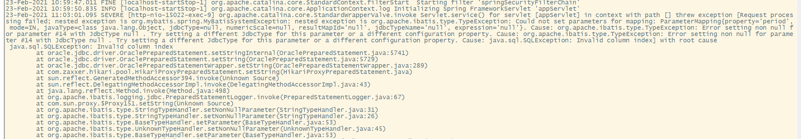
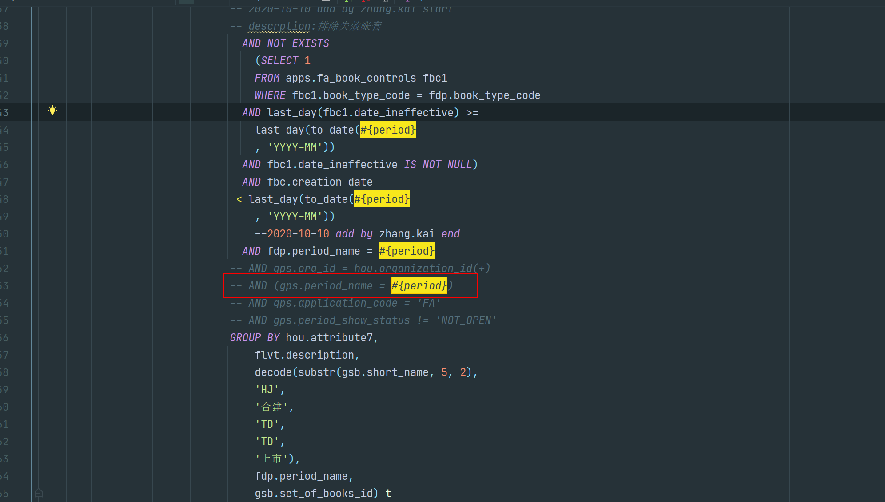

# 常见问题
## 日期数据错误

- 现象

产生截断没有时分秒

- 解决

类型映射时，jdbcType置空或者使用DATE和TIME以外的类型，DATE只有日期，TIME只有时间

## SQL注释引起的问题

### 参数装配

- 现象

某一个SQL在执行期间报错，错误信息如下

- 解决思路

1.检查函数调用是否存在参数不全

2.手动替换变量，单独执行这个SQL，没有报错

3.检查需要参数替换地方，发现问题

- 回顾

Mapper中尽量不要写诸如`--`和`\* *\`这类的注释，应该用xml注释替换，`<!-- -->`

### PageHelper失效

如果末尾有注释，插件在拼接LIMIT 语句时没有换行，会导致分页语句被注释