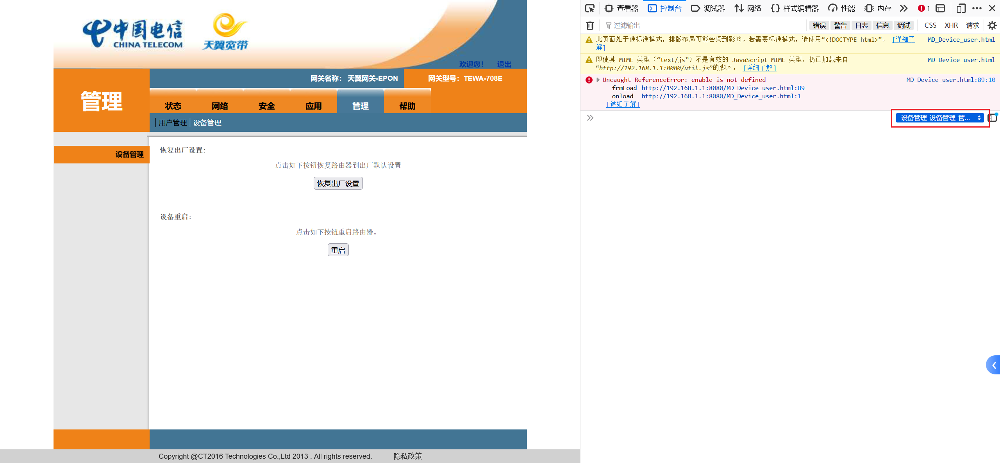
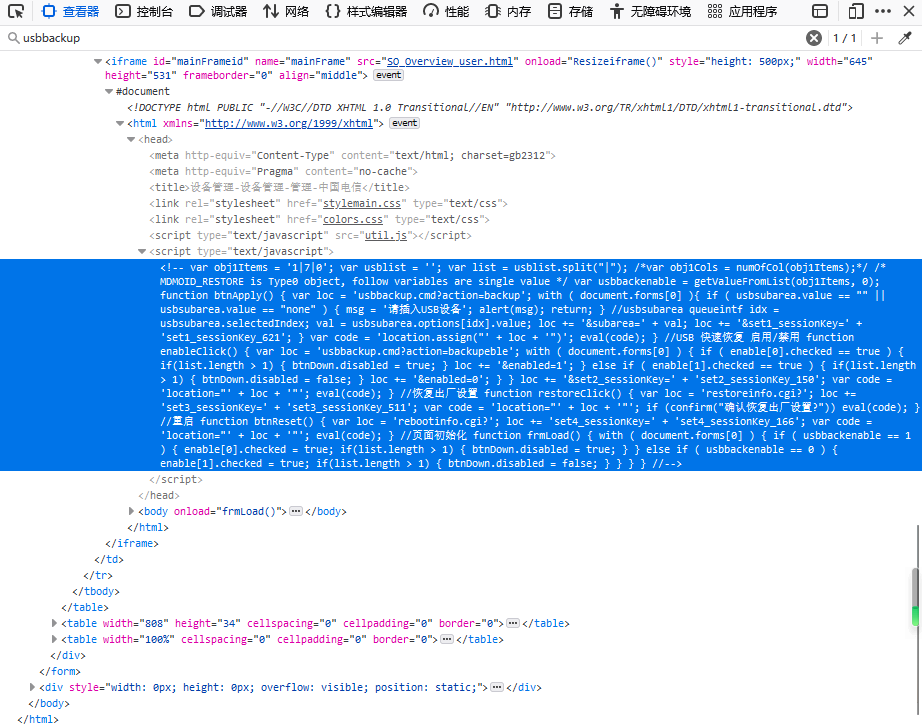
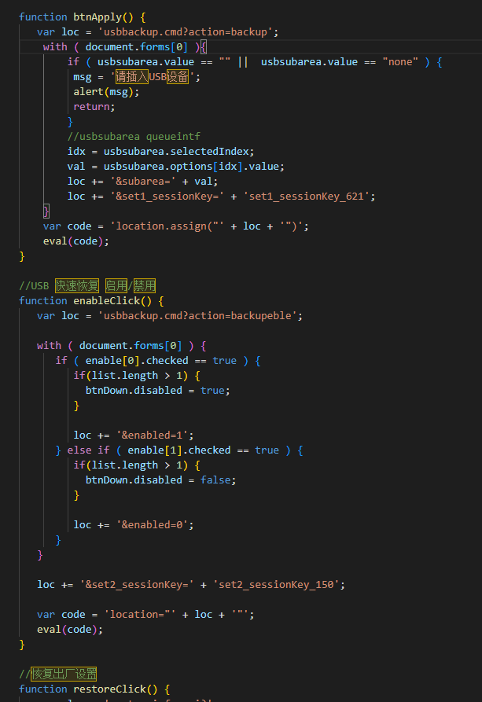
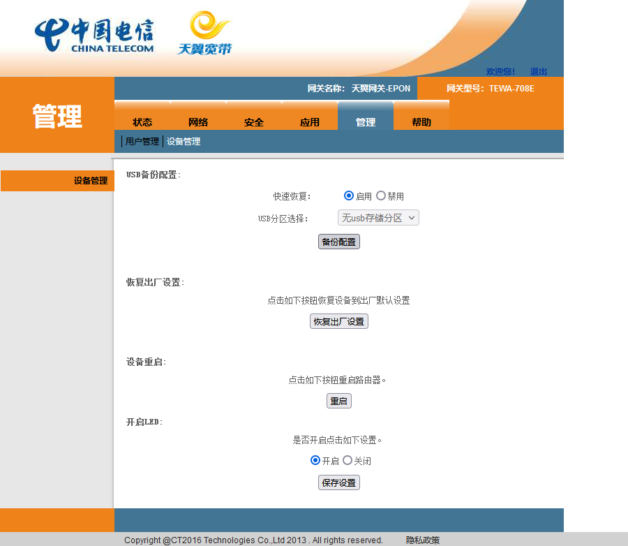
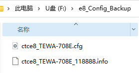
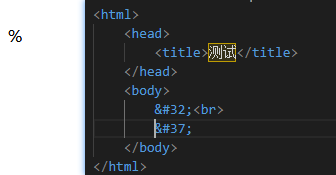
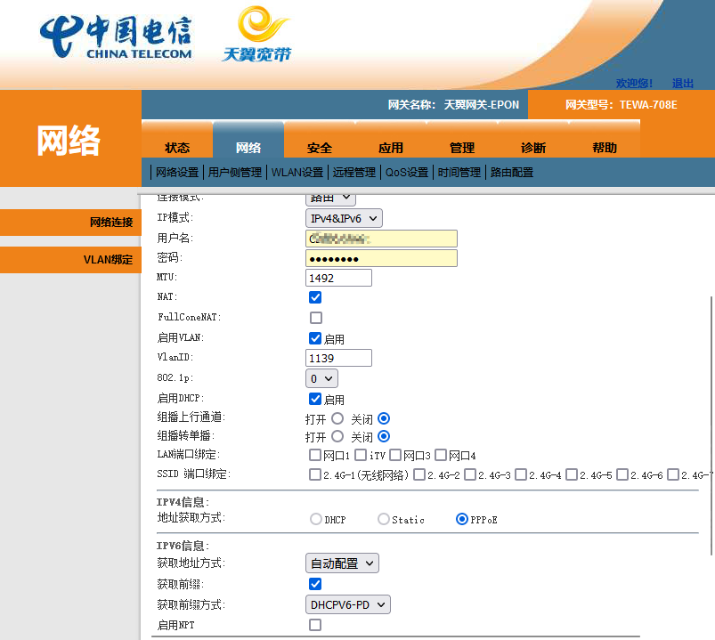

# 破解电信宽带超管密码（TEWA-708E，解决IPv6无法外部访问的问题）

## 背景

我需要在家里架设基于IPv6的服务器，但是通过光猫拨号获取的IPv6地址无法通过外部(公网)访问，联系电信工程师无果后，决定自己干。

[电信光纤ipv6-- 搭建属于自己的服务器](https://blog.csdn.net/lihong8879/article/details/115919090)

网上找到这篇文章，其中提到了光猫以桥接模式运行，使用自己的路由器拨号。但是使用光猫背面的ip账号密码访问网关8080端口后，却没有那个操作页面。百度一番之后才知道，**原来光猫背面提供的密码普通管理员密码，还有一个更高权限的超管密码的存在**。本文主要解决获取超管密码的问题。

最终实现通过自己的路由器拨号上网，解决了

不过现在出现了新的问题：

1、出现速度降低的问题，光猫拨号网速是300Mbps，而路由器拨号是100Mbps

2、拨号有概率会断，重新拨号后ipv6地址会变化。打算尝试WAN口使用固定IP观察一段时间看看

有懂的朋友欢迎指导一下

## 步骤

> Note
>
> 本教程基于天翼网关3.0（TEWA-708E），软件版本为2020年的版本。型号不同，版本不一样会有很大差异
>
> 本文参考了[破解光猫超级管理员密码（网关型号：TEWA-708E）](https://zhuanlan.zhihu.com/p/345516911)一文，但是具体步骤存在较大差异（应该软件版本不一致导致的）

1、准备一个U盘插入光猫，大小无所谓 格式化为FAT32文件系统

2、以普通管理员模式登陆管理系统。默认密码写在猫屁股上，浏览器输入http://192.168.1.1:8080进入普通管理员后台

2.1 点击管理设备管理

2.2 按F12调出浏览器控制台（这里以火狐为例），**选择DOM对象为设备管理的子页面**（右侧红框，不同浏览器不一样）




3、选择查看器，搜索**usbbackup**，找到一段JavaScript脚本



把这段脚本复制出来格式化之后就如下图（部分代码），有点前端基础应该都看得懂，甚至还有注释（好习惯）



​	读懂这段代码之后就知道该咋办了

4、切换到控制台，执行以下4行代码即可完成路由器配置导出

```javascript
var enable = [{"checked":true}];
var btnDown={"disabled":false};
enableClick();
btnApply();
```

​	其实第三行（`enableClick()`）执行完成之后就可以看到隐藏按钮出来了，如下图，最后一行代码就是备份配置（这个按钮可能是禁用状态）



5、取下U盘，可以看到里面有`.cfg`结尾的文件，这时用文本编辑器打开是乱码的，不可读



6、根据参考文档的方法下载工具解码

​	下载地址[routerpassview](https://link.zhihu.com/?target=http%3A//www.nirsoft.net/utils/router_password_recovery.html)

7、在解密后文件内找到TeleComAccount，对应的Password内即为超密

​	这里的超管密码可能存在特殊字符，例如`&#32;`和`&#37;`，写一个简单的html，通过浏览器打开渲染出来是空格和百分号，如下图左边所示



​	替换相关编码成对应的字符后，使用此密码登陆后，出现的页面就不一样了，增加了一些选项。如下图的网络连接之前就没有

​	至此终于找到了修改光猫为桥接模式的入口



## 完