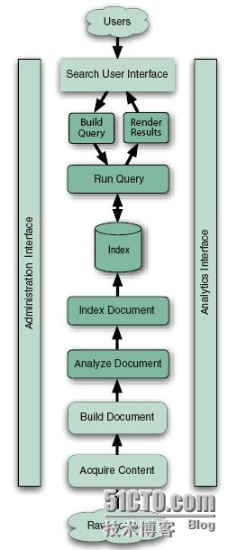
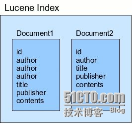
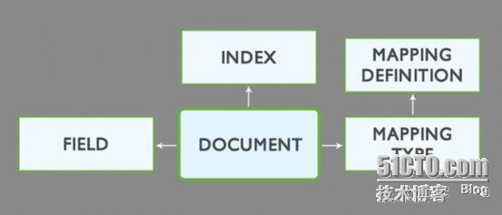
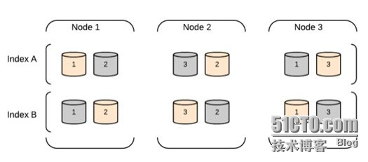
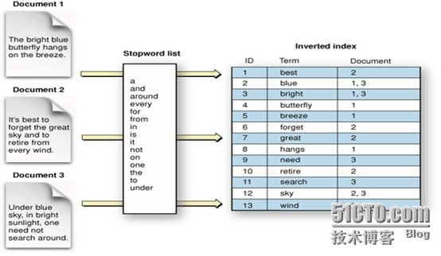

[TOC]

## 一、关于搜索引擎

  各位知道，搜索程序一般由索引链及搜索组件组成。

  索引链功能的实现需要按照几个独立的步骤依次完成：检索原始内容、根据原始内容来创建对应的文档、对创建的文档进行索引。

  搜索组件用于接收用户的查询请求并返回相应结果，一般由用户接口、构建可编程查询语句的方法、查询语句执行引擎及结果展示组件组成。

  如图所示。

  著名的开源程序Lucene是为索引组件，它提供了搜索程序的核心索引和搜索模块，例如图中的“Index”及下面的部分；而ElasticSearch则更像一款搜索组件，它利用Lucene进行文档索引，并向用户提供搜索组件，例如“Index”上面的部分。二者结合起来组成了一个完整的搜索引擎。

 

## 二、索引组件

  索引是一种数据结构，它允许对存储在其中的单词进行快速随机访问。当需要从大量文本中快速检索文本目标时，必须首先将文本内容转换成能够进行快速搜索的格式，以建立针对文本的索引数据结构，此即为索引过程。

  它通常由逻辑上互不相关的几个步骤组成。

 

###   第一步：获取内容。

  过网络爬虫或蜘蛛程序等来搜集及界定需要索引的内容。Lucene并不提供任何获取内容的组件，因此，需要由其它应用程序负责完成这一功能，例如著名的开源爬虫程序Solr、Nutch、Grub及Aperture等。必要时，还可以自行开发相关程序以高效获取自有的特定环境中的数据。获取到的内容需要建立为小数据块，即文档(Document)。

 

###   **第二步：建立文档。**

  获取的原始内容需要转换成专用部件(文档)才能供搜索引擎使用。

  一般来说，一个网页、一个PDF文档、一封邮件或一条日志信息可以作为一个文档。文档由带“值(Value)”的“域(Field)”组成，例如标题(Title)、正文(body)、摘要(abstract)、作者(Author)和链接(url)等。不过，二进制格式的文档处理起来要麻烦一些，例如PDF文件。

对于建立文档的过程来说有一个常见操作：向单个的文档和域中插入加权值，以便在搜索结果中对其进行排序。权值可在索引操作前静态生成，也可在搜索期间才动态生成。权值决定了其搜索相关度。

 

###   **第三步：文档分析。**

  搜索引擎不能直接对文本进行索引，确切地说，必须首先将文本分割成一系列被称为语汇单元(token)的独立原子元素，此过程即为文档分析。每个token大致能与自然语言中的“单词”对应起来，文档分析就是用于确定文档中的文本域如何分割成token序列。

  此即为切词，或分词。

  文档分析中要解决的问题包括如何处理连接一体的各个单词、是否需要语法修正(例如原始内容存在错别字)、是否需要向原始token中插入同义词(例如laptop和notebook)、是否需要将大写字符统一转换为小写字符，以及是否将单数和复数格式的单词合并成同一个token等。这通常需要词干分析器等来完成此类工作，Lucene提供了大量内嵌的分析器，也支持用户自定义分析器，甚至联合Lucene的token工具和过滤器创建自定义的分析链。

 

###   第四步：文档索引

  在索引步骤中，文档将被加入到索引列表。事实上，Lucene为此仅提供了一个非常简单的API，而后自行内生地完成了此步骤的所有功能。

 

  接下来，我们说搜索组件。

  索引处理就是从索引中查找单词，从而找到包含该单词的文档的过程。搜索质量主要由查准率(Precision)和查全率(Recall)两个指标进行衡量。查准率用来衡量搜索系列过滤非相关文档的能力，而查全率用来衡量搜索系统查找相关文档的能力。

  另外，除了快速搜索大量文本和搜索速度之后，搜索过程还涉及到了许多其它问题，例如单项查询、多项查询、短语查询、通配符查询、结果ranking和排序，以及友好的查询输入方式等。这些问题的解决，通常需要多个组件协作完成。

####    1、用户搜索界面

  UI(User Interface)是搜索引擎的重要组成部分，用户通过搜索引擎界面进行搜索交互时，他们会提交一个搜索请求，该请求需要先转换成合适的查询对象格式，以便搜索引擎能执行查询。

####    2、建立查询

  户提交的搜索请求通常以HTML表单或Ajax请求的形式由浏览器提交到搜索引擎服务器，因此，需要事先由查询解析器一类的组件将这个请求转换成搜索引擎使用的查询对象格式。

####    3、搜索查询

  当查询请求建立完成后，就需要查询检索索引并返回与查询语句匹配的并根据请求排好序的文档。搜索查询组件有着复杂的工作机制，它们通常根据搜索理论模型执行查询操作。常见的搜索理论模型有纯布尔模型、向量空间模型及概率模型三种。Lucene采用了向量空间模型和纯布尔模型。

####    4、展现结果

  查询获得匹配查询语句并排好序的文档结果集后，需要用直观、经济的方式为用户展现结果。UI也需要为后续的搜索或操作提供清晰的向导，如完善搜索结果、寻找与匹配结果相似的文档、进入下一页面等。

 

## 三、Lucene

  Lucene是一款高性能的、可扩展的信息检索（IR）工具库，是由Java语言开发的成熟、自由开源的搜索类库，基于Apache协议授权。Lucene只是一个软件类库，如果要发挥Lucene的功能，还需要开发一个调用Lucene类库的应用程序。

  文档是Lucene索引和搜索的原子单位，它是包含了一个或多个域的容器，而域的值则是真正被搜索的内容。每个域都有其标识名称，通常为一个文本值或二进制值。将文档加入索引中时，需要首先将数据转换成Lucene能识别的文档和域，域值是被搜索的对象。例如，用户输入搜索内容“title:elasticsearch”时，则表示搜索“标题”域值中包含单词“elasticsearch”的所有文档。

  都是文字，大家可能看的眼花。参考一幅从互联网上获取的图片吧。

 

  如前所述，ElasticSearch在底层利用Lucene完成其索引功能，因此其许多基本概念源于Lucene。

 

## 四、ES的基本概念

###  索引(Index)

  ES将数据存储于一个或多个索引中，索引是具有类似特性的文档的集合。类比传统的关系型数据库领域来说，索引相当于SQL中的一个数据库，或者一个数据存储方案(schema)。索引由其名称(必须为全小写字符)进行标识，并通过引用此名称完成文档的创建、搜索、更新及删除操作。一个ES集群中可以按需创建任意数目的索引。

 

###  类型(Type)

  类型是索引内部的逻辑分区(category/partition)，然而其意义完全取决于用户需求。因此，一个索引内部可定义一个或多个类型(type)。一般来说，类型就是为那些拥有相同的域的文档做的预定义。例如，在索引中，可以定义一个用于存储用户数据的类型，一个存储日志数据的类型，以及一个存储评论数据的类型。类比传统的关系型数据库领域来说，类型相当于“表”。

 

###  文档(Document)

  文档是Lucene索引和搜索的原子单位，它是包含了一个或多个域的容器，基于JSON格式进行表示。文档由一个或多个域组成，每个域拥有一个名字及一个或多个值，有多个值的域通常称为“多值域”。每个文档可以存储不同的域集，但同一类型下的文档至应该有某种程度上的相似之处。

  三者关系，如图中所示。

 

###  映射(Mapping)

  ES中，所有的文档在存储之前都要首先进行分析。用户可根据需要定义如何将文本分割成token、哪些token应该被过滤掉，以及哪些文本需要进行额外处理等等。另外，ES还提供了额外功能，例如将域中的内容按需排序。事实上，ES也能自动根据其值确定域的类型。

 

###  节点(Node)

   运行了单个实例的ES主机称为节点，它是集群的一个成员，可以存储数据、参与集群索引及搜索操作。类似于集群，节点靠其名称进行标识，默认为启动时自动生成的随机Marvel字符名称。用户可以按需要自定义任何希望使用的名称，但出于管理的目的，此名称应该尽可能有较好的识别性。节点通过为其配置的ES集群名称确定其所要加入的集群。

 

###  分片(Shard)和副本(Replica)

   ES的“分片(shard)”机制可将一个索引内部的数据分布地存储于多个节点，它通过将一个索引切分为多个底层物理的Lucene索引完成索引数据的分割存储功能，这每一个物理的Lucene索引称为一个分片(shard)。每个分片其内部都是一个全功能且独立的索引，因此可由集群中的任何主机存储。创建索引时，用户可指定其分片的数量，默认数量为5个。 

 

  Shard有两种类型：primary和replica，即主shard及副本shard。Primary shard用于文档存储，每个新的索引会自动创建5个Primary shard，当然此数量可在索引创建之前通过配置自行定义，不过，一旦创建完成，其Primary shard的数量将不可更改。Replica shard是Primary Shard的副本，用于冗余数据及提高搜索性能。每个Primary shard默认配置了一个Replica shard，但也可以配置多个，且其数量可动态更改。ES会根据需要自动增加或减少这些Replica shard的数量。

  ES集群可由多个节点组成，各Shard分布式地存储于这些节点上。

ES可自动在节点间按需要移动shard，例如增加节点或节点故障时。简而言之，分片实现了集群的分布式存储，而副本实现了其分布式处理及冗余功能。

  如图所示。

 

  ElasticSearch的RESTful API通过tcp协议的9200端口提供，可通过任何趁手的客户端工具与此接口进行交互，这其中包括最为流行的curl。curl与ElasticSearch交互的通用请求格式如下面所示。

`   ``curl -X<VERB> ``'<PROTOCOL>://<HOST>/<PATH>?<QUERY_STRING>'` `-d ``'<BODY>'` 			

1.`VERB：HTTP协议的请求方法，常用的有GET、POST、PUT、HEAD以及DELETE；` 			

2.`PROTOCOL：协议类型，http或https；` 			

3.`HOST：ES集群中的任一主机的主机名；` 			

4.`PORT：ES服务监听的端口，默认为9200；` 			

5.`QUERY_STRING：查询参数，例如?pretty表示使用易读的JSON格式输出；` 			

6.`BODY：JSON格式的请求主体；`

  

  例如，查看ElasticSearch工作正常与否的信息。

`~]$ curl ``'http://localhost:9200/?pretty'` 

  与ElasticSearch集群交互时，其输出数据均为JSON格式，多数情况下，此格式的易读性较差。cat API会在交互时以类似于Linux上cat命令的格式对结果进行逐行输出，因此有着较JSON好些的可读性。调用cat API仅需要向“_cat”资源发起GET请求即可。具体使用方法请查阅官方文档。

  另外，ES集群的CRUD操作也非常容易进行，朋友们参考官方文档即可。

###  管道(Pipeline)

**一组串行处理的集合**。包括多个有先后处理顺序的Processor

#### Processors

| 管道处理器                  | 处理器名称           |
| --------------------------- | -------------------- |
| HTML Strip Processor        | 小写处理器           |
| Uppercase Processor         | 大写处理器           |
| Trim Processor              | 空符号处理器         |
| Set Processor               | 设置参数处理器       |
| Bytes Processor             | 字节处理器           |
| Convert Processor           | 类型转换处理器       |
| Date Processor              | 日期转换处理器       |
| JSON Processor              | JSON对象转换处理器   |
| URL Decode Processor        | URL解码处理器        |
| Dissect Processor           | 数据解析处理器       |
| Dot Expander Processor      | 点扩展解析处理器     |
| GeoIP Processor             | IP解析处理器         |
| Grok Processor              | Grok解析处理器       |
| Gsub Processor              | Gsub解析处理器       |
| KV Processor                | 键值对解析处理器     |
| Append Processor            | 数据追加处理器       |
| Join Processor              | 拼接处理器           |
| Split Processor             | 分割处理器           |
| Sort Processor              | 排序处理器           |
| Date Index Name Processor   | 日期类索引定位处理器 |
| Drop Processor              | 降级处理器           |
| Fail Processor              | 故障处理             |
| Foreach Processor           | 循环处理             |
| Pipeline Processor          | 管道委托             |
| Remove Processor            | 移除处理器           |
| Rename Processor            | 重命名处理器         |
| Script Processor            | 脚本处理器           |
| Set Security User Processor | 设置安全用户处理器   |
| User Agent processor        | 用户代理处理器       |

## 五、ES中的数据查询简介

  需要注意的是，文档中每个域的值可能会存储为特定类型，而非字符串类型，因此，_all域的索引方式与特域的索引方式未必完全相同。

  文档中，域的数据存储时支持“string”、“numbers”、“Booleans”和“dates”几种类型，不同类型的数据在索引时是略有区别的。在创建文档时，Elasticsearch会通过检查域的值来动态为其创建mapping，可通过Mapping API来查看type的mapping，其访问端点是_mapping。

 

  下面，我们聊一个麻烦一点的问题，ES的精确值、full-text及倒排索引。

  精确值(Exact values)就是指数据未曾加工过的原始值，而Full-text则用于引用文本中的数据。在查询中，精确值是很容易进行搜索的，但full-text则需要判断文档在“多大程度上”匹配查询请求，换句话讲，即需要评估文档与给定查询的相关度(relevant)。因此，所谓的full-text查询通常是指在给定的文本域内部搜索指定的关键字，但搜索操作该需要真正理解查询者的目的。

 

 **例如：**
   (1) 搜索“UK”应该返回包含“United Kingdom”的相关文档；
   (2) 搜索“jump”应该返回包含“JUMP”、“jumped”、“jumps”、“jumping”甚至是“leap”的文档；
   (3) 搜索“johnny walker”应该匹配包含“Johnnie Walker”的文档；

 

  为了完成此类full-text域的搜索，ES必须首先分析文本并将其构建成为倒排索引(inverted index)，倒排索引由各文档中出现的单词列表组成，列表中的各单词不能重复且需要指向其所在的各文档。因此，为了创建倒排索引，需要先将各文档中域的值切分为独立的单词(也称为term或token)，而后将之创建为一个无重复的有序单词列表。这个过程称之为“分词(tokenization)”。

 

## 六、Queries and Filters

   尽管统一称之为query DSL，事实上Elasticsearch中存在两种DSL：查询DSL(query DSL)和过滤DSL(filter DSL)。查询子句和过滤子句的自然属性非常相近，但在使用目的上略有区别。简单来讲，当执行full-text查询或查询结果依赖于相关度分值时应该使用查询DSL，当执行精确值(extac-value)查询或查询结果仅有“yes”或“no”两种结果时应该使用过滤DSL。

  Filter DSL计算及过滤速度较快，且适于缓存，因此可有效提升后续查询请求的执行速度。而query DSL不仅要查找匹配的文档，还需要计算每个文件的相关度分值，因此为更重量级的查询，其查询结果不会被缓存。不过，得益于倒排索引，一个仅返回少量文档的简单query或许比一个跨数百万文档的filter执行起来并得显得更慢。

  Filter DSL中常见的有term Filter、terms Filter、range Filter、exists and missing Filters和bool Filter。而Query DSL中常见的有match_all、match 、multi_match及bool Query。鉴于时间关系，这里不再细述，朋友们可参考官方文档学习。

  Queries用于查询上下文，而filters用于过滤上下文，不过，Elasticsearch的API也支持此二者合并运行。组合查询可用于合并查询子句，组合过滤用于合并过滤子句，然而，Elasticsearch的使用习惯中，也常会把filter用于query上进行过滤。不过，很少有机会需要把query用于filter上的。

## 七、安装配置

### 插件配置

#### 中文分词

#### 附件上传