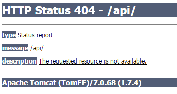
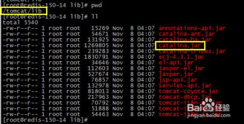
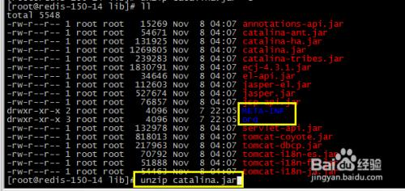
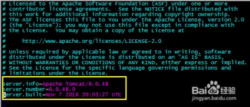
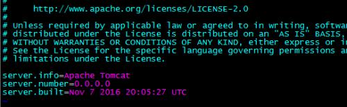
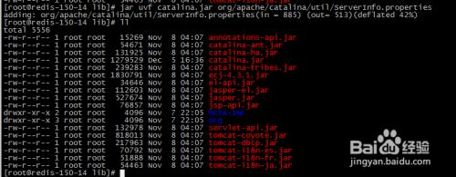

## Tomcat服务器版本号泄露（低危）

### 一、问题描述

 Tomcat报错页面泄漏Apache Tomcat/7.0.68相关版本号信息，是攻击者攻击的途径之一。因此实际当中建议去掉版本号信息。

### 二、解决办法

#### windows

​	1、进入到tomcat/lib目录下，用电脑自带解压软件打开catalina.jar 进入到\org\apache\catalina\util目录下

​	2、编辑ServerInfo.properties文件，编辑最后三行，去掉版本号等信息

​	3、改完后自动跳出提示，点击“是”自动更新catalina.jar重新打包。

#### linux

1.  进入tomcat的lib目录找到catalina.jar文件

    

2.  

    unzip catalina.jar之后会多出两个文件夹

    

3.  进入org/apache/catalina/util 编辑配置文件ServerInfo.properties

    

    

4.  修改为

    server.info=Apache Tomcat

    server.number=0.0.0.0

    server.built=Nov 7 2016 20:05:27 UTC

    

5. 将修改后的信息压缩回jar包

    cd  /tomcat/lib

    jar uvf catalina.jar org/apache/catalina/util/ServerInfo.properties

    

6. 重启tomcat