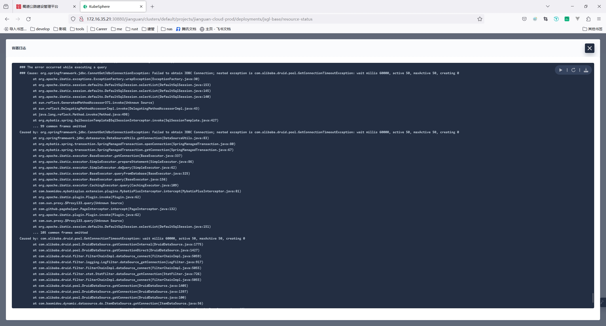
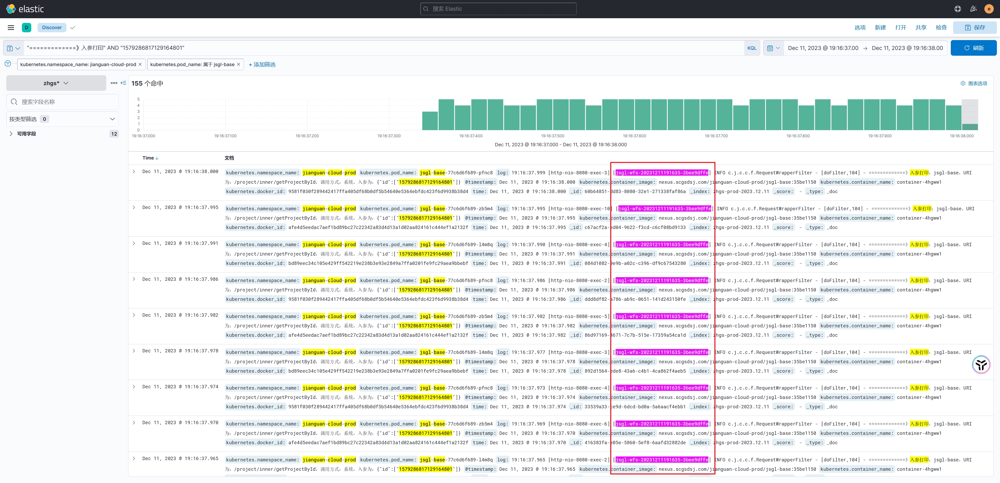
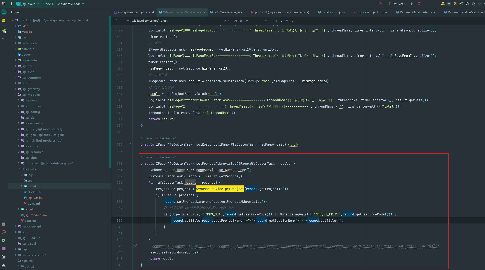

# 现象

base服务druid连接池满了，并且连接一直无法释放，也无法创建新的连接



# 排查

通过日志查看发现出问题时base服务的请求特别多，通过请求参数筛选数据，把范围缩小的1妙时，发现同1秒内一个这155个竟然都来自同一个用户请求，参数是一样的属于重复查询。



# 原因

根据traceId追踪到用户请求地址为`/wfs/task/his`，该请求为用户首页加载已办信息的接口，调用频率较高，其调用链路为

wfs服务（/wfs/task/his)  =>  base（/base/project/inner/getProjectById）

找到调用base服务的代码发现问题：



# 改造

业务背景：真实用户一般就属于1个项目，个别岗位存在多个项目（几乎都是个位数），对应用户的已办也是跟用户的项目绑定的。

这里循环查出来的已办数据调用base服务是完全没必要的，可以考虑去重后批量查询

```java
// .......................................................................................
	private IPage<WfsCustomTask> setProjectAbbreviated(IPage<WfsCustomTask> result) {
        List<WfsCustomTask> records = result.getRecords();
        // 先把records根据projectId去重，然后再提炼出所有projectId
        List<ProjectDto> projects = wfsBaseService.getProjectByIds(records.stream().map(WfsCustomTask::getProjectId).distinct().collect(Collectors.toList()));
        Map<String, ProjectDto> projectMap = projects.stream()
            .collect(Collectors.toMap(ProjectDto::getId, project -> project, (p1, p2) -> p1));
        // 通过projects中id和records中projectId匹配，设置项目简称
        for (WfsCustomTask task : records) {
            ProjectDto project = projectMap.get(task.getProjectId());
            if (null == project) {
                continue;
            }
            task.setProjectName(project.getProjectAbbreviated());
            // 结构拆量和单价重置标题为"项目-标段-标题"
            if (Objects.equals("MMS_QUA",task.getResourceCode()) || Objects.equals("MMS_CI_PRICE",task.getResourceCode())) {
                task.setTitle(task.getProjectName()+"-"+task.getSectionNum()+"-"+task.getTitle());
            }
        }
		result.setRecords(records);
		return result;
	}
// .......................................................................................
```

