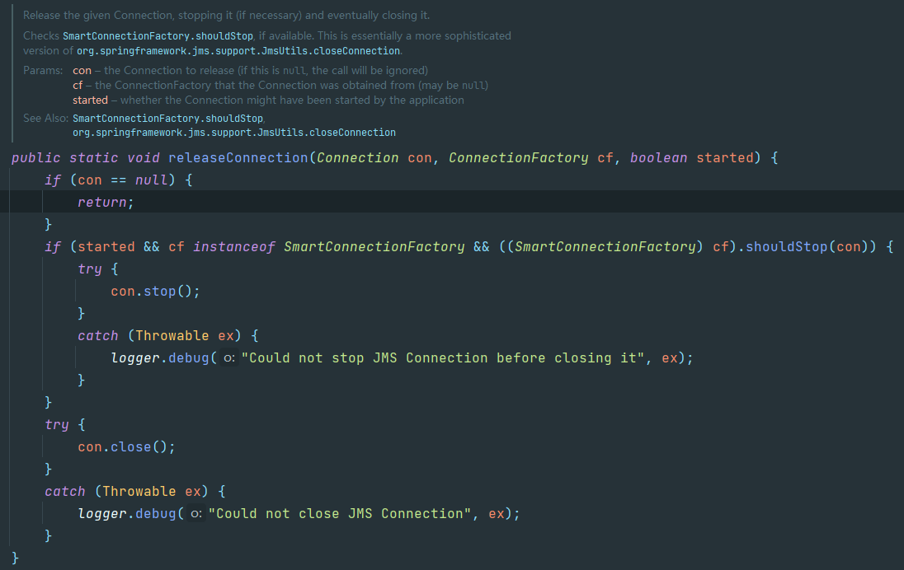

环境

spring JMS weblogicmq

现象

产生大量连接数导致服务端系统崩溃

问题

1.为什么会出现监听失败
2.为什么会创建大量连接没有关闭

代码

DefaultMessageListenerContainer  -> 

内部类AsyncMessageListenerInvoker -> 

​		DefaultMessageListenerContainer#handleListenerSetupFailure
​		警告日志：org.springframework.jms.listener.DefaultMessageListenerContainer.handleListenerSetupFailure Setup of JMS message listener invoker failed for destination 'JMSMODULE_SOA!TOPIC_DISTEI
PUSERSRV_SOA' - trying to recover. Cause: javax.naming.NameNotFoundException: Unable to resolve 'weblogic.jms.backend.JMSSERVER_SOA'. Resolved 'weblogic.jms.backend'; remaining name 'JMSSERVER_SOA'

​		DefaultMessageListenerContainer#recoverAfterListenerSetupFailure -> refreshConnectionUntilSuccessful -> ConnectionFactoryUtils#releaseConnection失败（con.close失败,日志为debug级别，所以看不到这个的错误日志）




```log
10-Jan-2022 15:54:13.466 WARNING [DistMdmBankSrv-3] org.springframework.jms.listener.DefaultMessageListenerContainer.handleListenerSetupFailure Setup of JMS message listener invoker failed for destination 'JMSMODULE_SOA!TOPIC_DISTCOOPERATIVEBANKSRV_SOA' - trying to recover. Cause: javax.naming.NameNotFoundException: Unable to resolve 'weblogic.jms.backend.JMSSERVER_SOA'. Resolved 'weblogic.jms.backend'; remaining name 'JMSSERVER_SOA'
10-Jan-2022 15:54:13.466 INFO [DistMdmBankSrv-3] org.springframework.jms.listener.DefaultMessageListenerContainer.refreshConnectionUntilSuccessful Successfully refreshed JMS Connection
```

？？

核心日志javax.naming.NameNotFoundException: Unable to resolve 'weblogic.jms.backend.JMSSERVER_SOA'. Resolved 'weblogic.jms.backend'; remaining name 'JMSSERVER_SOA'像是服务端的问题