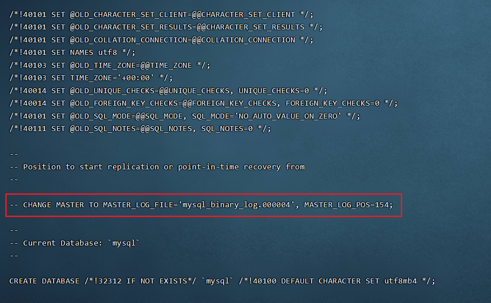

# MySQL主从复制

## 原理

​	MySQL的主从复制是一个异步的复制过程（虽然一般情况下感觉是实时的），数据将从一个Mysql数据库（我们称之为Master）复制到另一个Mysql数据库（我们称之为Slave），在Master与Slave之间实现整个主从复制的过程是由三个线程参与完成的。其中有两个线程（SQL线程和IO线程）在Slave端，另一个线程（I/O线程）在Master端。

​	要实现MySQL的主从复制，首先必须打开Master端的binlog记录功能，否则就无法实现。因为整个复制过程实际上就是Slave从aster端获取binlog日志，然后再在Slave上以相同顺序执行获取的binlog日志中的记录的各种SQL操作

**主从复制条件**

```
1、主库开启Binlog功能
2、主库要建立账号
3、从库要配置master.info（CHANGE MASTER to...相当于配置密码文件和Master的相关信息）
4、start slave 开启复制功能
```

**小结：**

```
1.主从复制是异步的逻辑的SQL语句级的复制
2.复制时，主库有一个I/O线程，从库有两个线程，I/O和SQL线程
3.实现主从复制的必要条件是主库要开启记录binlog功能
4.作为复制的所有Mysql节点的server-id都不能相同
5.binlog文件只记录对数据库有更改的SQL语句（来自主库内容的变更），不记录任何查询（select，show）语句
```

## 实践

### 主库配置

#### my.cnf

```properties
[mysqld]
# 省略其他无关配置...

# 开启bin—log指定路径
log_bin=/data/mysql/mysql_binary_log
# 服务器唯一标识，集群内全局唯一
server_id=1
binlog_format = mixed
```

#### 配置用户

```mysql
CREATE USER 'req'@'0.0.0.%' IDENTIFIED BY 'password';
-- 给rep用户赋复制权限
grant replication slave on *.* to 'rep'@'10.0.0.%';
# 修改密码
# set password for 'root'@'localhost'=password('NEWPASSWORD');
flush privileges;
```

#### 导出期初数据

```shell
# -F 会生成新的bin-log文件，-S指定socket文件，-A导出全部数据库, -x代表lock-all-tables，--master-data会写入保存点
mysqldump -uroot -p123456 -S /data/3306/mysql.sock -A -B -F --single-transaction --master-data=2 --events|gzip >/server/backup/rep_bak$(date +%F).sql.gz

# 或直接导出到从库 -C启用压缩
# mysqldump --host=10.0.0.101 -uroot -proot -C --databases test |mysql --host=10.0.0.102 -uroot -proot test 
```

导出的文件里面有保存点的位置（--master-data）



### 从库配置

#### 恢复数据到从库

```shell
mysql -uroot -p < rep_bak2022-01-09.sql
```

#### my.cnf

```properties
[mysqld]
# 省略其他无关配置...

# 配置不同的server_id
server_id=1
```

#### 配置master信息

```mysql
CHANGE MASTER TO 
MASTER_HOST='10.0.0.101',  #这是主库的IP（域名也可以需要做解析）
MASTER_PORT=3306,          #主库的端口
MASTER_USER='rep',         #这是主库上创建用来复制的用户rep
MASTER_PASSWORD='123456',   #rep的密码
MASTER_LOG_FILE='mysql-bin.000025', #这里是show master status时看到的查询二进制日志文件名称，这里不能多空格
MASTER_LOG_POS=9155;       #这里是show master status时看到的二进制日志偏移量，不能多空格
```

#### 启动slave

```mysql
start slave
# 检查同步状态，并在主库更新测试
show slave status
```

#### 异常处理：

**Slave_SQL_Running：NO** 

下面会有提示，如果提示这个库已经创建无法创建等是可以跳过的

**解决办法**

```mysql
stop slave;
set global sql_slave_skip_counter=1; #将同步指针向下移动，如果多次不同步，可以添加移动的数量
start slave;
```

