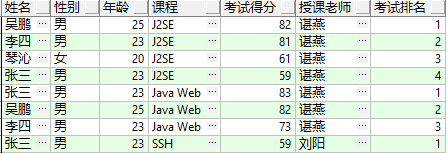

#  PLSQL练习题：

请在Oracle数据库中新建一个包，在Pacakge中，自定义一个存储过程，该存储过程可以输出一个HTML的报表，打印所有参加过考试的学生的考试记录。
需要打印的列：学生姓名、性别、年龄、考试课程、考试得分（四舍五入取整）、授课老师，该科考试排名
要求：1.支持按学号和科目查询和打印报表。
​      2.调用存储过程后必须返回程序是否运行成功
​      3.程序必须结构清晰，逻辑完整
叶随风 2018/11/30 16:49:22




# 建表 和 导入数据

```sql
Create Table  HAND_STUDENT
(
 STUDENT_NO Varchar2(10) Not Null,
 STUDENT_NAME Varchar2(20),
 STUDENT_AGE Number,
 STUDENT_GENDER Varchar2(5),
 OBJECT_VERSION_NUMBER Number Default 1 Not Null,
 CREATION_DATE DATE Default Sysdate Not Null,
 CREATED_BY NUMBER Default -1 Not Null,
 LAST_UPDATED_BY NUMBER Default -1 Not Null,
 LAST_UPDATE_DATE DATE Default Sysdate Not Null,
 LAST_UPDATE_LOGIN NUMBER
);
-- Add comments to the table
comment on table  HAND_STUDENT is '学生信息表';
-- Add comments to the columns
comment on column  HAND_STUDENT.STUDENT_NO is '学号';
comment on column  HAND_STUDENT.STUDENT_NAME is '姓名';
comment on column  HAND_STUDENT.STUDENT_AGE is '年龄';
comment on column  HAND_STUDENT.STUDENT_GENDER is '性别';
comment on column  HAND_STUDENT.OBJECT_VERSION_NUMBER is '行版本号，用来处理锁';

-- Create/Recreate indexes
Create Unique Index  HAND_STUDENT_U1 On  HAND_STUDENT(STUDENT_NO);


Create Table  HAND_TEACHER
(
 TEACHER_NO Varchar2(10) Not Null,
 TEACHER_NAME Varchar2(20),
 MANAGER_NO Varchar2(10),
 OBJECT_VERSION_NUMBER Number Default 1 Not Null,
 CREATION_DATE DATE Default Sysdate Not Null,
 CREATED_BY NUMBER Default -1 Not Null,
 LAST_UPDATED_BY NUMBER Default -1 Not Null,
 LAST_UPDATE_DATE DATE Default Sysdate Not Null,
 LAST_UPDATE_LOGIN NUMBER
);
-- Add comments to the table
comment on table  HAND_TEACHER is '教师信息表';
-- Add comments to the columns
comment on column  HAND_TEACHER.TEACHER_NO is '教师编号';
comment on column  HAND_TEACHER.TEACHER_NAME is '教师名称';
comment on column  HAND_TEACHER.MANAGER_NO is '上级编号';
comment on column  HAND_TEACHER.OBJECT_VERSION_NUMBER is '行版本号，用来处理锁';

-- Create/Recreate indexes
Create Unique Index  HAND_TEACHER_U1 On  HAND_TEACHER(TEACHER_NO) ;

Create Table  HAND_COURSE
(
 COURSE_NO Varchar2(10) Not Null,
 COURSE_NAME Varchar2(20),
 TEACHER_NO Varchar2(10) Not Null,
 OBJECT_VERSION_NUMBER Number Default 1 Not Null,
 CREATION_DATE DATE Default Sysdate Not Null,
 CREATED_BY NUMBER Default -1 Not Null,
 LAST_UPDATED_BY NUMBER Default -1 Not Null,
 LAST_UPDATE_DATE DATE Default Sysdate Not Null,
 LAST_UPDATE_LOGIN NUMBER
);
-- Add comments to the table
comment on table  HAND_COURSE is '课程信息表';
-- Add comments to the columns
comment on column  HAND_COURSE.COURSE_NO is '课程号';
comment on column  HAND_COURSE.COURSE_NAME is '课程名称';
comment on column  HAND_COURSE.TEACHER_NO is '教师编号';
comment on column  HAND_COURSE.OBJECT_VERSION_NUMBER is '行版本号，用来处理锁';

-- Create/Recreate indexes
Create Unique Index  HAND_COURSE_U1 On  HAND_COURSE(COURSE_NO);


Create Table  HAND_STUDENT_CORE
(
 STUDENT_NO Varchar2(10) Not Null,
 COURSE_NO Varchar2(10) Not Null,
 CORE Number,
 OBJECT_VERSION_NUMBER Number Default 1 Not Null,
 CREATION_DATE DATE Default Sysdate Not Null,
 CREATED_BY NUMBER Default -1 Not Null,
 LAST_UPDATED_BY NUMBER Default -1 Not Null,
 LAST_UPDATE_DATE DATE Default Sysdate Not Null,
 LAST_UPDATE_LOGIN NUMBER
);
-- Add comments to the table
comment on table  HAND_STUDENT_CORE is '学生成绩表';
-- Add comments to the columns
comment on column  HAND_STUDENT_CORE.STUDENT_NO is '学号';
comment on column  HAND_STUDENT_CORE.COURSE_NO is '课程号';
comment on column  HAND_STUDENT_CORE.CORE is '分数';
comment on column  HAND_STUDENT_CORE.OBJECT_VERSION_NUMBER is '行版本号，用来处理锁';

-- Create/Recreate indexes
Create Unique Index  HAND_STUDENT_CORE_U1 On  HAND_STUDENT_CORE(STUDENT_NO,COURSE_NO);

/*******初始化学生表的数据******/
insert into HAND_STUDENT(STUDENT_NO,STUDENT_NAME,STUDENT_AGE,STUDENT_GENDER) values ('s001','张三',23,'男');
insert into HAND_STUDENT(STUDENT_NO,STUDENT_NAME,STUDENT_AGE,STUDENT_GENDER) values ('s002','李四',23,'男');
insert into HAND_STUDENT(STUDENT_NO,STUDENT_NAME,STUDENT_AGE,STUDENT_GENDER) values ('s003','吴鹏',25,'男');
insert into HAND_STUDENT(STUDENT_NO,STUDENT_NAME,STUDENT_AGE,STUDENT_GENDER) values ('s004','琴沁',20,'女');
insert into HAND_STUDENT(STUDENT_NO,STUDENT_NAME,STUDENT_AGE,STUDENT_GENDER) values ('s005','王丽',20,'女');
insert into HAND_STUDENT(STUDENT_NO,STUDENT_NAME,STUDENT_AGE,STUDENT_GENDER) values ('s006','李波',21,'男');
insert into HAND_STUDENT(STUDENT_NO,STUDENT_NAME,STUDENT_AGE,STUDENT_GENDER) values ('s007','刘玉',21,'男');
insert into HAND_STUDENT(STUDENT_NO,STUDENT_NAME,STUDENT_AGE,STUDENT_GENDER) values ('s008','萧蓉',21,'女');
insert into HAND_STUDENT(STUDENT_NO,STUDENT_NAME,STUDENT_AGE,STUDENT_GENDER) values ('s009','陈萧晓',23,'女');
insert into HAND_STUDENT(STUDENT_NO,STUDENT_NAME,STUDENT_AGE,STUDENT_GENDER) values ('s010','陈美',22,'女');
commit;
/******************初始化教师表***********************/
insert into HAND_TEACHER(TEACHER_NO,TEACHER_NAME,MANAGER_NO) values ('t001', '刘阳','');
insert into HAND_TEACHER(TEACHER_NO,TEACHER_NAME,MANAGER_NO)  values ('t002', '谌燕','t001');
insert into HAND_TEACHER(TEACHER_NO,TEACHER_NAME,MANAGER_NO)  values ('t003', '胡明星','t002');
commit;
/***************初始化课程表****************************/
insert into HAND_COURSE(COURSE_NO,COURSE_NAME,TEACHER_NO) values ('c001','J2SE','t002');
insert into HAND_COURSE(COURSE_NO,COURSE_NAME,TEACHER_NO) values ('c002','Java Web','t002');
insert into HAND_COURSE(COURSE_NO,COURSE_NAME,TEACHER_NO) values ('c003','SSH','t001');
insert into HAND_COURSE(COURSE_NO,COURSE_NAME,TEACHER_NO) values ('c004','Oracle','t001');
insert into HAND_COURSE(COURSE_NO,COURSE_NAME,TEACHER_NO) values ('c005','SQL SERVER 2005','t003');
insert into HAND_COURSE(COURSE_NO,COURSE_NAME,TEACHER_NO) values ('c006','C#','t003');
insert into HAND_COURSE(COURSE_NO,COURSE_NAME,TEACHER_NO) values ('c007','JavaScript','t002');
insert into HAND_COURSE(COURSE_NO,COURSE_NAME,TEACHER_NO) values ('c008','DIV+CSS','t001');
insert into HAND_COURSE(COURSE_NO,COURSE_NAME,TEACHER_NO) values ('c009','PHP','t003');
insert into HAND_COURSE(COURSE_NO,COURSE_NAME,TEACHER_NO) values ('c010','EJB3.0','t002');
commit;
/***************初始化成绩表***********************/
insert into HAND_STUDENT_CORE(STUDENT_NO,COURSE_NO,CORE) values ('s001','c001',58.9);
insert into HAND_STUDENT_CORE(STUDENT_NO,COURSE_NO,CORE) values ('s002','c001',80.9);
insert into HAND_STUDENT_CORE(STUDENT_NO,COURSE_NO,CORE) values ('s003','c001',81.9);
insert into HAND_STUDENT_CORE(STUDENT_NO,COURSE_NO,CORE) values ('s004','c001',60.9);
insert into HAND_STUDENT_CORE(STUDENT_NO,COURSE_NO,CORE) values ('s001','c002',82.9);
insert into HAND_STUDENT_CORE(STUDENT_NO,COURSE_NO,CORE) values ('s002','c002',72.9);
insert into HAND_STUDENT_CORE(STUDENT_NO,COURSE_NO,CORE) values ('s003','c002',81.9);
insert into HAND_STUDENT_CORE(STUDENT_NO,COURSE_NO,CORE) values ('s001','c003','59');
commit;
-- 建立约束
alter table HAND_STUDENT_CORE add constraint FK_STUDENT_NO foreign key(STUDENT_NO) REFERENCES HAND_STUDENT(STUDENT_NO);
alter table HAND_STUDENT_CORE add constraint FK_COURSE_NO foreign key(COURSE_NO) REFERENCES HAND_COURSE(COURSE_NO);
alter table HAND_COURSE add constraint FK_TEACHER_NO foreign key(TEACHER_NO) REFERENCES HAND_TEACHER(TEACHER_NO);
```

# 实现

## package head

```plsql
CREATE OR REPLACE PACKAGE plsql_practice IS
  /***********************************************************************************************
  PLSQL练习题：
  请在Oracle数据库中新建一个包，在Pacakge中，自定义一个存储过程，该存储过程可以输出一个HTML的报表，
  打印所有参加过考试的学生的考试记录。
  需要打印的列：学生姓名、性别、年龄、考试课程、考试得分（四舍五入取整）、授课老师，该科考试排名
  要求：1.支持按学号查询和打印报表。
  ?      2.调用存储过程后必须返回程序是否运行成功
  ?      3.程序必须结构清晰，逻辑完整
  
  使用方法：直接调用以下某个过程
  PROCEDURE report_to_console(p_stu_no VARCHAR2 DEFAULT NULL);
  PROCEDURE report_html_console(p_stu_no VARCHAR2 DEFAULT NULL);
  
   ************************************************************************************************/

  -- 公共类型
  TYPE report_record_type IS RECORD(
    stu_name   HAND_STUDENT.STUDENT_NAME%TYPE,
    stu_gender HAND_STUDENT.STUDENT_GENDER%TYPE,
    stu_age    HAND_STUDENT.STUDENT_AGE%TYPE,
    c_name     HAND_COURSE.COURSE_NAME%TYPE,
    score      NUMBER(3),
    t_name     HAND_TEACHER.TEACHER_NAME%TYPE,
    rank       NUMBER(10));

  TYPE report_table_type IS TABLE OF report_record_type INDEX BY BINARY_INTEGER;

  TYPE stu_name_table_type IS TABLE OF HAND_STUDENT.STUDENT_NO%TYPE INDEX BY BINARY_INTEGER;
  TYPE course_name_table_type IS TABLE OF HAND_COURSE.COURSE_NAME%TYPE INDEX BY BINARY_INTEGER;
  TYPE course_no_table_type IS TABLE OF HAND_COURSE.COURSE_NO%TYPE INDEX BY BINARY_INTEGER;

  -- 打印到控制台
  PROCEDURE report_to_console(p_stu_no VARCHAR2 DEFAULT NULL);

  -- 打印HTML格式化的报表到DBMS控制台
  PROCEDURE report_html_console(p_stu_no VARCHAR2 DEFAULT NULL);

END plsql_practice;

```

## package body

```plsql
CREATE OR REPLACE PACKAGE BODY plsql_practice IS

  -- global variable
  g_results  report_table_type; -- 结果数组
  g_res_size NUMBER := 1; -- 当前大小

  -- functions 
  -- 将一条记录转化为html
  FUNCTION to_html RETURN VARCHAR2;

  -- 输出结果集的大小
  PROCEDURE print_size;

  -- 获取数据到结果集中
  PROCEDURE get_data(p_stu_no HAND_STUDENT.STUDENT_NO%TYPE DEFAULT NULL);
  -- 添加制定数据到结果集中
  --   PROCEDURE add_to_res(p_stu_no IN HAND_STUDENT.STUDENT_NO%TYPE, p_course_no IN HAND_STUDENT.STUDENT_NAME%TYPE);

  FUNCTION query_a_res(p_stu_name IN VARCHAR2, p_course_name IN VARCHAR2)
    RETURN report_record_type;
  -- 控制台 字符串 行输出
  PROCEDURE println(str VARCHAR2);
  --清楚结果内容
  PROCEDURE clear_results;

  -- DBMS控制台打印结果
  PROCEDURE print_results;
  -- exceptions
  no_results EXCEPTION;
  PRAGMA EXCEPTION_INIT(no_results, -3301);

  PROCEDURE report_to_console(p_stu_no VARCHAR2 DEFAULT NULL) IS
  BEGIN
    get_data(p_stu_no);
    PRINT_RESULTS();
    CLEAR_RESULTS();
  EXCEPTION
    WHEN no_results THEN
      println('no result found');
  END;

  -- 打印HTML格式化的报表到DBMS控制台
  PROCEDURE report_html_console(p_stu_no VARCHAR2 DEFAULT NULL) IS
  BEGIN
    get_data(p_stu_no);
    println(to_html);
    CLEAR_RESULTS();
  EXCEPTION
    WHEN no_results THEN
      println('no result found');
  END;

  PROCEDURE print_size IS
  BEGIN
    println(g_res_size);
  END;

  -- 获取全部的成绩信息到结果集中
  PROCEDURE get_data(p_stu_no IN HAND_STUDENT.STUDENT_NO%TYPE DEFAULT NULL) IS
    CURSOR res_cursor(stu_no HAND_STUDENT.STUDENT_NO%TYPE) IS
      SELECT STUDENT_NAME,
             STUDENT_GENDER,
             STUDENT_AGE,
             COURSE_NAME,
             score,
             TEACHER_NAME,
             rank
        FROM (SELECT s.STUDENT_NO,
                     s.STUDENT_NAME,
                     s.STUDENT_GENDER,
                     s.STUDENT_AGE,
                     c.COURSE_NAME,
                     ROUND(sc.CORE) score,
                     t.TEACHER_NAME,
                     row_number() over(PARTITION BY sc.COURSE_NO ORDER BY sc.CORE DESC) rank
                FROM HAND_STUDENT      s,
                     HAND_COURSE       c,
                     HAND_TEACHER      t,
                     HAND_STUDENT_CORE sc
               WHERE sc.STUDENT_NO = s.STUDENT_NO
                 AND sc.COURSE_NO = c.COURSE_NO
                 AND c.TEACHER_NO = t.TEACHER_NO)
       WHERE STUDENT_NO = NVL(stu_no, STUDENT_NO);
  BEGIN
    g_res_size := 1;
    OPEN res_cursor(stu_no => p_stu_no);
    LOOP
      FETCH res_cursor
        INTO g_results(g_res_size);
      EXIT WHEN res_cursor%NOTFOUND;
      g_res_size := g_res_size + 1;
    END LOOP;
    CLOSE res_cursor;
  END;

  FUNCTION query_a_res(p_stu_name IN VARCHAR2, p_course_name IN VARCHAR2)
    RETURN report_record_type IS
    v_a_record report_record_type;
  BEGIN
    IF g_res_size < 2 THEN
      RAISE no_results;
    END IF;
    FOR i IN 1 .. g_res_size - 1 LOOP
      v_a_record := g_results(i);
      IF v_a_record.stu_name = p_stu_name AND
         v_a_record.c_name = p_course_name THEN
        RETURN v_a_record;
      ELSE
        CONTINUE;
      END IF;
    END LOOP;
  END;

  -- 将一条记录转化为html
  FUNCTION to_html RETURN VARCHAR2 IS
    c_html_head      CONSTANT VARCHAR2(1000) := '<html lang="en"><head><meta charset="UTF-8"><title>Title</title></head><body><table><tr><th>姓名</th><th>性别</th><th>年龄</th><th>课程</th><th>成绩</th><th>老师</th><th>排名</th></tr>';
    c_html_middle_td CONSTANT VARCHAR2(10) := '</td><td>';
    c_html_tail      CONSTANT VARCHAR2(100) := '</table></body></html>';
    v_a_record report_record_type;
    v_html_res VARCHAR2(10000) := c_html_head;
    v_html_tmp VARCHAR2(100);
  BEGIN
    IF g_res_size < 2 THEN
      RAISE no_results;
    END IF;
    FOR i IN 1 .. g_res_size - 1 LOOP
      v_a_record := g_results(i);
      v_html_tmp := '<tr><td>'||v_a_record.stu_name || c_html_middle_td ||
                    v_a_record.stu_gender || c_html_middle_td ||
                    v_a_record.stu_age || c_html_middle_td ||
                    v_a_record.c_name || c_html_middle_td ||
                    v_a_record.score || c_html_middle_td ||
                    v_a_record.t_name || c_html_middle_td ||
                    v_a_record.rank||'</td></tr>';
      v_html_res := v_html_res || v_html_tmp;
    END LOOP;
    v_html_res := v_html_res || c_html_tail;
    RETURN v_html_res;
  END;

  /*
  -- 按学号和课程号查询一条记录，并加入到结果集中
  PROCEDURE add_to_res(p_stu_no IN HAND_STUDENT.STUDENT_NO%TYPE, p_course_no IN HAND_STUDENT.STUDENT_NAME%TYPE)
  IS
    v_report_record report_record_type;
    CURSOR score_cursor(stu_no VARCHAR2, c_no VARCHAR2) IS
      SELECT s.STUDENT_NAME,
             s.STUDENT_GENDER,
             s.STUDENT_AGE,
             c.COURSE_NAME,
             ROUND(sc.CORE)                                                      score,
             t.TEACHER_NAME,
             row_number() over (PARTITION BY sc.COURSE_NO ORDER BY sc.CORE DESC) rank
      FROM HAND_STUDENT s,
           HAND_COURSE c,
           HAND_TEACHER t,
           HAND_STUDENT_CORE sc
      WHERE sc.STUDENT_NO = s.STUDENT_NO
        AND sc.COURSE_NO = c.COURSE_NO
        AND c.TEACHER_NO = t.TEACHER_NO
        AND sc.STUDENT_NO = stu_no
        AND sc.COURSE_NO = c_no;
        */
  /*ORDER BY score DESC;*/
  /*BEGIN
    OPEN score_cursor(p_stu_no, p_course_no);
    FETCH score_cursor INTO v_report_record;
    CLOSE score_cursor;
    g_res_size := g_res_size + 1;
    g_results(g_res_size) := v_report_record;
  END add_to_res;*/

  -- 打印一行字符串
  PROCEDURE println(str VARCHAR2) IS
  BEGIN
    DBMS_OUTPUT.PUT_LINE(str);
  END;

  -- 清除结果集
  PROCEDURE clear_results IS
  BEGIN
    g_results.delete();
    g_res_size := 0;
  END;

  -- 打印结果集
  PROCEDURE print_results IS
    out_str    VARCHAR2(100);
    table_head VARCHAR2(100) := '姓名  性别  年龄 课程名  成绩  老师  排名';
    v_a_record report_record_type;
  BEGIN
    IF g_res_size < 2 THEN
      RAISE no_results;
    END IF;
    println(table_head);
    FOR i IN 1 .. g_res_size - 1 LOOP
      v_a_record := g_results(i);
      out_str    := v_a_record.stu_name || '  ' || v_a_record.stu_gender || '  ' ||
                    v_a_record.stu_age || '  ' || v_a_record.c_name || '  ' ||
                    v_a_record.score || '  ' || v_a_record.t_name || '  ' ||
                    v_a_record.rank;
      println(out_str);
    END LOOP;
  END;
END plsql_practice;

```

