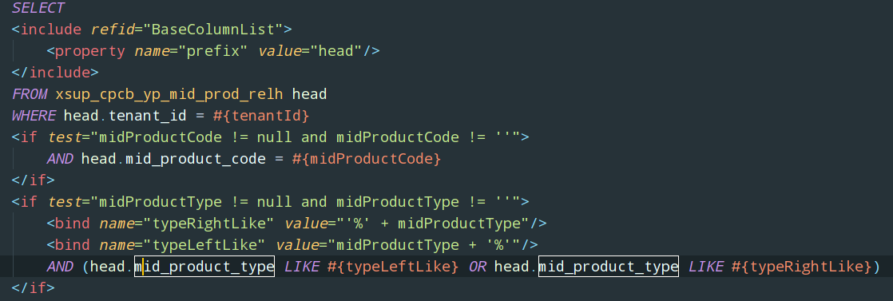

# SQL优化

## 一、为什么要对SQL进行优化

我们开发项目上线初期，由于业务数据量相对较少，一些SQL的执行效率对程序运行效率的影响不太明显，而开发和运维人员也无法判断SQL对程序的运行效率有多大，故很少针对SQL进行专门的优化，而随着时间的积累，业务数据量的增多，SQL的执行效率对程序的运行效率的影响逐渐增大，而这些效率减慢往往不是因为数据量大到数据库的性能瓶颈，而是SQL本身存在很大的问题，此时对SQL的优化就很有必要。

## 二、执行计划

那么我们如何发现一个SQL的问题并对其进行优化呢？除了根据我们的使用经验来看以外，最好的办法的就是查看SQL的执行计划，然后找到执行速度慢的原因并对症下药。

- MySQL

```mysql
explain <sql statement>
```

- Oracle

```sql
explain plan for <sql statement>
```

- Postgresql

```sql
explain analyze <sql statement>
```

- sql server

```mssql
-- 显示执行计划
SET SHOWPLAN_ALL ON
-- 显示磁盘IO信息
SET STATISTICS IO ON
GO
<sql statement>
GO
SET SHOWPLAN_ALL OFF
SET STATISTICS IO OFF
GO
```

虽然各数据库调出执行计划的方式不同、展示的方式也不同。但都是根据数据库的范式来确定的，都描述了诸如全表扫描、全部索引扫描、区间索引扫描等概念。

## 三、索引设计原则

- 使用唯一索引

  唯一索引上的记录完全不同，每一条数据都是唯一确定的，效率最高。

- 为经常需要排序、分组和联合操作的字段建立索引

  经常需要ORDER BY、GROUP BY、DISTINCT和JOIN ON等操作的字段，排序操作会浪费很多时间。如果为其建立索引，可以有效地避免排序操作。

- 为常作为查询条件的字段建立索引

  不解释了，尽可能多的让查询走上索引。

- 限制索引的数目

  索引降低新增和删除的效率，另外还占用存储空间

- 使用前缀索引

  如果索引字段的值很长，最好使用值的前缀来索引。例如，TEXT和BLOG类型的字段，进行全文检索会很浪费时间。如果只检索字段的前面的若干个字符，这样可以提高检索速度。

- 按实际情况确定索引字段的排序方式

  例如索引上有日期字段，那么他往往应该是降序的（新数据访问频次较高）。

- 利用索引的左前缀原则

  例如索引由date、code、name组成，那么就相当于有了date以及date和code组合的索引

- 差异性原则

  差异性越大的字段越适合建立索引、差异性越低的字段越不适合建立索引。试想给一个只有两个值的flag字段建立索引会怎样。

## 四、一些案例

- 尽可能使用UNION ALL而不是UNION

- IN的子查询

  ```sql
  -- 可选装置
  SELECT dd.device_code, dd.device_name
  FROM xsup_pub_device_maintain dd
  WHERE dd.device_code
            IN (SELECT ldd.device_code
                FROM xsup_cpcb_lq_device_data ldd
                WHERE ldd.effective_date <= '${w_date}'
                  AND (ldd.expiry_date IS NULL OR ldd.expiry_date > '${w_date}'))
  ORDER BY dd.order_seq
  ```

  使用EXISTS改造

  ```sql
  -- 可选装置
  SELECT dd.device_code, dd.device_name
  FROM xsup_pub_device_maintain dd
  WHERE EXISTS(SELECT 1
               FROM xsup_cpcb_lq_device_data ldd
               WHERE dd.device_code = ldd.device_code
                 AND ldd.effective_date <= '${w_date}'
                 AND (ldd.expiry_date IS NULL OR ldd.expiry_date > '${w_date}'))
  ORDER BY dd.order_seq
  ```

  结果是一个走索引，一个全表扫描。NOT IN同理

  如果device_code是唯一的，还可以用JOIN改写

  ```sql
  SELECT DISTINCT ldd.device_code, dd.device_name
  FROM xsup_cpcb_lq_device_data ldd
           JOIN xsup_pub_device_maintain dd ON dd.device_code = ldd.device_code
  WHERE ldd.effective_date <= '${w_date}'
    AND (ldd.expiry_date IS NULL OR ldd.expiry_date > '${w_date}')
  ORDER BY dd.order_seq
  ```

- where中使用null过滤条件

  ```sql
  SELECT id FROM t WHERE num IS NULL
  ```

  即便num有索引，也是全表扫描。

  解决方案：**最好不要给数据库留NULL**，尽可能的使用 NOT NULL填充数据库.

- 优化OR

  避免在 where 子句中使用 or 来连接条件，如果一个字段有索引，一个字段没有索引，将导致引擎放弃使用索引而进行全表扫描

  ```sql
  SELECT id FROM t WHERE num = 10 OR Name = 'admin'
  ```

  使用UNION ALL改写

  ```sql
  SELECT id FROM t WHERE num = 10
  UNION ALL
  SELECT id FROM t WHERE Name = 'admin'
  ```

- 不要在where中对字段使用函数

  ```sql
  SELECT xpip.item_code, xpip.item_name, xpip.price
  FROM xsup_pub_item_price xpip
  WHERE DATE_FORMAT(xpip.price_date, '%Y-%m') = '${month}'
    AND xpip.item_code = 'H0100001519'
  ```

  改写：转移函数到参数上

  ```sql
  SELECT xpip.item_code, xpip.item_name, xpip.price
  FROM xsup_pub_item_price xpip
  WHERE xpip.item_code = 'H0100001519'
    AND xpip.price_date 
    	BETWEEN '${month}-01' 
  	AND DATE_SUB(DATE_ADD('${month}-01', INTERVAL 1 MONTH), INTERVAL 1 DAY)
  ```

- 优化ORDER BY

  在某些情况中，MySQL 可以使用一个索引来满足 ORDER BY 子句，而不需要额外的排序。 WHERE 条件和 ORDER BY 使用相同的索引，并且 ORDER BY 的顺序和索引顺序相同，并且 ORDER BY 的字段都是升序或者都是降序。 

## 五、其他优化思路

- 强制使用索引

  ```mysql
  SELECT DISTINCT xp.device_code, xp.project_category, xp.project_detail_code
  FROM xsup_prcb_device_total_account xp
           FORCE INDEX (XSUP_PRCB_DEVICE_TOTAL_ACCOUNT_u1)
  WHERE xp.device_date >= '2019-01-01'
    AND xp.device_date <= '2019-12-31'
    AND xp.date_type = 'DAY'
  ```

- 尽量不使用全模糊查询

  例如一个字段一定是两个代码的组合，那么可以使用左模糊和右模糊而不是全模糊。

  

- 存储过程

  适用于DML多、计算少的场景，好处是快，缺点是不好维护。大多数情况下，考虑多线程替代。

- SQL合并

  看下面的例子，每一个头数据，都去查一次行数据，如果一页100条数据，那么将执行101次查询。

  ```java
  @Override
  public Page<MaterialRule> pageAndGenExpression(PageRequest pageRequest, MaterialRule materialRule) {
      Page<MaterialRule> materialRules = materialRuleRepository.pageMaterialRule(pageRequest, materialRule);
      // 实时生成规则表达式
      materialRules.forEach(rule -> {
          long id = rule.getMaterialRuleId();
          List<MaterialRuleLine> materialRuleLines = Optional
              .ofNullable(materialRuleLineMapper.unionSelectByMaterialRuleId(id))
              .orElseGet(Collections::emptyList);
          rule.setRuleExpression(this.getRuleExpression(materialRuleLines));
      });
      return materialRules;
  }
  ```

  将行数据的查询合并为一个，然后在内存中分组。

  ```java
  @Override
  public Page<MaterialRule> pageAndGenExpression(PageRequest pageRequest, MaterialRule materialRule) {
      Page<MaterialRule> materialRules = materialRuleRepository.pageMaterialRule(pageRequest, materialRule);
      // 实时生成规则表达式
      List<Long> ids = materialRules.stream()
          .map(MaterialRule::getMaterialRuleId)
          .collect(Collectors.toList());
      List<MaterialRuleLine> materialRuleLines = materialRuleLineMapper
          .unionSelectByHeaderIds(ids);
      if (CollectionUtils.isEmpty(materialRuleLines)) {
          return materialRules;
      }
      Map<Long, List<MaterialRuleLine>> ruleLineMap = materialRuleLines
          .stream()
          .collect(Collectors.groupingBy(MaterialRuleLine::getMaterialRuleId));
      materialRules.forEach(rule -> {
          long id = rule.getMaterialRuleId();
          String expr =this.getRuleExpression(ruleLineMap.get(id)); 
          rule.setRuleExpression(expr)
      });
      return materialRules;
  }
  ```

- ORDER BY NULL禁止排序

- 网络优化

  有时候索引、SQL、配置都没有毛病的情况下，也可能是网络不好，访问数据的服务应该尽量和数据库在同一个内网，避免网速和延时造成查询缓慢。