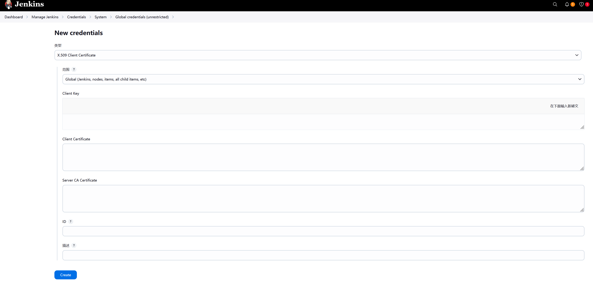

# docker配置通用tls证书

## 背景

因为安全策略无法直接开通22端口，需要通过流水线远程更新服务，只好让Jenkins通过远程访问docker的2375端口实现，这种形式还必须配置证书以达到安全访问的目的，网上找了很多资料，证书中都是配置的IP，这样每一个节点都需要单独生成证书，非常麻烦。通配符证书只对域名生效，因此配合修改hosts，使用自签名通配符证书即可实现多节点共用证书，详细方法如下。

## 生成通配符证书

使用脚本如下，按需修改域名，目录，有效期等参数

```shell
#!/bin/bash

HOST=ttcheng.wang

# 创建证书存放目录
mkdir -p $PWD/cert/docker
cd $PWD/cert/docker

# 生成CA密钥
openssl genrsa -aes256 -out ca-key.pem 4096
# 生成CA证书
openssl req -new -x509 -days 3650 -key ca-key.pem -sha256 -out ca.pem

# 生成服务端密钥
openssl genrsa -out server-key.pem 4096
# 生成服务端证书签名的请求文件
openssl req -subj "/CN=${HOST}" -sha256 -new -key server-key.pem -out server.csr
# 配置白名单，推荐配置0.0.0.0，允许所有IP连接但只有证书才可以连接成功
subjectAltName="DNS:*.${HOST},IP:0.0.0.0"
echo "subjectAltName = ${subjectAltName}" > extfile.cnf
# 生成服务端证书
openssl x509 -req -days 3650 -sha256 -in server.csr -CA ca.pem -CAkey ca-key.pem -CAcreateserial -out server-cert.pem -extfile extfile.cnf

# 生成客户端密钥
openssl genrsa -out key.pem 4096
# 生成客户端证书签名的请求文件
openssl req -subj '/CN=client' -new -key key.pem -out client.csr
echo "extendedKeyUsage = clientAuth" > extfile.cnf
# 生成客户端证书
openssl x509 -req -days 3650 -sha256 -in client.csr -CA ca.pem -CAkey ca-key.pem -CAcreateserial -out cert.pem -extfile extfile.cnf

# 更改密钥权限
chmod -v 0400 ca-key.pem key.pem server-key.pem
# 更改证书权限
chmod -v 0444 ca.pem server-cert.pem cert.pem

# 删除无用文件
rm -v client.csr server.csr
```
生成文件如下

| 文件            | 说明       |
| --------------- | ---------- |
| ca.pem          | CA证书     |
| ca-key.pem      | CA秘钥     |
| cert.pem        | 客户端证书 |
| key.pem         | 客户端私钥 |
| server-cert.pem | 服务端证书 |
| server-key.pem  | 服务端私钥 |
| 其他省略...     |            |


## 服务端配置

修改服务启动脚本如下

```shell

sed -i "s|-H fd:// ||" /usr/lib/systemd/system/docker.service
# 即移除如下内容中的“-H fd://”，否则修改daemon配置后重启docker会失败
#ExecStart=/usr/bin/dockerd -H fd:// --containerd=/run/containerd/containerd.sock
```
修改docker配置文件，加入如下几项配置

```json
{
  "tls": true,
  "tlscert": "/home/docker-tls/cert/docker/server-cert.pem",
  "tlskey": "/home/docker-tls/cert/docker/server-key.pem",
  "tlscacert": "/home/docker-tls/cert/docker/ca.pem",
  "hosts": ["tcp://0.0.0.0:2375", "fd://"]
}
```

重启docker

```shell
systemctl daemon-reload
systemctl restart docker
```

## 客户端使用
执行命令是增加对应参数即可
```shell
docker --tlsverify \
  --tlscacert=/etc/docker/certs.d/ttcheng.wang/cert/docker/ca.pem \
  --tlscert=/etc/docker/certs.d/ttcheng.wang/cert/docker/cert.pem \
  --tlskey=/etc/docker/certs.d/ttcheng.wang/cert/docker/key.pem \
  -H tcp://docker3917.ttcheng.wang \
  ps
```
为了方便还可以配置别名，缩短命令长度
```shell
alias dockertls='docker --tlsverify --tlscacert=/etc/docker/certs.d/ttcheng.wang/cert/docker/ca.pem --tlscert=/etc/docker/certs.d/ttcheng.wang/cert/docker/cert.pem --tlskey=/etc/docker/certs.d/ttcheng.wang/cert/docker/key.pem'

dockertls -H tcp://docker3917.ttcheng.wang ps
dockertls -H tcp://docker3917.ttcheng.wang service update --env-add SPRING_PROFILES_ACTIVE=dev app-backend_gateway
```
## Jenkins Pipeline中使用

配置秘钥，如下图，分别配置客户端秘钥、客户端证书、CA的证书



Pipeline脚本

```groovy
pipeline {
    agent any
    //定义环境变量
    environment {
    }
    stages {
        stage('部署') {
            steps {
                withDockerServer([credentialsId: 'docker-tls', uri: 'tcp://docker3917.ttcheng.wang:2375']) {
                    sh """
                    docker service update --image=${imageTag} ai-chat_api
                    """
                }
                echo "部署完成"
            }
        }
    }
}

```
