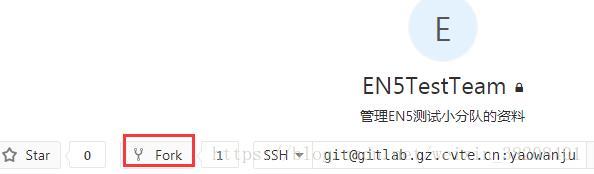
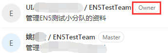
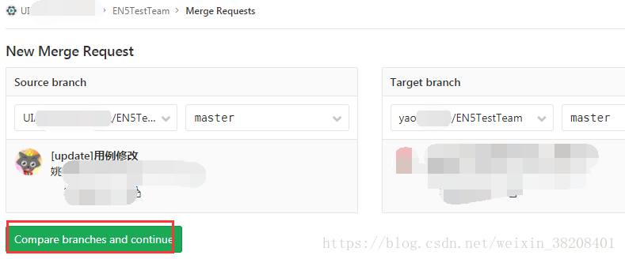
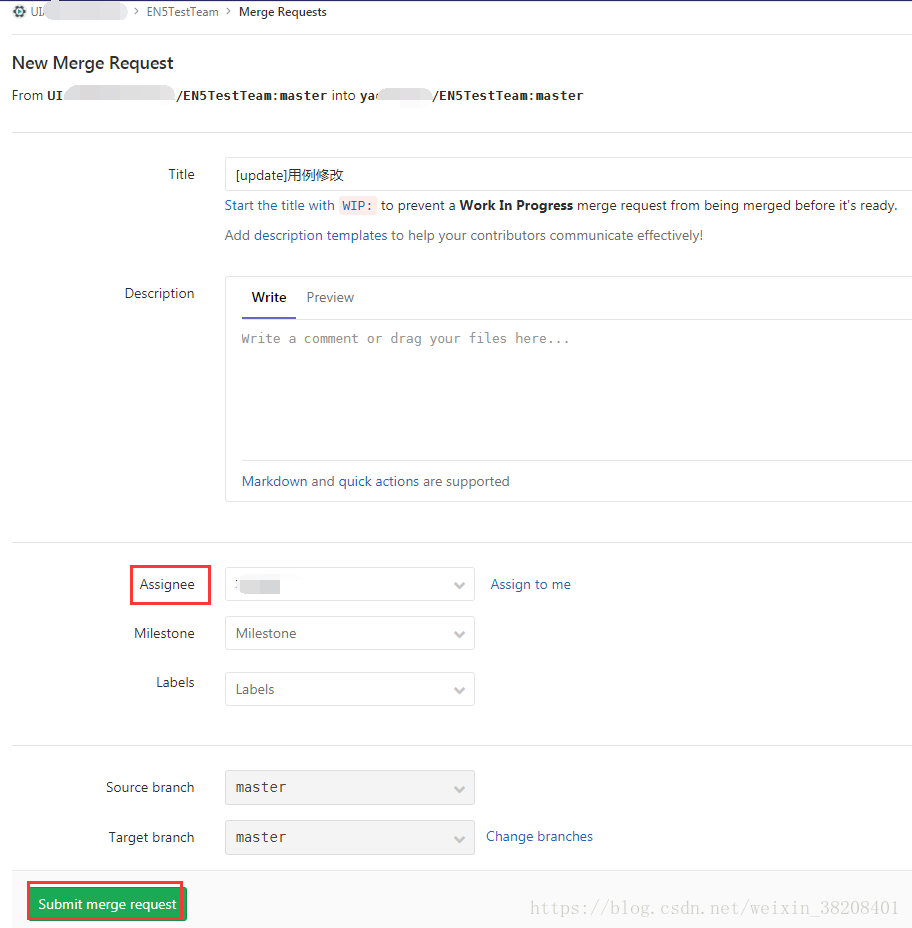
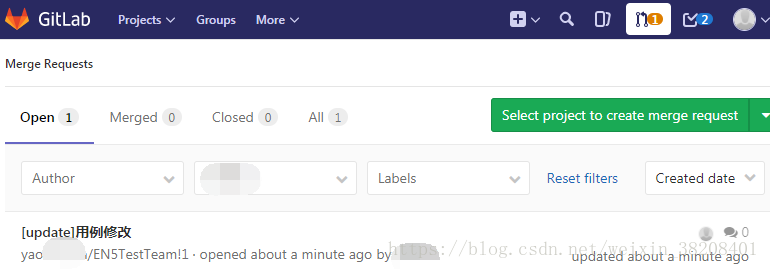
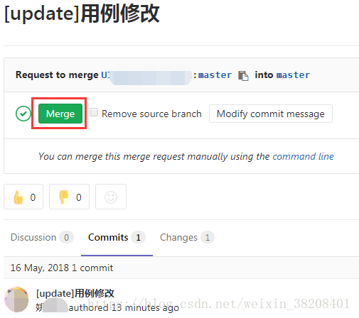

# 1、git merge request

### 1）fork：项目主分支上建立一个分支

 **成功后：** 

### 2）和以往一样的操作（<https://blog.csdn.net/weixin_38208401/article/details/72518258>）

- clone新分支
- 修改代码
- status
- add file
- commit
- push

### 3）新分支中New Merge Request

####  **选择代码审核人 Assignee** 

  

### 4、审核人在通知中可查看到

####  **审核人点击Merge** 

 

#### **结果：** 

