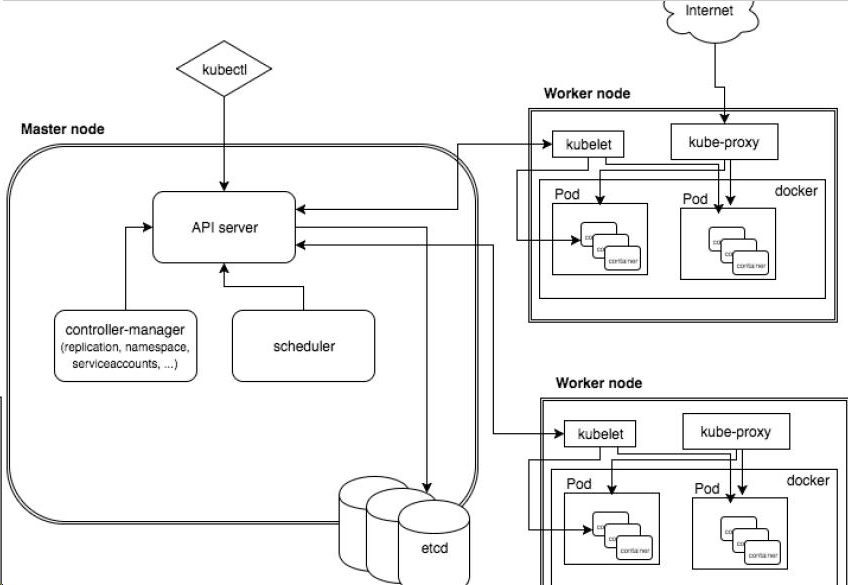
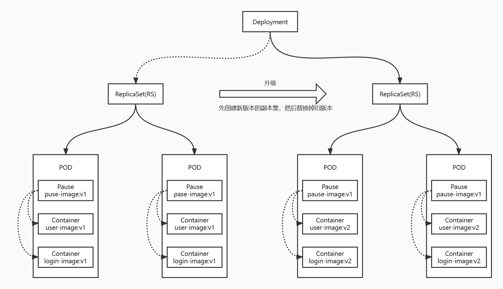
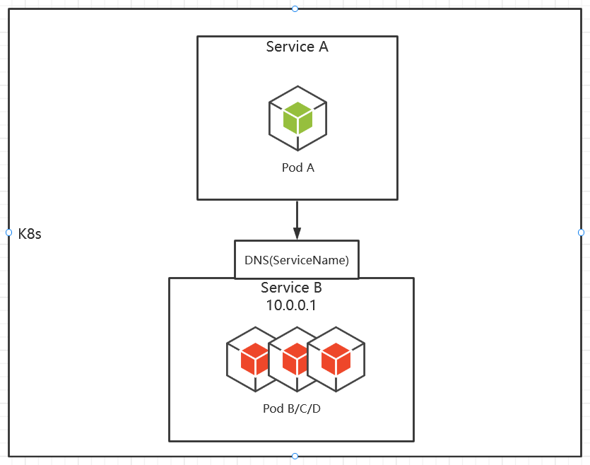
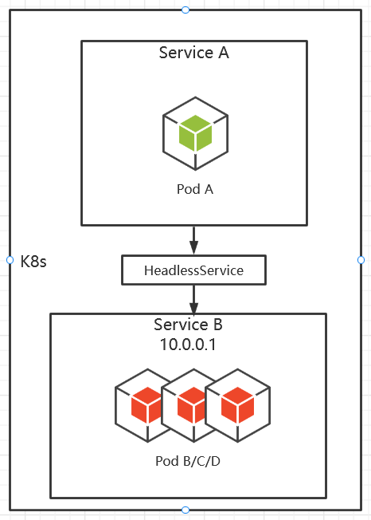
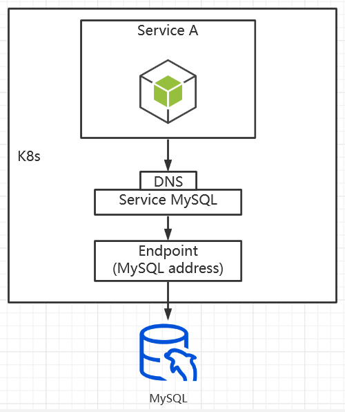
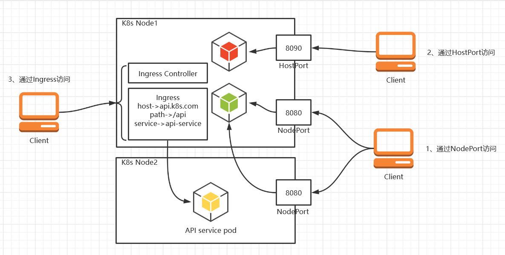
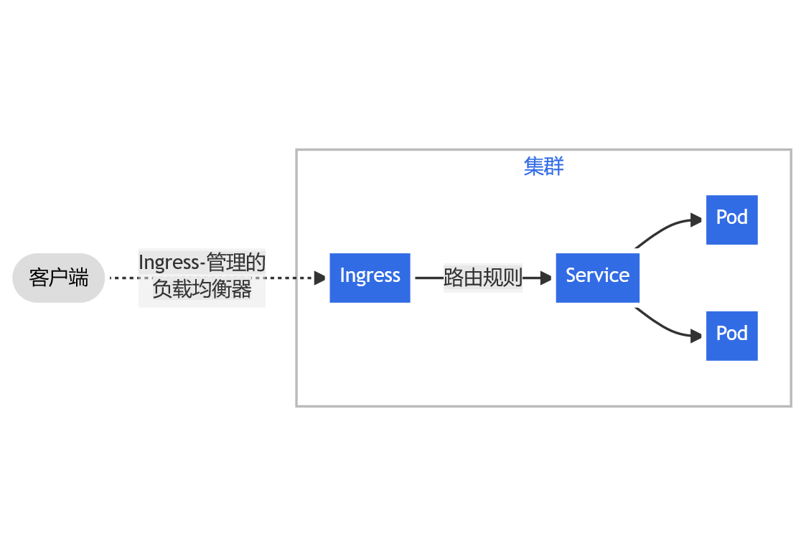
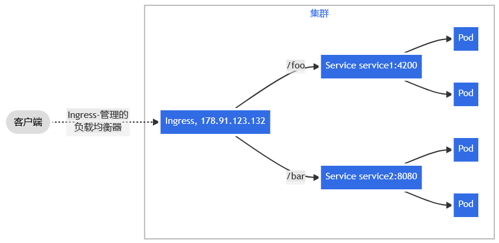
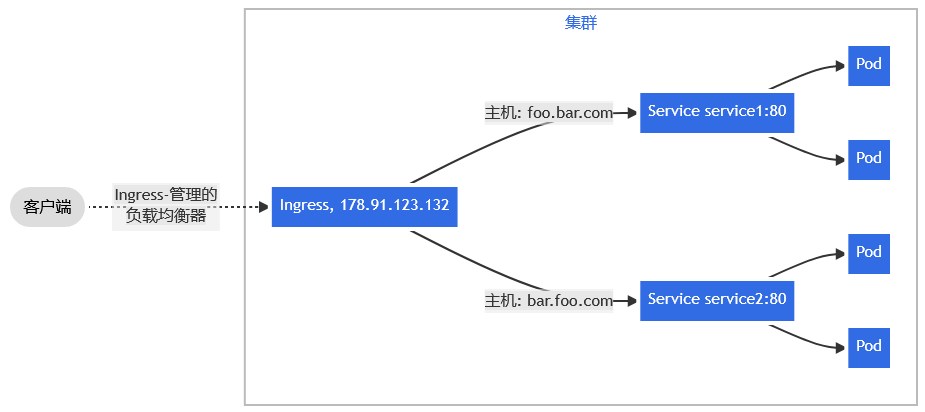

# Kubernetes

## 简介

Kubernetes 是一个轻便的和可扩展的开源平台，用于管理容器化应用和服务。通过Kubernetes 能够进行应用的自动化部署和扩缩容。在 Kubernetes 中，会将组成应用的容器组合成一个逻辑单元以更易管理和发现

## 功能（优势）

- 自动装箱
  基于容器对应用运行环境的资源配置要求自动部署应用容器
- 自我修复( ( 自愈能力) )
  当容器失败时，会对容器进行重启当所部署的 Node 节点有问题时，会对容器进行重新部署和重新调度当容器未通过监控检查时，会关闭此容器直到容器正常运行时，才会对外提供服务
- 水平扩展
  通过简单的命令、用户 UI 界面或基于 CPU 等资源使用情况，对应用容器进行规模扩大或规模剪裁
- 服务发现
  用户不需使用额外的服务发现机制，就能够基于 Kubernetes 自身能力实现服务发现和负载均衡
- 滚动更新
  可以根据应用的变化，对应用容器运行的应用，进行一次性或批量式更新
- 版本回退
  可以根据应用部署情况，对应用容器运行的应用，进行历史版本即时回退
- 密钥和配置管理
  在不需要重新构建镜像的情况下，可以部署和更新密钥和应用配置，类似热部署。
- 存储编排
  自动实现存储系统挂载及应用，特别对有状态应用实现数据持久化非常重要存储系统可以来自于本地目录、网络存储(NFS、Gluster、Ceph 等)、公共云存储服务
- 批处理
  提供一次性任务，定时任务；满足批量数据处理和分析的场景

## 核心概念

### 集群架构




### 组件功能

- Master Node

  k8s 集群控制节点，对集群进行调度管理，接受集群外用户去集群操作请求

- WorkerNode

  集群工作节点，运行用户业务应用主机

- kubectl

  Kubernetes 命令行工具，[kubectl](https://kubernetes.io/docs/reference/kubectl/kubectl/)，使得你可以对 Kubernetes 集群运行命令。 你可以使用 kubectl 来部署应用、监测和管理集群资源以及查看日志。

- API server

  验证并配置 API 对象的数据，这些对象包括 pods、services、replicationcontrollers 等。API 服务器为 REST 操作提供服务，并为集群的共享状态提供前端，所有其他组件都通过该前端进行交互。

  例：以下是一个Pod API对象

  ```yaml
  apiVersion: v1
  kind: Pod
  metadata:
    name: nginx
  spec:
    containers:
    - name: nginx
      image: nginx:1.14.2
      ports:
      - containerPort: 80
  ```

- Scheduler

  调度器，将Pod调度到Node上。

- ControlerManager

  管理各种controller，

- etcd

  etcd 是兼具一致性和高可用性的键值数据库，可以作为保存 Kubernetes 所有集群数据的后台数据库

- Kubelet

  是每个Node节点上运行的主要“节点代理”

- kube-proxy

  是每个Node节点上运行的网络代理

- Pod

  *Pod* 一般包含一个或一组紧密关联的容器应用，是可以在 Kubernetes 中创建和管理的、最小的可部署的计算及存储单元。可以看成是一个虚拟主机。是分配资源的基本单位，也是调度的基本单位。
  
  资源包括：1、共享的存储卷。2、唯一的网络ip地址

### 部署示例

一个Pod中可以部署多个紧密相关的容器应用，各容器共享POD的资源

Pause的作用是作为Pod内的容器管理节点（或根节点），可以给其他容器提供资源（如网络），监控其他容器的健康状态

# 

## 集群搭建（kubeAdmin）

### 安装要求

- 一台或多台机器，操作系统 CentOS7.x-86_x64
- 硬件配置：2GB 或更多 RAM，2 个 CPU 或更多 CPU，硬盘 30GB 或更多
- 集群中所有机器之间网络互通
- 可以访问外网，需要拉取镜像
- 禁止 swap 分区

### 准备环境

- 软件环境

  | 软件               | 版本    |
  | ------------------ | ------- |
  | 操作系统           | CentOS7 |
  | Docker或containerd |         |
  | Kubernets          | 1.24.2  |

- 服务器规划

  | 角色       | IP             | 组件                                                         |
  | ---------- | -------------- | ------------------------------------------------------------ |
  | k8s-master | 192.168.60.101 | kube-apiserver，kube-controller-manager，kube-scheduler，etcd |
  | k8s-node1  | 192.168.60.102 | kubelet，kube-proxy，docker etcd                             |
  | k8s-node2  | 192.168.60.103 | kubelet，kube-proxy，docker etcd                             |

### 操作系统初始化

```shell
# 关闭防火墙
systemctl stop firewalld
systemctl disable firewalld
# 关闭 selinux
sed -i 's/enforcing/disabled/' /etc/selinux/config # 永久
setenforce 0 # 临时
# 关闭 swap
swapoff -a # 临时
sed -ri 's/.*swap.*/#&/' /etc/fstab # 永久
# 根据规划设置主机名
hostnamectl set-hostname <hostname>
# 在 master 添加 hosts
cat >> /etc/hosts << EOF
192.168.44.147 m1
192.168.44.148 n1
EOF
# 将桥接的 IPv4 流量传递到 iptables 的链
cat > /etc/sysctl.d/k8s.conf << EOF
net.bridge.bridge-nf-call-ip6tables = 1
net.bridge.bridge-nf-call-iptables = 1
EOF
sysctl --system # 生效
# 时间同步
yum install ntpdate -y
ntpdate time.windows.com
```

### 安装运行时（Docker/Containerd）

1.24版本正式移除了DockerShim，现在支持kubelet直接驱动containerd，也支持通过Docker来驱动，以及其他实现CRI（Container Runtime Interface）接口的运行时。

Docker和Containerd二选一

#### 以Docker作为运行时

安装docker

```shell
# wget https://mirrors.aliyun.com/docker-ce/linux/centos/docker-ce.repo -O /etc/yum.repos.d/docker-ce.repo
yum -y install docker-ce
systemctl enable docker && systemctl start docker
docker --version
```

配置国内镜像和本地目录

```shell
cat > /etc/docker/daemon.json << EOF
{
	"registry-mirrors": [
		"https://5cqvr97p.mirror.aliyuncs.com",
		"https://docker.mirrors.ustc.edu.cn",
		"https://hub-mirror.c.163.com"
    ],
    "graph": "/data/docker",
    "exec-opts": ["native.cgroupdriver=systemd"]
}
EOF
```

安装CRI-dockered

CRI-dockered实现了CRI的接口，替换Dockershim

https://github.com/Mirantis/cri-dockerd

去Github官网下载编译好的release版本，然后解压复制二进制可执行文件cri-dockerd到PATH的目录下（如/usr/bin/）。

按照README的说明添加cri-docker.service的服务和cri-docker.socket的接口之后启动服务就可以使用了

#### 以Continainerd作为运行时

- 安装

  yum -y install containerd

- 配置

```shell
# 初始化
# 生成默认配置
containerd config default > /etc/containerd/config.toml
# 修改镜像源
sed -i "s#k8s.gcr.io/pause#registry.aliyuncs.com/google_containers/pause#g" /etc/containerd/config.toml
# 启用SystemdCgroup
sed -i 's#SystemdCgroup = false#SystemdCgroup = true#g' /etc/containerd/config.toml
sed -i 's#systemd_cgroup = false#systemd_cgroup = true#g' /etc/containerd/config.toml
# 修改镜像源
sed -i '/registry.mirrors]/a\\      [plugins."io.containerd.grpc.v1.cri".registry.mirrors."docker.io"]' /etc/containerd/config.toml
sed -i '/registry.mirrors."docker.io"]/a\\        endpoint=["https://5cqvr97p.mirror.aliyuncs.com"]' /etc/containerd/config.toml
# 修改默认存储路径
sed -i 's#/opt/containerd#/data/containerd#' /etc/containerd/config.toml
# 设置运行时并重启
crictl config runtime-endpoint /run/containerd/containerd.sock
systemctl daemon-reload
systemctl restart containerd
```

或者直接新建`/etc/containerd/config.toml`并写入以下配置

```shell
version = 2
root = "/var/lib/containerd"
state = "/run/containerd"
oom_score = -999

[grpc]
  max_recv_message_size = 16777216
  max_send_message_size = 16777216

[debug]
  level = "info"

[metrics]
  address = ""
  grpc_histogram = false

[plugins]
  [plugins."io.containerd.internal.v1.opt"]
    path = "/data/containerd"
  [plugins."io.containerd.grpc.v1.cri"]
    sandbox_image = "registry.aliyuncs.com/google_containers/pause:3.6"
    max_container_log_line_size = -1
    [plugins."io.containerd.grpc.v1.cri".containerd]
      default_runtime_name = "runc"
      snapshotter = "overlayfs"
      [plugins."io.containerd.grpc.v1.cri".containerd.runtimes]
        [plugins."io.containerd.grpc.v1.cri".containerd.runtimes.runc]
          runtime_type = "io.containerd.runc.v2"
          runtime_engine = ""
          runtime_root = ""
          [plugins."io.containerd.grpc.v1.cri".containerd.runtimes.runc.options]
            SystemdCgroup = true
    [plugins."io.containerd.grpc.v1.cri".registry]
      [plugins."io.containerd.grpc.v1.cri".registry.mirrors]
        [plugins."io.containerd.grpc.v1.cri".registry.mirrors."docker.io"]
          endpoint = ["https://docker.mirrors.ustc.edu.cn", "https://hub-mirror.c.163.com", "https://registry-1.docker.io"]
```

### 安装kubeadm/kubelet(所有节点)

添加阿里云 YUM 软件源

```shell
cat > /etc/yum.repos.d/kubernetes.repo << EOF
[kubernetes]
name=Kubernetes
baseurl=https://mirrors.aliyun.com/kubernetes/yum/repos/kubernetes-el7-x86_64
enabled=1
gpgcheck=0
repo_gpgcheck=0
gpgkey=https://mirrors.aliyun.com/kubernetes/yum/doc/yum-key.gpg
https://mirrors.aliyun.com/kubernetes/yum/doc/rpm-package-key.gpg
EOF
```

安装 kubeadm，kubelet 和 kubectl

```shell
yum install -y kubelet kubeadm kubectl
systemctl enable kubelet
```

kubeadmin常用 命令

```shell
kubeadm init #启动一个master节点
kubeadm join #添加启动一个worker节点
kubeadm upgrade #更新一个集群到新版本
kubeadm config
kubeadm token #管理令牌
kubeadm reset #还原kubeadm init/join的改变
kubeadm version
kubeadm alpha
```

### 部署 Kubernetes Master

1、在192.168.60.101上执行

```shell
 kubeadm init \
--apiserver-advertise-address=192.168.60.101 \
--image-repository registry.aliyuncs.com/google_containers \
--kubernetes-version stable \
--service-cidr=10.96.0.0/12 \
--pod-network-cidr=10.244.0.0/16
--cri-socket unix:///run/containerd/containerd.socket
# --cri-socket unix:///var/run/cri-docker.socket
# 两种socket分别对应CRI的两种实现，直接调用containerd或者通过docker调用containerd

# 初始化成功之后记录token，会有如下日志，忘记可以根据kubeadm重新生成
# kubeadm join 192.168.56.102:6443 --token xbzz28.rh338weqytkffcnj \
#        --discovery-token-ca-cert-hash sha256:6d071a2222147bd0af1831af477d5a2c3dad218bdffc042cf0cd9ae3814ebf14
```

**Note**:如果命令执行失败报错：

关键字cgroups

```log
 OCI runtime create failed: runc create failed: expected cgroupsPath to be of format \"slice:prefix:name\" for systemd cgroups, got \"/kubepods/burstable....
```

说明时containerd和kubelet的cgroups驱动不一致

```shell
systemctl status kubelet -l
# 查看kebelet的命令的cgroup驱动选项是不是systemd(--cgroup-driver=systemd)
# 不是则修改为systemd。
vim /usr/lib/systemd/system/kubelet.service.d/10-kubeadm.conf
# 注意目录有可能在/etc下面，根据status的日志判断

systemctl daemon-reload
kubeadm reset
```

然后重新初始化即可

**Note**:如果初始化失败，需要重新执行`kubeadm init`时，需要先执行`kubeadm reset`进行重置

```shell
kubeadm reset
iptables -F && iptables -t nat -F && iptables -t mangle -F && iptables -X
```

2、配置kubectl

普通用户执行

```shell
mkdir -p $HOME/.kube
sudo cp -i /etc/kubernetes/admin.conf $HOME/.kube/config
sudo chown $(id -u):$(id -g) $HOME/.kube/config
kubectl get nodes
```

### 安装 Pod 网络插件（CNI）

网络插件装一个就行，下面两种二选一，因为github经常无法下载，建议使用calico

- flannel

  Docker默认使用的

  ```shell
  kubectl apply –f https://raw.githubusercontent.com/coreos/flannel/master/Documentation/kube-flannel.yml
  ```

- calico

  当前更流行

  ```shell
  kubectl create -f https://projectcalico.docs.tigera.io/manifests/tigera-operator.yaml
  wget https://projectcalico.docs.tigera.io/manifests/custom-resources.yaml
  # 这里需要修改custom-resources.yaml中的cidr: 192.168.0.0/16，将网段修改为k8s的podSubNet
  kubectl apply -f custom-resources.yaml
  # Remove the taints on the master so that you can schedule pods on it.
  kubectl taint nodes --all node-role.kubernetes.io/master-
  ```

### 加入Node

```shell
# node节点执行104/103
kubeadm join 192.168.56.102:6443 --token xbzz28.rh338weqytkffcnj \
        --discovery-token-ca-cert-hash sha256:6d071a2222147bd0af1831af477d5a2c3dad218bdffc042cf0cd9ae3814ebf14
```

忘记token时可以用以下两个命令重新生成命令

```shell
kubeadm token generate
kubeadm token create 上一条命令生成的token --print-join-command
```

### 测试 kubernetes 集群

在 Kubernetes 集群中创建一个 pod，验证是否正常运行：

```shell
kubectl create deployment nginx --image=nginx
kubectl expose deployment nginx --port=80 --type=NodePort
kubectl get pod,svc
```

访问地址：http://NodeIP:Port

## 集群搭建（离线安装包）

离线安装需要额外设置自签发证书

### 部署ETCD集群

1、生成ETCD证书

```shell
# 准备 cfssl 证书生成工具
wget https://pkg.cfssl.org/R1.2/cfssl_linux-amd64
wget https://pkg.cfssl.org/R1.2/cfssljson_linux-amd64
wget https://pkg.cfssl.org/R1.2/cfssl-certinfo_linux-amd64
chmod +x cfssl_linux-amd64 cfssljson_linux-amd64 cfssl-certinfo_linux-amd64
mv cfssl_linux-amd64 /usr/local/bin/cfssl
mv cfssljson_linux-amd64 /usr/local/bin/cfssljson
mv cfssl-certinfo_linux-amd64 /usr/bin/cfssl-certinfo

# 生成Etcd证书
## 创建工作目录：
mkdir -p ~/TLS/{etcd,k8s}
cd TLS/etcd

## 自签 CA
cat > ca-config.json<< EOF
{
    "signing": {
        "default": {
        "expiry": "87600h"
        },
        "profiles": {
            "www": {
            "expiry": "87600h",
            "usages": [
                "signing",
                "key encipherment",
                "server auth",
                "client auth"
                ]
            }
        }
    }
}
EOF
cat > ca-csr.json<< EOF
{
    "CN": "etcd CA",
    "key": {
        "algo": "rsa",
        "size": 2048
    },
    "names": [
        {
            "C": "CN",
            "L": "Beijing",
            "ST": "Beijing"
        }
    ]
}
EOF
## 生成证书
cfssl gencert -initca ca-csr.json | cfssljson -bare ca -
ls *pem
ca-key.pem ca.pem

# 使用自签CA签发etcd的https证书
cat > server-csr.json<< EOF
{
    "CN": "etcd",
    "hosts": [
        "192.168.60.101",
        "192.168.60.102",
        "192.168.60.103"
    ],
    "key": {
        "algo": "rsa",
        "size": 2048
    },
    "names": [
        {
            "C": "CN",
            "L": "BeiJing",
            "ST": "BeiJing"
        }
    ]
}
EOF
## 生成证书
cfssl gencert -ca=ca.pem -ca-key=ca-key.pem -config=ca-config.json -
profile=www server-csr.json | cfssljson -bare server
ls server*pem
server-key.pem server.pem
```

2、安装ETCD集群

```shell
# 建工作目录并下载解压二进制包
wget https://github.com/etcd-io/etcd/releases/download/v3.4.9/etcd-v3.4.9-linux-amd64.tar.gz
mkdir /opt/etcd/{bin,cfg,ssl} –p
tar zxvf etcd-v3.4.9-linux-amd64.tar.gz
mv etcd-v3.4.9-linux-amd64/{etcd,etcdctl} /opt/etcd/bin/

# 创建ETCD配置文件
cat > /opt/etcd/cfg/etcd.conf << EOF
#[Member]
ETCD_NAME="etcd-1"
ETCD_DATA_DIR="/var/lib/etcd/default.etcd"
ETCD_LISTEN_PEER_URLS="https://192.168.60.101:2380"
ETCD_LISTEN_CLIENT_URLS="https://192.168.60.101:2379"
#[Clustering]
ETCD_INITIAL_ADVERTISE_PEER_URLS="https://192.168.60.101:2380"
ETCD_ADVERTISE_CLIENT_URLS="https://192.168.60.101:2379"
ETCD_INITIAL_CLUSTER="etcd-1=https://192.168.60.101:2380,etcd-2=https://192.168.60.102:2380,etcd-3=https://192.168.60.103:2380"
ETCD_INITIAL_CLUSTER_TOKEN="etcd-cluster"
ETCD_INITIAL_CLUSTER_STATE="new"
EOF
```

ETCD_NAME：节点名称，集群中唯一
ETCD_DATA_DIR：数据目录
ETCD_LISTEN_PEER_URLS：集群通信监听地址
ETCD_LISTEN_CLIENT_URLS：客户端访问监听地址
ETCD_INITIAL_ADVERTISE_PEER_URLS：集群通告地址
ETCD_ADVERTISE_CLIENT_URLS：客户端通告地址
ETCD_INITIAL_CLUSTER：集群节点地址
ETCD_INITIAL_CLUSTER_TOKEN：集群 Token
ETCD_INITIAL_CLUSTER_STATE：加入集群的当前状态，new 是新集群，existing 表示加入已有集群


3、systemd 管理 etcd

```shell
cat > /usr/lib/systemd/system/etcd.service << EOF
[Unit]
Description=Etcd Server
After=network.target
After=network-online.target
Wants=network-online.target
[Service]
Type=notify
EnvironmentFile=/opt/etcd/cfg/etcd.conf
ExecStart=/opt/etcd/bin/etcd \
--cert-file=/opt/etcd/ssl/server.pem \
--key-file=/opt/etcd/ssl/server-key.pem \
--peer-cert-file=/opt/etcd/ssl/server.pem \
--peer-key-file=/opt/etcd/ssl/server-key.pem \
--trusted-ca-file=/opt/etcd/ssl/ca.pem \
--peer-trusted-ca-file=/opt/etcd/ssl/ca.pem \
--logger=zap
Restart=on-failure
LimitNOFILE=65536
[Install]
WantedBy=multi-user.target
EOF

cp ~/TLS/etcd/ca*pem ~/TLS/etcd/server*pem /opt/etcd/ssl/

systemctl daemon-reload
systemctl start etcd
systemctl enable etcd

scp -r /opt/etcd/ root@192.168.31.72:/opt/
scp /usr/lib/systemd/system/etcd.service
root@192.168.31.72:/usr/lib/systemd/system/
scp -r /opt/etcd/ root@192.168.31.73:/opt/
scp /usr/lib/systemd/system/etcd.service
root@192.168.31.73:/usr/lib/systemd/system/

vi /opt/etcd/cfg/etcd.conf
#[Member]
ETCD_NAME="etcd-1" # 修改此处，节点 2 改为 etcd-2，节点 3 改为 etcd-3
ETCD_DATA_DIR="/var/lib/etcd/default.etcd"
ETCD_LISTEN_PEER_URLS="https://192.168.31.71:2380" # 修改此处为当前服务器 IP
ETCD_LISTEN_CLIENT_URLS="https://192.168.31.71:2379" # 修改此处为当前服务器 IP
#[Clustering]
ETCD_INITIAL_ADVERTISE_PEER_URLS="https://192.168.31.71:2380" # 修改此处为当前服务器 IP
ETCD_ADVERTISE_CLIENT_URLS="https://192.168.31.71:2379" # 修改此处为当前服务器IP
ETCD_INITIAL_CLUSTER="etcd-1=https://192.168.31.71:2380,etcd-2=https://192.168.31.72:2380,etcd-3=https://192.168.31.73:2380"
ETCD_INITIAL_CLUSTER_TOKEN="etcd-cluster"
ETCD_INITIAL_CLUSTER_STATE="new"
```


```shell
# 查看集群状态
ETCDCTL_API=3 /opt/etcd/bin/etcdctl --cacert=/opt/etcd/ssl/ca.pem --
cert=/opt/etcd/ssl/server.pem --key=/opt/etcd/ssl/server-key.pem --
endpoints="https://192.168.31.71:2379,https://192.168.31.72:2379,https://192.16
8.31.73:2379" endpoint health
https://192.168.31.71:2379 is healthy: successfully committed proposal: took =
8.154404ms
https://192.168.31.73:2379 is healthy: successfully committed proposal: took =
9.044117ms
https://192.168.31.72:2379 is healthy: successfully committed proposal: took =
10.000825ms
```

## 服务发现

### 集群内互访

- DNS + ClusterIP

  Service A的Pod A想要访问Service B的服务，流程如下图所示

  1、Pod IP会变化，不能直接访问。（POD有快速创建和快速销毁的特性）

  2、Service Cluster IP是一个相对固定虚拟IP，有多个POD的负载均衡和高可用的作用

  3、程序中直接使用IP并不优雅，为了方便通过DNS映射服务名，通过服务名来访问



- HeadlessService

  当ServiceA的Pod A想要根据一定的规则（如指定Pod通信、不想随机选择、自定义负载均衡策略）访问Service B中的某个具体的POD时，上一种方式就不再适用。

  基于此k8s提供了一个headless的解决方案：

  Headless的每一个服务Pod都有一个服务名，POD A访问HeadlessService得到服务B的Pod列表（服务名，IP），通过服务名或IP列表自定义策略访问服务B的POD

  

### 内部访问集群外服务

- 直接访问

  使用传统的方式可以直接放访问

- 外部服务

  将外部服务的地址虚拟化为一个内部服务，当外部服务发生变化时修改这个内部服务的Endpoint即可，不用修改服务集群。

  

### 外部访问集群内服务

- NodePort

  在k8s每个节点上暴露一个固定端口，外部客户端通过节点端口来访问。

  不常用，会占用节点端口，每个节点都占用造成资源浪费，对客户端来说也不知道该访问哪个节点。

- HostPort

  相比NodePort，端口只在有服务Pod的节点上占用，降低了端口资源的浪费。

- LoadBalancer

  使用云服务厂商提供的外部负载均衡器
  
- Ingress

  通过ingress来访问，这种需要单独部署IngressController跟前三种不相同，下一章详细展开。

其中三种方式如下图



### Ingress

是一种容器外访问集群内服务的域名访问方案。Ingress 可为 Service 提供外部可访问的 URL、负载均衡流量、终止 SSL/TLS，以及基于名称的虚拟托管。



使用Ingress域名服务时，需要先部署一个Ingress控制器（如Ingress-Nginx、ingress-gce），仅创建Ingress资源没有任何效果，这样的控制器有很多，理想情况下，所有 Ingress 控制器都应符合参考规范。但实际上，不同的 Ingress 控制器操作略有不同。

一个最小的 Ingress 资源示例：

```yaml
apiVersion: networking.k8s.io/v1
kind: Ingress
metadata:
  name: minimal-ingress
  annotations:
    nginx.ingress.kubernetes.io/rewrite-target: /
spec:
  ingressClassName: nginx-example
  rules:
  - http:
      paths:
      - path: /testpath
        pathType: Prefix
        backend:
          service:
            name: test
            port:
              number: 80
```

Ingress有三种类型

- 单服务支撑的Ingress（通过IP）
- 简单扇出（分路由）
- 基于名称的虚拟托管（分n级域名）

#### 单服务（IP）

现有的 Kubernetes 概念允许你暴露单个 Service ([Service.Type=LoadBalancer](https://kubernetes.io/zh-cn/docs/concepts/services-networking/service/#loadbalancer)，[Service.Type=NodePort](https://kubernetes.io/zh-cn/docs/concepts/services-networking/service/#nodeport))。

你也可以通过指定无规则的 *默认后端* 来对 Ingress 进行此操作。

```yaml
apiVersion: networking.k8s.io/v1
kind: Ingress
metadata:
  name: test-ingress
spec:
  defaultBackend:
    service:
      name: test
      port:
        number: 80
```

`kubectl get ingress test-ingress`

```shell
NAME           CLASS         HOSTS   ADDRESS         PORTS   AGE
test-ingress   external-lb   *       203.0.113.123   80      59s
```

其中 `203.0.113.123` 是由 Ingress 控制器分配以满足该 Ingress 的 IP。

#### 简单扇出（路由）

一个扇出（fanout）配置根据请求的 HTTP URI 将来自同一 IP 地址的流量路由到多个 Service。 Ingress 允许你将负载均衡器的数量降至最低。例如，这样的设置：



基于上图的Ingress资源示例：

```yaml
apiVersion: networking.k8s.io/v1
kind: Ingress
metadata:
  name: simple-fanout-example
spec:
  rules:
  - host: foo.bar.com
    http:
      paths:
      - path: /foo
        pathType: Prefix
        backend:
          service:
            name: service1
            port:
              number: 4200
      - path: /bar
        pathType: Prefix
        backend:
          service:
            name: service2
            port:
              number: 8080
```

`kubectl describe ingress simple-fanout-example`

```shell
Name:             simple-fanout-example
Namespace:        default
Address:          178.91.123.132
Default backend:  default-http-backend:80 (10.8.2.3:8080)
Rules:
  Host         Path  Backends
  ----         ----  --------
  foo.bar.com
               /foo   service1:4200 (10.8.0.90:4200)
               /bar   service2:8080 (10.8.0.91:8080)
Annotations:
  nginx.ingress.kubernetes.io/rewrite-target:  /
Events:
  Type     Reason  Age                From                     Message
  ----     ------  ----               ----                     -------
  Normal   ADD     22s                loadbalancer-controller  default/test
```

#### 基于名称的虚拟托管（n级域名）

基于名称的虚拟主机支持将针对多个主机名的 HTTP 流量路由到同一 IP 地址上。



基于上图的Ingress资源示例：

```yaml
apiVersion: networking.k8s.io/v1
kind: Ingress
metadata:
  name: name-virtual-host-ingress
spec:
  rules:
  - host: foo.bar.com
    http:
      paths:
      - pathType: Prefix
        path: "/"
        backend:
          service:
            name: service1
            port:
              number: 80
  - host: bar.foo.com
    http:
      paths:
      - pathType: Prefix
        path: "/"
        backend:
          service:
            name: service2
            port:
              number: 80
```

#### 负载均衡

Ingress 控制器启动引导时使用一些适用于所有 Ingress 的负载均衡策略设置，例如负载均衡算法、后端权重方案等。 更高级的负载均衡概念（例如持久会话、动态权重）尚未通过 Ingress 公开。 你可以通过用于服务的负载均衡器来获取这些功能。

值得注意的是，尽管健康检查不是通过 Ingress 直接暴露的，在 Kubernetes 中存在并行的概念，比如 [就绪检查](https://kubernetes.io/zh-cn/docs/tasks/configure-pod-container/configure-liveness-readiness-startup-probes/)， 允许你实现相同的目的。 请检查特定控制器的说明文档（[nginx](https://git.k8s.io/ingress-nginx/README.md)、 [GCE](https://git.k8s.io/ingress-gce/README.md#health-checks)）以了解它们是怎样处理健康检查的。

`todo`

#### Ingress常用命令

```shell
# 应用一个Ingress
kubectl apply -f service/networking/simple-fanout-example.yaml
# 描述一个Ingress
kubectl describe ingress simple-fanout-example
# 编辑一个Ingress
kubectl edit ingress simple-fanout-example
# 替换一个Ingress
kubectl replace -f service/networking/simple-fanout-example-v2.yaml
```

#### 部署和配置Nginx Ingress

[官方安装文档](https://kubernetes.github.io/ingress-nginx/deploy/)

[裸机注意事项](https://kubernetes.github.io/ingress-nginx/deploy/baremetal/)

[用户指南](https://kubernetes.github.io/ingress-nginx/user-guide)

## 服务迁移

服务迁移的步骤如下

1. 制作镜像
   1. 基础镜像
   2. 服务运行相关文件
   3. Dockerfile制作镜像
2. 部署k8s服务
   1. 确定服务发现策略
   2. 编写k8s配置文件

### SpringBoot应用

`Dockerfile`

```dockerfile
FROM openjdk:8-jre-alpine

COPY target/springboot-web-demo-1.0-SNAPSHOT.jar /springboot-web.jar

ENTRYPOINT ["java", "-jar", "/springboot-web.jar"]
```

`springboot-web.yaml`

```yaml
#deploy
apiVersion: apps/v1
kind: Deployment
metadata:
  name: springboot-web-demo
spec:
  selector:
    matchLabels:
      app: springboot-web-demo
  replicas: 1
  template:
    metadata:
      labels:
        app: springboot-web-demo
    spec:
      containers:
      - name: springboot-web-demo
        image: hub.mooc.com/kubernetes/springboot-web:v1
        ports:
        - containerPort: 8080
---
#service
apiVersion: v1
kind: Service
metadata:
  name: springboot-web-demo
spec:
  ports:
  - port: 80
    protocol: TCP
    targetPort: 8080
  selector:
    app: springboot-web-demo
  type: ClusterIP

---
#ingress
apiVersion: networking.k8s.io/v1
kind: Ingress
metadata:
  name: springboot-web-demo
spec:
  rules:
  - host: springboot.mooc.com
    http:
      paths:
      - path: /
        backend:
          serviceName: springboot-web-demo
          servicePort: 80
```

### 传统Web应用

`Dockerfile`

```dockerfile
FROM tomcat:8.0.51-alpine

COPY ROOT /usr/local/tomcat/webapps/ROOT

COPY dockerfiles/start.sh /usr/local/tomcat/bin/start.sh

ENTRYPOINT ["sh" , "/usr/local/tomcat/bin/start.sh"]
```

`start.sh`

```shell
#!/bin/bash
sh /usr/local/tomcat/bin/startup.sh
tail -f /usr/local/tomcat/logs/catalina.out
```

`web.yaml`

```yaml
#deploy
apiVersion: apps/v1
kind: Deployment
metadata:
  name: web-demo
spec:
  selector:
    matchLabels:
      app: web-demo
  replicas: 1
  template:
    metadata:
      labels:
        app: web-demo
    spec:
      containers:
      - name: web-demo
        image: hub.mooc.com/kubernetes/web:v1
        ports:
        - containerPort: 8080
---
#service
apiVersion: v1
kind: Service
metadata:
  name: web-demo
spec:
  ports:
  - port: 80
    protocol: TCP
    targetPort: 8080
  selector:
    app: web-demo
  type: ClusterIP

---
#ingress
apiVersion: extensions/v1beta1
kind: Ingress
metadata:
  name: web-demo
spec:
  rules:
  - host: web.mooc.com
    http:
      paths:
      - path: /
        backend:
          serviceName: web-demo
          servicePort: 80
```

## CICD

传统的部署流程

```
获取VCS代码 --> 构建(编译打包) --> 发布(上传服务器) --> 部署(脚本停止、运行)
```

存在的问题

```
        / 1、服务间断
问题 --- | 2、环境不可控(共用主机,别的应用修改环境参数)
        \ 3、多次构建(dev,sit,uat,prd)
```

引入Kubernetes之后

```
获取VCS代码 --> 构建(编译、打包) --> 制作上传镜像 --> k8s滚动部署 --> 健康检查
```

好处就是解决之前的三个问题

一个CICD示例，包含以下4个文件

│  jenkins.pipeline
└─script
    │  build-image-web.sh
    │  deploy.sh
    └─template
            web.yaml

1、jenkins.pipeline，包含了流水线的各个阶段执行的命令

```jenkins.pipeline
node {
   def BUILD_DIR = "/root/build-workspace/"
   env.BUILD_DIR = "/root/build-workspace/"
   env.MODULE = "web-demo"
   env.HOST = "k8s-web.mooc.com"
    
   stage('Preparation') { // for display purposes
      // Get some code from a GitHub repository
      git 'https://gitee.com/pa/mooc-k8s-demo-docker.git'
   }
   stage('Maven Build') {
      // Run the maven build
      sh "mvn -pl ${MODULE} -am -Dmaven.test.failure.ignore clean package"
   }
   stage('Build Image') {
      sh "/root/script/build-image-web.sh"
   }
   stage('Deploy') {
       sh "/root/script/deploy.sh"
   }
}
```

2、制作镜像的脚本`script/build-image-web.sh`

```shell
#!/bin/bash

if [ "${BUILD_DIR}" == "" ];then
    echo "env 'BUILD_DIR' is not set"
    exit 1
fi
# JOB_NAME及后面的WORKSPACE为jenkins的预定义变量
DOCKER_DIR=${BUILD_DIR}/${JOB_NAME}

if [ ! -d ${DOCKER_DIR} ];then
    mkdir -p ${DOCKER_DIR}
fi

echo "docker workspace: ${DOCKER_DIR}"

JENKINS_DIR=${WORKSPACE}/${MODULE}

echo "jenkins workspace: ${JENKINS_DIR}"

if [ ! -f ${JENKINS_DIR}/target/*.war ];then
    echo "target war file not found ${JENKINS_DIR}/target/*.war"
    exit 1
fi

cd ${DOCKER_DIR}
rm -fr *
unzip -oq ${JENKINS_DIR}/target/*.war -d ./ROOT

mv ${JENKINS_DIR}/Dockerfile .
if [ -d ${JENKINS_DIR}/dockerfiles ];then
    mv ${JENKINS_DIR}/dockerfiles .
fi

VERSION=$(date +%Y%m%d%H%M%S)
IMAGE_NAME=hub.mooc.com/kubernetes/${JOB_NAME}:${VERSION}

echo "${IMAGE_NAME}" > ${WORKSPACE}/IMAGE

echo "building image: ${IMAGE_NAME}"
docker build -t ${IMAGE_NAME} .
# ！！需要先在服务器上登录镜像仓库
docker push ${IMAGE_NAME}
```

3、部署到k8s

K8s资源配置文件模板 `script/template/web.yaml`

```yaml
#deploy
apiVersion: apps/v1
kind: Deployment
metadata:
  name: {{name}}
spec:
  selector:
    matchLabels:
      app: {{name}}
  replicas: 1
  template:
    metadata:
      labels:
        app: {{name}}
    spec:
      containers:
      - name: {{name}}
        image: {{image}}
        ports:
        - containerPort: 8080
---
#service
apiVersion: v1
kind: Service
metadata:
  name: {{name}}
spec:
  ports:
  - port: 80
    protocol: TCP
    targetPort: 8080
  selector:
    app: {{name}}
  type: ClusterIP

---
#ingress
apiVersion: networking.k8s.io/v1
kind: Ingress
metadata:
  name: {{name}}
spec:
  rules:
  - host: {{host}}
    http:
      paths:
      - path: /
        backend:
          serviceName: {{name}}
          servicePort: 80
```

部署脚本`script/deploy.sh`，替换模板中的变量，创建k8s并进行健康检查

```shell
#!/bin/bash

name=${JOB_NAME}
image=$(cat ${WORKSPACE}/IMAGE)
host=${HOST}

echo "deploying ... name: ${name}, image: ${image}, host: ${host}"

rm -f web.yaml
cp $(dirname "${BASH_SOURCE[0]}")/template/web.yaml .
echo "copy success"
sed -i "s,{{name}},${name},g" web.yaml
sed -i "s,{{image}},${image},g" web.yaml
sed -i "s,{{host}},${host},g" web.yaml
echo "ready to apply"
kubectl apply -f web.yaml
echo "apply ok"

cat web.yaml

# 健康检查
success=0
count=60
IFS=","
sleep 5
while [ ${count} -gt 0 ]
do
    replicas=$(kubectl get deploy ${name} -o go-template='{{.status.replicas}},{{.status.updatedReplicas}},{{.status.readyReplicas}},{{.status.availableReplicas}}')
    echo "replicas: ${replicas}"
    arr=(${replicas})
    if [ "${arr[0]}" == "${arr[1]}" -a "${arr[1]}" == "${arr[2]}" -a "${arr[2]}" == "${arr[3]]}" ];then
        echo "health check success!"
        success=1
        break
    fi
    ((count--))
    sleep 2
done

if [ ${success} -ne 1 ];then
    echo "health check failed!"
    exit 1
fi
```

## 常见问题处理

处理问题常用的一些命令

```shell
systemctl status kubelet -l
crictl ps 
kubectl get nodes -o wide
kubectl describe node k8s-master
kubectl get pods
kubectl get pods -n kube-system
kubectl describe pod pod-nginx
# 查看pod日志
kubectl logs -n calico-system calico-node-r2lt2
```

### 节点状态NotReady

重启主机后发现主节点状态是NotReady，如下图所示

```shell
[jesse@k8s-master ~]$ kubectl get nodes
NAME         STATUS     ROLES           AGE   VERSION
k8s-master   NotReady   control-plane   27d   v1.24.2
```

解决办法

kubectl describe node k8s-master

可以在Conditions一栏中看到错误信息：NetworkPluginNotReady message:Network plugin returns error: cni plugin not initialized

```log
Conditions:
  Type             Status  LastHeartbeatTime                 LastTransitionTime                Reason                       Message
  ----             ------  -----------------                 ------------------                ------                       -------
  MemoryPressure   False   Sun, 24 Jul 2022 15:52:05 +0800   Mon, 27 Jun 2022 11:02:09 +0800   KubeletHasSufficientMemory   kubelet has sufficient memory available
  DiskPressure     False   Sun, 24 Jul 2022 15:52:05 +0800   Mon, 27 Jun 2022 11:02:09 +0800   KubeletHasNoDiskPressure     kubelet has no disk pressure  PIDPressure      False   Sun, 24 Jul 2022 15:52:05 +0800   Mon, 27 Jun 2022 11:02:09 +0800   KubeletHasSufficientPID      kubelet has sufficient PID available
  Ready            False   Sun, 24 Jul 2022 15:52:05 +0800   Mon, 27 Jun 2022 11:02:09 +0800   KubeletNotReady              container runtime network not ready: NetworkReady=false reason:NetworkPluginNotReady message:Network plugin returns error: cni plugin not initialized
```

说明是网络插件的问题，之前安装flannel作为CNI失败了，重新安装calico作为网络插件就恢复了，参考前面CNI安装章节

### 使用Kubeadm加入节点报错

使用如下命令加入节点

```shell
sudo kubeadm join 192.168.56.102:6443 --token xbzz28.rh338weqytkffcnj --discovery-token-ca-cert-hash sha256:6d071a2222147bd0af1831af477d5a2c3dad218bdffc042cf0cd9ae3814ebf14
```

报以下错误

```log
[preflight] Running pre-flight checks
error execution phase preflight: couldn't validate the identity of the API Server: could not find a JWS signature in the cluster-info ConfigMap for token ID "xbzz28"
To see the stack trace of this error execute with --v=5 or higher
```

原因：token 过期

```shell
# master主机重新生成token
kubeadm token generate
# 85geri.x85fe9d4oug830e8

# 生成加入节点的命令，token为上一条命令生成的
kubeadm token create 85geri.x85fe9d4oug830e8 --print-join-command
# kubeadm join 192.168.56.102:6443 --token 85geri.x85fe9d4oug830e8 --discovery-token-ca-cert-hash sha256:6d071a2222147bd0af1831af477d5a2c3dad218bdffc042cf0cd9ae3814ebf14
```

在节点中使用以下命令加入节点

### NMI watchdog: BUG: soft lockup-CPU#0 stuck for 22s

VirtualBox虚拟机开启多CPU时出现这个问题，把CPU数量改成1就行了
