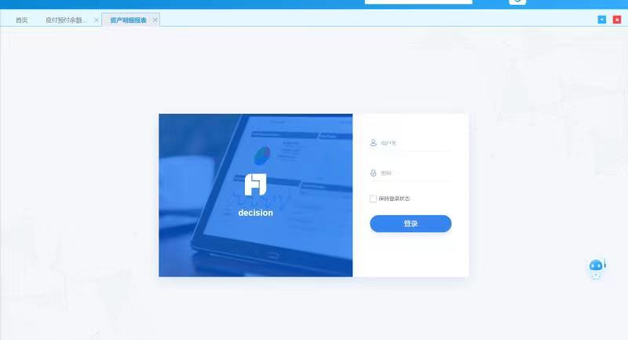

# 嵌入式部署帆软10跳转登录页的问题

## 现象

现象如图



## 原因探究

1、帆软页面通过iframe页面，嵌入到HAP的子框架中

2、帆软和hap各自都有自己的会话，各认各的

​	HAP的会话ID保存在cookie的SESSIONID_HAP中

​	帆软的token保存在cookie的fine_auth_token中

3、HAP认证进入首页时同时在后台登录帆软

4、当用户在报表界面停留过久，可能存在帆软的认证信息已经过期，而hap的认证没有过期时，就会出现帆软的登录界面

## 解决方案

### 临时解决

增加帆软会话的有效时间，降低出现的概率，但始终有可能会出现


### 永久解决方案

#### 1、方案一（实际采用）

**拦截过期跳转登录页面 - 返回登陆过期提示页面 - 跳转首页 - 首页自动获取token**

拦截核心代码

覆盖重写帆软源码RedirectAction这个类，将登录过期重定向的页面由/decision/login改为/timeout.html

```java
/**
 * com.fr.decision.webservice.interceptor.handler.redirect.RedirectAction#dealLoginInvalidStatus
 */
public class RedirectAction extends RequestInterceptorAction {
    // ......
	@Override
    public void dealLoginInvalidStatus(HttpServletRequest var1, HttpServletResponse var2, Exception var3)
                    throws Exception {
        FineLoggerFactory.getLogger().info(var3.getMessage());
        OriginUrlResponseBean var4 = getOriginalRedirectedUrl(var1);
        String var5 = UUIDUtil.generate();
        DecisionStatusService.originUrlStatusService().put(var5, var4,
                        (int) FSConfig.getInstance().getLoginConfig().getLoginTimeout());
        /**
         * String var6 = HttpToolbox.appendQuery("${fineServletURL}/login", "origin", var5);
         * var2.sendRedirect(TemplateUtils.render(var6));
         */
        var1.getRequestDispatcher("/timeout.html").forward(var1, var2);
    }
    // ......
}
```

拦截相关源码

PreHandlerFactory
RequestChecker.checkLogin
RedirectAction.dealLoginInvalidStatus


超时页面（帆软页面是iframe嵌入的，top是index.html）

timeout.html

```html
<!DOCTYPE html>
<html>
<head>
<meta charset="UTF-8">
<title></title>
<body>
    <script>
        if(top.sessionExpiredLogin){
            top.sessionExpiredLogin();
        }else{
            top.location.href = "${base.contextPath}/"
        }
    </script>
</body>
</html>
```

index.html 中的sessionExpiredLogin函数

```html
<!-- ...省略其他html部分... -->
<script>
	function sessionExpiredLogin(){
        kendo.ui.showInfoDialog({
            message: '<@spring.message "hap.login.timeout"/>',
            title: '<@spring.message "hap.prompt"/>',
        }).done(function (e) {
            // 访问首页，没认证会自动跳转单点登录地址
            window.location.href = "${base.contextPath}/"
        })
    }
</script>
<!-- ...省略其他html部分... -->
```

后端返回首页同时进行帆软的后台认证（这里后来拆分成独立接口了，影响首页的加载速度）

`LoginController.java`

```java
@Controller
public class LoginController extends BaseController
    // ...省略其他部分...
    
	@GetMapping(value = {"/", "/index.html"})
    public ModelAndView indexView(final HttpServletRequest request, final HttpServletResponse response) {
        ModelAndView modelAndView = getLoginAdaptor().indexView(request, response);
        IRequest iRequest = createRequestContext(request);
        FineUtils.login(request, response, iRequest);
        return modelAndView;
    }
}
```

`FineUtils.java`

```java
public class FineUtils {
    // ...省略其他部分...
    
	public static void login(HttpServletRequest request, HttpServletResponse response, IRequest serviceContext) {
        try {
            String userName = serviceContext.getUserName();
            String curToken = TokenResource.COOKIE.getToken(request);
            if (StringUtils.isEmpty(curToken) || !checkTokenValid(request, curToken, userName)) {
                User var13 = UserService.getInstance().getUserByUserName(userName);
                if (var13 == null) {
                    throw new UserNotExistException();
                }
                LoginService.getInstance().login(request, response, userName);
            }
        } catch (Exception e) {
            LOGGER.error("登录帆软失败！", e);
        }
    }
}
```


#### 2、方案二（不建议）

修改帆软登录配置和逻辑，保证帆软会话始终比HAP会话后过期。那么HAP会话更新时同时触发帆软会话更新即可

帆软会话过期时间设置为4小时

HAP过期时间2小时

HAP过期时帆软还剩两小时，此时更新HAP过期时间为两小时，同时重置帆软会话过期时间为4小时，

`FineUtils#holdLogin`

```java
public class FineUtils {
    // ...省略其他部分...
    
	/**
     * Login.认证信息过期时间小于一定阈值时刷新Token，而不是失效之后才刷新
     *
     * @param request        the request
     * @param response       the response
     * @param serviceContext the service context
     * @deprecated 配置复杂，并不百分百可靠
     */
    @Deprecated
    public static void holdLogin(HttpServletRequest request, HttpServletResponse response, IRequest serviceContext) {
        try {
            String userName = serviceContext.getUserName();
            String curToken = TokenResource.COOKIE.getToken(request);
            if (StringUtils.isNotBlank(curToken)) {
                Claims claims = JwtUtils.parseJWT(curToken);
                // 获取配置的过期提前偏移量
                int shiftTime = getShiftExpirationOrDefault(serviceContext.getUserId());
                if (StringUtils.equals(userName, claims.getSubject())
                                && claims.getExpiration().getTime() - System.currentTimeMillis() < shiftTime) {
                    // token过期时间小于阈值，则刷新token，减少出现登录页面的情况
                    RefreshTokenBean tokenBean = new RefreshTokenBean();
                    tokenBean.setOldToken(curToken);
                    tokenBean.setTokenTimeOut(FSConfig.getInstance().getLoginConfig().getLoginTimeout());
                    LoginService.getInstance().tokenRefresh(request, response, tokenBean);
                    return;
                }
            }
            // 否则如果需要再重新登录
            if (StringUtils.isEmpty(curToken) || !checkTokenValid(request, curToken, userName)) {
                User var13 = UserService.getInstance().getUserByUserName(userName);
                if (var13 == null) {
                    throw new UserNotExistException();
                }
                LoginService.getInstance().login(request, response, userName);
            }
        } catch (Exception e) {
            LOGGER.error("登录帆软失败！", e);
        }
    }
}
```

问题：当停留一个页面的时间足够长，两个会话都过期时，刷新页面不影响（因为HAP的过滤器优先级更高），但如果只发ajax请求，可能会出现403无法跳转的问题（没有尝试过，不确定）
