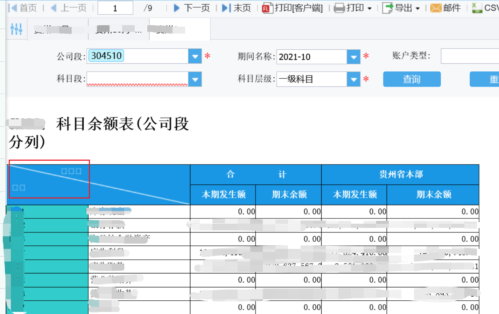
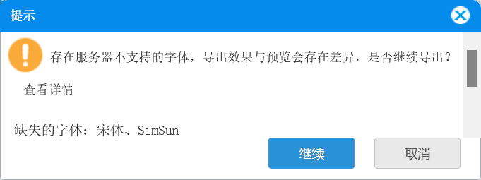

# 帆软9升级帆软10字体异常

## 现象

部分字体显示为小方块，如下图的表头



点击导出还会提示字体缺失



参考官方文档字体缺失检测
https://help.fanruan.com/finereport10.0/doc-view-4063.html

参考官方文档服务器安装字体

https://help.fanruan.com/finereport10.0/doc-view-3999.html


## 解决步骤

在服务器上安装WIN中文字体：宋体，simsun.ttc

```shell
sudo yum install -y fontconfig

sudo mkdir -p /usr/share/fonts/chinese 
sudo chmod -R 755 /usr/share/fonts/chinese

# 复制字体SIMSUN.ttc到/usr/share/fonts/chinese

cd /usr/share/fonts/chinese
#字体扩展 && 新增字体
sudo mkfontscale && sudo mkfontdir
sudo fc-cache -fv #刷新缓存，或者执行 
fc-cache /usr/share/fonts/chinese/fc-list #查看系统字体

# 检查是否安装成功
fc-list | grep simhei.ttf 

# 字体安装成功后，重启tomcat
```

