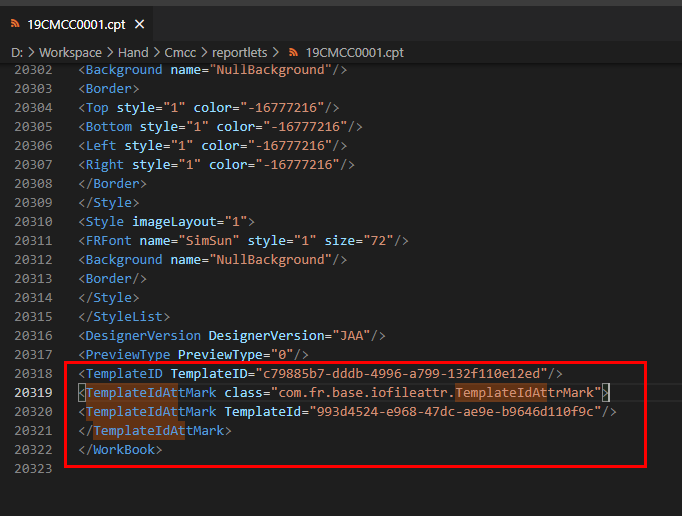
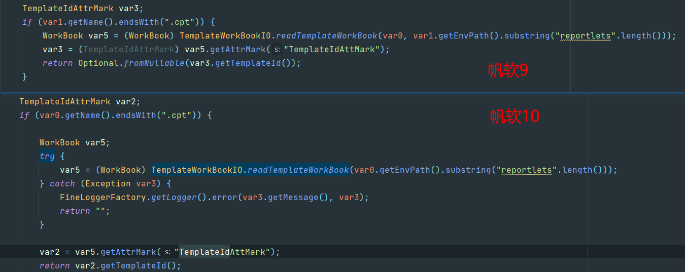

# 常用参数迁移

## 表结构

常用参数使用参考

https://help.fanruan.com/finereport10.0/doc-view-2230.html

帆软10表结构

https://help.fanruan.com/finereport10.0/doc-view-3151.html

fine_param_template	模板参数组合

| 字段名     | 描述     | 数据类型 | 长度  | 非空  |
| ---------- | -------- | -------- | ----- | ----- |
| ID         | 主键     | VARCHAR  | 255   | TRUE  |
| TEMPLATEID | 模板 ID  | VARCHAR  | 255   | FALSE |
| TPGROUP    | 参数组合 | VARCHAR  | 65536 | FALSE |
| USERNAME   | 用户名   | VARCHAR  | 255   | FALSE |

帆软9表结构参考

https://help.finereport.com/finereport9.0/doc-view-1573.html

FR_P_FAVORITE				常用参数组合表

| 字段名     | 描述     | 数据类型 | 长度     | 非空  |
| ---------- | -------- | -------- | -------- | ----- |
| ID         | 主键     | VARCHAR  | 255      | TRUE  |
| TEMPLATEID | 模板 ID  | VARCHAR  | 255      | FALSE |
| TPGROUP    | 参数组合 | VARCHAR  | longtext | FALSE |
| USERNAME   | 用户名   | VARCHAR  | 255      | FALSE |

## 需要解决的问题

### 2.1 新旧版本模板id是否匹配

新旧版本模板id是如何生成的

如何关联cpt名称的

> 初次随机生成，下次从CPT文件中读取
>
> TemplateWorkBookIO#readTemplateWorkBook ->  workbook#assertTemplateId -> 随机生成UUID

可以通过以下测试方法得到templateId，可以看到帆软10取的TemplateIdAttMark标签中的templateId

```java
public class FineExportTest {
    public static final String BASE_PATH = "D:\\Workspace\\Hand\\Cmcc";

    static {
        FineExportUtils.setEnv(BASE_PATH);
    }

    @Test
    public void readWorkBook() throws Exception {
        TemplateWorkBook workbook = TemplateWorkBookIO.readTemplateWorkBook("test0.cpt");
        TemplateIdAttrMark templateIdAttr = workbook.getAttrMark("TemplateIdAttMark");
        System.out.println("=============================");
        System.out.println(templateIdAttr.getTemplateId());
    }
}

```




再看源码



9和10取值逻辑是一致的。无需转换

### 2.2 参数组合值(tpgroup)如何转换

在帆软9中以json格式存储

在帆软10中以json格式加密后存储

追踪源码得到一种对称的hash加密算法

> SaveFavoriteParamsAction ->  ParamsTemplateControllerImpl#add -> FavoriteParamsUtils#encrypt -> Encrypt#encrypt

加解密方法

```
com.fr.general.Encrypt#encrypt
com.fr.general.Decrypt#decrypt
```


