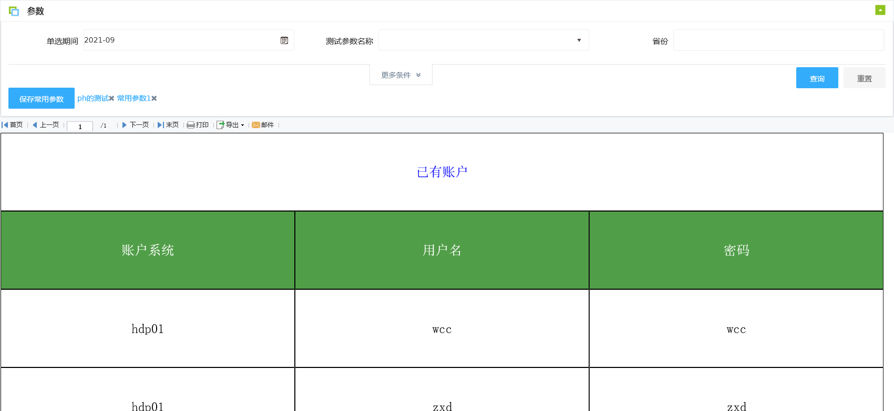
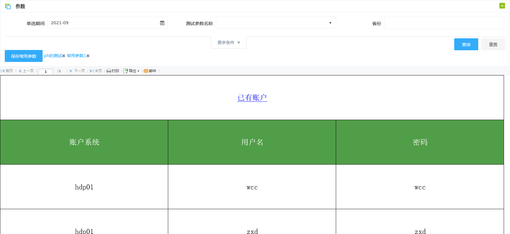

# 截取预览图


## 实现方式

### html2canvas

#### 代码

```js
function domshot() {
    html2canvas(document.querySelector("#ReportParamWrapper"), {
        ignoreElements: function (element) {
            return ["export-btn"].includes(element.id);
        }
    }).then(function (paramCanvas) {
        var view = document.querySelector("#ReportViewWrapper>iframe");
        if (!view) {
            return Promise.resolve(paramCanvas)
        }
        return html2canvas(view.contentDocument.body, {}).then(function (viewCanvas) {
            return linkImage(paramCanvas, viewCanvas);
        });
    }).then(function (canvas) {
        new Promise(function (resolve) {
            resolve(canvas.toDataURL("image/png"));
        }).then(function (dataUrl) {
            var anchor = document.createElement('a');
            anchor.style.visibility = 'hidden';
            anchor.href = dataUrl;
            anchor.download = "screenshot-" + cptName + "-" + new Date().getTime();
            anchor.click();
        })
    }).catch(function (reason) {
        console.log(reason)
    });
}

```

#### 效果



#### 存在问题：

- 有的样式，字体，iconfont无法渲染（如上图中的标题明显丢失了下划线）

### dom2image

#### 代码

```js
function domToImage() {
    var drawOptions = {};
    domtoimage.drawCanvas(document.querySelector("#ReportParamWrapper"), drawOptions).then(function (paramCanvas) {
        var view = document.querySelector("#ReportViewWrapper>iframe");
        if (!view) {
            return Promise.resolve(paramCanvas)
        }
        return domtoimage.drawCanvas(view.contentDocument.body, drawOptions)
            .then(function (viewCanvas) {
                return linkImage(paramCanvas, viewCanvas);
            });
    }).then(function (canvas) {
        new Promise(function (resolve) {
            resolve(canvas.toDataURL("image/png"));
        }).then(function (dataUrl) {
            var anchor = document.createElement('a');
            anchor.style.visibility = 'hidden';
            anchor.href = dataUrl;
            anchor.download = "screenshot-" + cptName + "-" + new Date().getTime();
            anchor.click();
        })
    }).catch(function (reason) {
        console.log(reason)
    });
}
```

#### 效果


